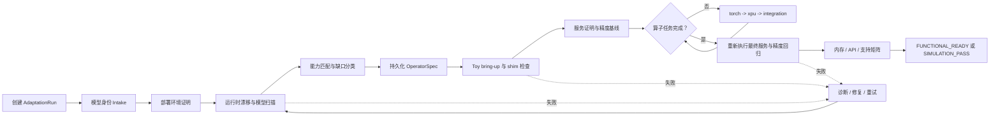
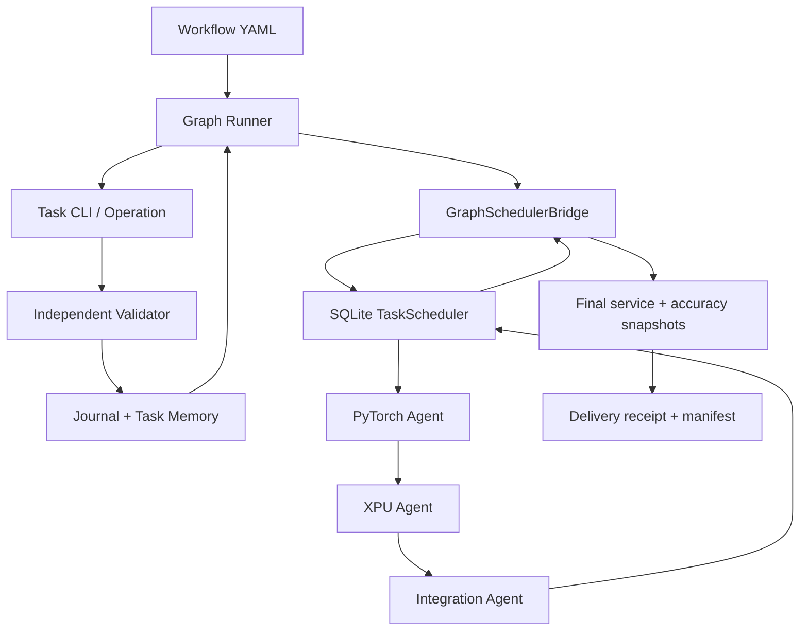

<p align="center">
  
</p>

# Infer-Forge Harness

> 面向异构加速器的模型适配、验证与优化编排框架。

Infer-Forge 不实现推理引擎，也不重新实现已经存在的模型网络。它把环境证明、模型扫描、算子缺口发现、Agent 协作、设备验证、服务回归和最终交付组织成一条**可恢复、可审计、有证据门禁**的工程流程。

当前第一套完整能力是 **vLLM-Kunlun + Kunlun P800 的模型适配**。项目同时提供不依赖集群和 Torch 的本地端到端演练，用于验证 Graph Runner、持久化 Scheduler、Validator 和产物系统能否真正衔接。

## 目录

- [当前支持](#当前支持)
- [系统如何工作](#系统如何工作)
- [快速开始：本地完整演练](#快速开始本地完整演练)
- [运行真实模型适配](#运行真实模型适配)
- [处理算子任务](#处理算子任务)
- [结果与证据](#结果与证据)
- [项目结构](#项目结构)
- [文档导航](#文档导航)
- [开发与验证](#开发与验证)

## 当前支持

### 能力状态

| 能力 | 状态 | 当前边界 |
| --- | --- | --- |
| 模型适配工作流 | **可用** | 覆盖 intake、环境证明、运行时漂移、能力匹配、toy bring-up、算子适配、服务与精度回归、支持矩阵 |
| Graph Runner + 持久化 Scheduler | **可用** | Graph 负责流程和失败边，SQLite Scheduler 负责 `torch -> xpu -> integration` 任务、租约、诊断和恢复 |
| 部署环境证明 | **可用** | 验证 Pod、运行时、代码工作树、XPU、基础模型 prefill/decode、健康检查和 chat 请求 |
| 缺失算子适配 | **可用** | 严格 `OperatorSpec`、独立 PyTorch 参考、XPU 实现、dispatch 证明、服务集成回归 |
| Torch shim 治理 | **可用** | 未豁免的 shim 必须进入持久化算子任务，不能只留下文件请求 |
| 自动失败恢复 | **可用** | 支持外部 Agent 决策或规则决策；每次修复都会重新执行节点验证器 |
| 运行产物治理 | **可用** | 外部 run root、独立 attempt、文件哈希、manifest、Journal、Task Memory 和 SQLite 状态 |
| 本地模型适配 E2E | **必选回归** | 使用生产工作流和真实内部组件，只模拟集群、远端运行时观察和外部 Agent；结果为 `SIMULATION_PASS` |
| 真实设备 Smoke | **可选** | 必须显式授权，复用已经证明的 Pod；普通本地测试不会连接集群 |
| 真实模型回归 | **可选** | 必须有真实 run、已完成算子任务和固定环境身份 |
| 性能分析/优化 | **流程骨架** | 已有 workflow 和 runner 结构，尚未注册为完整可交付场景 |
| 上下文长度与显存优化 | **规划中** | 已有 memory budget 等基础节点，但没有完整端到端能力模板 |

### 平台兼容性

平台组合以 [`compatibility/matrix.yaml`](compatibility/matrix.yaml) 为准：

| Hardware | Engine | Backend / Plugin | 状态 |
| --- | --- | --- | --- |
| Kunlun P800 | vLLM | Kunlun / vLLM-Kunlun | **supported** |
| Kunlun P800 | SGLang | Kunlun / SGLang-Kunlun | planned |
| NVIDIA B200 | SGLang | CUDA | planned |
| NVIDIA B200 | vLLM | CUDA | unsupported |

`planned` 表示接口或目录已经预留，不表示可以完成真实交付。未声明的平台组合会在执行前被拒绝。

## 系统如何工作

### 模型适配主流程



环境证明是硬门禁：真实扫描、算子发现和设备任务必须绑定同一个 Pod、代码版本和环境指纹。算子完成以后，流程会重新执行服务与精度回归，不能用替换算子之前的基线证明最终模型。

### Graph 与 Scheduler 的职责



- **Workflow / Graph Runner**：决定节点顺序、失败边、恢复路径和可复用事实。
- **Task / Operation**：定义并执行一个有边界的工程目标。
- **Scheduler**：持久化算子任务、worker 租约、attempt、事件和诊断任务。
- **Validator**：独立判定证据是否满足任务契约；退出码 0 本身不是成功。
- **Artifact Store**：保存输入、日志、输出、哈希和 manifest，避免重试覆盖历史。

更完整的层级说明见[技术实现与抽象层级](docs/architecture/implementation-layers.zh-CN.md)。

## 快速开始：本地完整演练

这是第一次使用时推荐的入口。它会执行原始生产工作流，并跨多个真实 Python 进程验证 CLI、Graph、Scheduler、租约、Validator、恢复和最终交付；不会访问网络、集群或真实 XPU。

### 1. 安装

```bash
git clone https://github.com/xyDong0223/infer-forge-harness.git
cd infer-forge-harness

python3 -m venv .venv
source .venv/bin/activate
python -m pip install --upgrade pip
python -m pip install -e '.[test]'
```

项目要求 Python 3.10+。本地 E2E 不需要安装 Torch；只有部分 CPU 数值参考测试需要额外安装 Torch。

### 2. 运行模型适配场景

```bash
E2E_ROOT="$(mktemp -d)"

PYTHONDONTWRITEBYTECODE=1 python -m pytest -q \
  -m local_e2e tests/e2e \
  --basetemp "$E2E_ROOT/pytest" \
  --junitxml "$E2E_ROOT/model-adaptation-e2e.xml"
```

该场景会验证：

- 正常流程从 `create-run` 到持久化交付凭据；
- 缺失或篡改的 worker 证据不能推进任务；
- 中断、租约过期和新进程恢复不会重复创建任务或覆盖旧 attempt；
- 算子完成前的服务和精度结果不能证明最终模型；
- 模拟环境证明不能解锁真实 run；
- 运行期间不会向源码目录写入临时产物。

最终状态是 **`SIMULATION_PASS`**，只证明编排和持久化链路正确，不证明真实设备数值、真实模型精度或性能。

完整场景契约和可选硬件层级见 [`tests/e2e/README.md`](tests/e2e/README.md)。

## 运行真实模型适配

### 前置条件

- 有权限访问目标 Kubernetes 集群；
- 模型目录已挂载并记录准确 revision；
- vLLM-Kunlun 镜像、插件 revision 和运行时版本已固定；
- `KUBECONFIG` 等凭据只存在于外部环境；
- 状态数据库和所有运行产物位于源码目录之外；
- 使用匹配模型的 deployment contract，或准备一个内容完整的实例。

仓库内已有示例实例：

- [`qwen3-8b-p800.yaml`](tasks/kdp-001-deployment-proof/instances/qwen3-8b-p800.yaml)
- [`glm52-int-w8a8-p800.yaml`](tasks/kdp-001-deployment-proof/instances/glm52-int-w8a8-p800.yaml)
- [`minimax-m25-w8a8-p800.yaml`](tasks/kdp-001-deployment-proof/instances/minimax-m25-w8a8-p800.yaml)

示例是参数模板，不包含模型权重、凭据或私有地址。

### 1. 创建或恢复 run

```bash
export INFER_FORGE_STATE_ROOT="$HOME/.local/state/infer-forge"

RUN_ID="my-model-p800-001"
STATE="$INFER_FORGE_STATE_ROOT/state.sqlite"
RUN_ROOT="$INFER_FORGE_STATE_ROOT/runs/$RUN_ID"
MODEL_PATH="/mounted/models/MyModel"
MODEL_REVISION="<model-revision>"
PLUGIN_REVISION="<vllm-kunlun-commit>"
CONTRACT="/path/to/pinned-deployment-contract.yaml"

python cli/adaptation.py --state "$STATE" create-run \
  --run-id "$RUN_ID" \
  --model "MyModel" \
  --model-revision "$MODEL_REVISION" \
  --plugin-revision "$PLUGIN_REVISION" \
  --backend kunlun \
  --artifact-root "$RUN_ROOT"
```

重复执行 `create-run` 会恢复同一个 `run_id`，不会创建第二个 run。已经有算子任务以后，不能静默替换环境身份或 artifact root。

### 2. 先查看前置计划

不传 `--execute` 时 Graph 只解析前置命令，不修改集群：

```bash
python cli/workflow/graph.py \
  --subject "MyModel" \
  --run-id "$RUN_ID" \
  --env hardware=P800 \
  --env stack_commit="$PLUGIN_REVISION" \
  --set model_path="$MODEL_PATH" \
  --set contract_instance="$CONTRACT" \
  --until-node kdp-001a-environment-proof \
  --json
```

### 3. 执行完整 Graph

```bash
python cli/workflow/graph.py \
  --subject "MyModel" \
  --scheduler-state "$STATE" \
  --run-id "$RUN_ID" \
  --artifact-root "$RUN_ROOT" \
  --env hardware=P800 \
  --env stack_commit="$PLUGIN_REVISION" \
  --set model_path="$MODEL_PATH" \
  --set contract_instance="$CONTRACT" \
  --operator-report /path/to/measured-operators.json \
  --shim-registry /path/to/shim-registry.json \
  --execute --resume --json
```

重要约束：

- `--operator-report` 必须包含实测 shape、dtype、layout、输入输出和语义证据；不能从算子名字猜测契约。
- 没有可执行 gap，或者分类结果本身已经包含完整契约时，才可以省略 `--operator-report`。
- `--shim-registry` 记录 shim 的调用证据、替代算子和豁免理由。
- 如果复用已经准备好的 Pod，传入 `--set pod=<prepared-pod>`；Graph 会 attach 并重新证明，不会创建第二个环境。
- 不使用 `--scheduler-state` 时仍可运行旧的 graph-only 模式，但不会生成 scheduler-backed 功能交付凭据。

Graph 的常见退出码：

| 退出码 | 含义 | 下一步 |
| --- | --- | --- |
| `0` | 当前请求完成 | 检查 JSON `status`；`--until-node` 完成不等于模型已交付 |
| `2` | 输入、证据或门禁阻塞 | 查看 `reason_code`、失败 attempt 和诊断任务 |
| `3` | `WAITING_FOR_OPERATORS` | 领取并完成持久化算子任务，然后用同一个 run 执行 `--resume` |

## 处理算子任务

缺口被转换成严格的 `OperatorSpec` 后，Scheduler 按阶段推进：

```text
torch reference
  -> independent reference validation
  -> XPU implementation/build/registration
  -> device correctness + dispatch validation
  -> integration + service/accuracy regression
```

### 领取任务

```bash
python cli/adaptation.py --state "$STATE" claim \
  --worker torch-agent-01 \
  --stage torch \
  --limit 1
```

claim 返回完整任务输入、`task_id`、attempt workspace、`lease_token` 和租约截止时间。Worker 只能把正式证据写到当前 attempt 的 `output/`。

### 提交结果

```bash
python cli/adaptation.py --state "$STATE" complete \
  --task-id "$TASK_ID" \
  --worker torch-agent-01 \
  --lease-token="$LEASE_TOKEN" \
  --result "$RESULT_JSON"
```

`--lease-token=...` 使用等号是有意的：token 可能以 `-` 开头。结果必须包含任务身份、环境指纹、证据模式、显式 PASS、全部证据文件哈希，以及不同于生产者的独立验证报告。

### 报告失败

```bash
python cli/adaptation.py --state "$STATE" fail \
  --task-id "$TASK_ID" \
  --worker torch-agent-01 \
  --lease-token="$LEASE_TOKEN" \
  --error "concise original failure"
```

失败会创建持久化 diagnosis 任务，不应直接修改 SQLite 状态或静默重试。任务结果协议见 [`docs/migration/worker-results.md`](docs/migration/worker-results.md)。

### 查看状态并继续

```bash
python cli/adaptation.py --state "$STATE" status \
  --run-id "$RUN_ID" \
  --events

python cli/workflow/graph.py \
  --subject "MyModel" \
  --scheduler-state "$STATE" \
  --run-id "$RUN_ID" \
  --artifact-root "$RUN_ROOT" \
  --env hardware=P800 \
  --env stack_commit="$PLUGIN_REVISION" \
  --set model_path="$MODEL_PATH" \
  --set contract_instance="$CONTRACT" \
  --execute --resume --json
```

恢复时必须继续使用相同的模型、revision、环境、数据库和 artifact root。

## 结果与证据

### 状态不能混用

| 状态 | 证明了什么 | 不证明什么 |
| --- | --- | --- |
| `ENVIRONMENT_READY` | Pod、运行时、代码和基础设备/模型检查通过 | 目标模型已经适配完成 |
| `DEPLOYMENT_READY` | 当前服务健康并完成真实请求 | 所有缺失算子都已经实现 |
| `WAITING_FOR_OPERATORS` | Graph 已完成前置流程，仍有异步任务 | 功能可交付 |
| `SIMULATION_PASS` | 本地生产流程、调度和证据门禁衔接通过 | 真实 XPU、真实模型精度、性能 |
| `FUNCTIONAL_READY` | 真实环境、算子阶段、最终服务和精度回归均通过 | 性能目标已经达成 |
| `BLOCKED` / `REWORK` | 证据不足、身份不一致或验证失败 | 可以忽略后继续发布 |

性能是独立的后置阶段。功能就绪不能从一次 profiler 或单请求吞吐推导，性能优化也不能绕过正确性回归。

### 运行目录

默认状态根目录为 `$XDG_STATE_HOME/infer-forge`，未设置时使用 `~/.local/state/infer-forge`；可通过 `INFER_FORGE_STATE_ROOT` 覆盖。

```text
<state-root>/
  state.sqlite
  runs/<run-id>/
    run.json
    journal.jsonl
    task_memory.json
    tasks/<task-id>/attempts/000001/
      .attempt.json
      input/
      scratch/
      output/
      logs/
      manifest.json
```

- 每次执行和重试使用新的 attempt；
- `scratch/` 用于调查，不进入正式证据清单；
- `output/` 是 worker 正式结果的唯一允许位置；
- `manifest.json` 记录文件和哈希，但不替代 Validator；
- 源码仓库不是运行工作区，受管 CLI 会拒绝把状态或产物写入项目目录。

详细规则见[运行时写入策略](docs/migration/runtime-write-policy.zh-CN.md)。

## 项目结构

```text
workflows/     场景拓扑和成功/失败边
tasks/         任务契约、验收条件和实例
skills/        可复用工程方法
catalog/       工具、runtime、设备和能力事实
cli/           稳定命令入口和参数解析
operations/    按领域组织的任务实现
engine/        Scheduler、Graph bridge、诊断与恢复
engine/state/  Journal 和 Task Memory
runners/       Graph、部署证明和任务执行序列
validators/    独立验收门禁
adapters/      硬件与集群差异
runtimes/      推理引擎/backend/plugin 差异
core/          共享契约、目标解析、路径和存储
tools/         可移植 probe、可重放 patch、Torch 参考
tests/e2e/     能力场景及外部边界替身
openwiki/      上游、插件和项目工程经验参考
```

新增源码前先阅读[源码归类说明](docs/architecture/source-layout.zh-CN.md)。运行时修复必须同时提供 `tools/patches/` 下幂等、可重放的源码补丁，不能只修改某个 Pod 的 site-packages。

## 文档导航

| 文档 | 内容 |
| --- | --- |
| [`docs/architecture/implementation-layers.zh-CN.md`](docs/architecture/implementation-layers.zh-CN.md) | 抽象层级、每层意义、Graph/Scheduler 衔接和边界 |
| [`docs/architecture/source-layout.zh-CN.md`](docs/architecture/source-layout.zh-CN.md) | 当前源码目录责任和依赖方向 |
| [`docs/guides/add-workflow.zh-CN.md`](docs/guides/add-workflow.zh-CN.md) | 把已有流程或性能、上下文等新能力接入 Harness 的完整步骤 |
| [`docs/guides/migrate-legacy-skill.zh-CN.md`](docs/guides/migrate-legacy-skill.zh-CN.md) | 拆分并迁移同时包含目标、脚本和工程经验的旧 Skill |
| [`tests/e2e/README.md`](tests/e2e/README.md) | 本地必选场景、真实设备 Smoke、真实模型回归及新增能力模板 |
| [`docs/migration/runtime-write-policy.zh-CN.md`](docs/migration/runtime-write-policy.zh-CN.md) | 外部 run root、attempt、manifest 和写入约束 |
| [`docs/migration/worker-results.md`](docs/migration/worker-results.md) | worker 结果 envelope、租约和证据要求 |
| [`docs/guides/performance-analysis.md`](docs/guides/performance-analysis.md) | 性能阶段边界和指标解释 |
| [`openwiki/harness/`](openwiki/harness/) | 已沉淀的模型适配、运行时漂移和算子接入经验 |
| [`CONTRIBUTING.md`](CONTRIBUTING.md) | 修改边界、场景要求和提交规范 |
| [`AGENTS.md`](AGENTS.md) | Agent 执行协议和证据门禁，任务执行时以此为准 |

## 开发与验证

基础安装：

```bash
python -m pip install -e '.[test]'
```

按改动范围选择最小测试；提交前至少检查源码引用：

```bash
python cli/maintenance/check_repo_references.py
```

运行必选能力场景：

```bash
python -m pytest -q -m local_e2e tests/e2e
```

部分 CPU 数值测试会 import Torch；只有执行这些测试时才需要安装对应版本。真实设备测试默认跳过，不能在没有 namespace、镜像 digest、模型 revision、硬件身份和清理策略时连接共享集群。

---

Infer-Forge 版本化的是**流程、契约、方法和验收规则**。模型权重、凭据、私有端点、Pod 状态、原始生产流量和大型 trace 始终保存在仓库之外。
