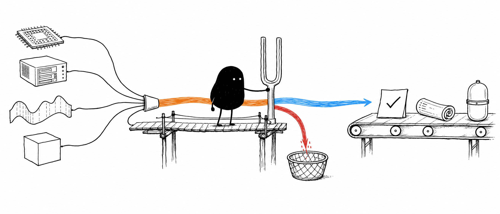
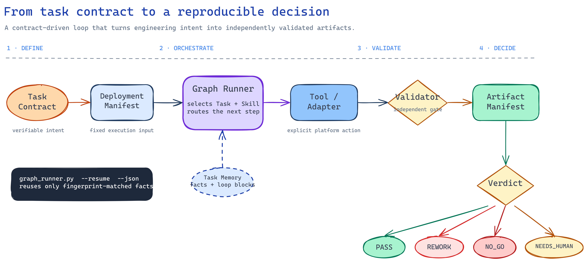
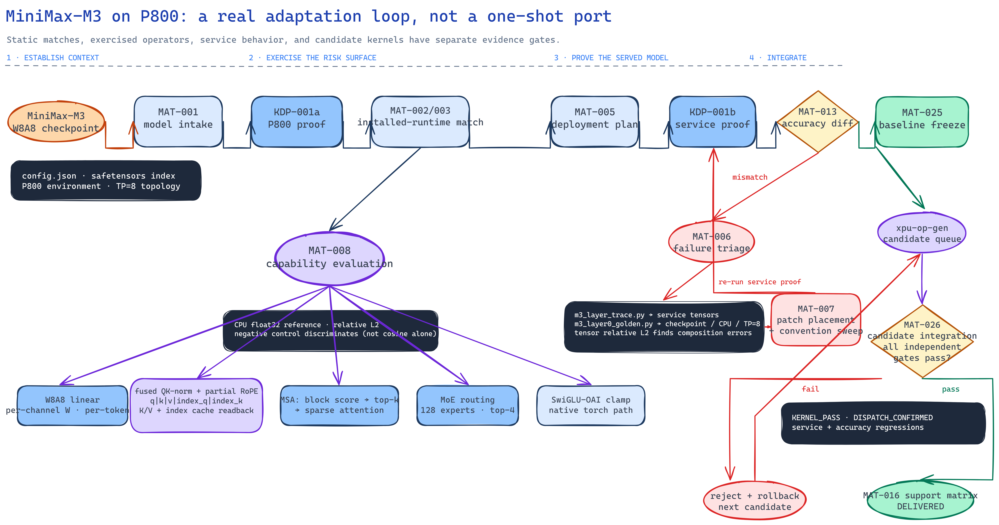
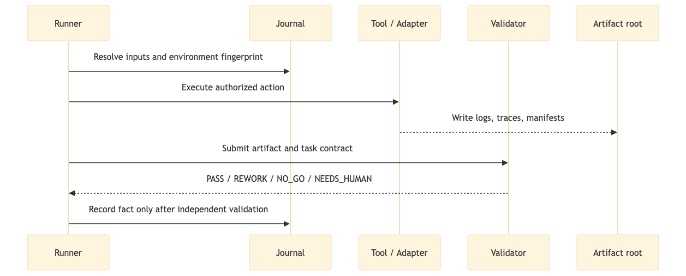

<p align="center">
  
</p>

# infer-forge-harness

> **An agentic harness for bringing up, validating, and optimizing inference models across heterogeneous accelerators.**

**Python 3.10+** · **v0.1 public scaffold** · **Plan-only by default**

`infer-forge-harness` turns inference-engineering work into explicit, verifiable loops. It keeps reusable engineering rules in version control, separates them from runtime state, and requires independent validation before an outcome becomes a reusable fact. Kunlun P800 is the first backend and real-world adaptation case.

## Contents

- [Quick start](#quick-start)
- [What it solves](#what-it-solves)
- [Design model](#design-model)
- [Execution path](#execution-path)
- [MiniMax-M3 real adaptation loop](#minimax-m3-real-adaptation-loop)
- [Execution model](#execution-model)
- [Operator integration loop](#operator-integration-loop)
- [Repository map](#repository-map)
- [Run the checks](#run-the-checks)
- [Reference material](#reference-material)
- [Contributing](#contributing)
- [Status](#status)

## Quick start

Use Python 3.10 or later. The repository is **plan-only by default**: local checks resolve contracts and validate artifacts without creating or changing cluster resources.

```bash
git clone https://github.com/xyDong0223/infer-forge-harness.git
cd infer-forge-harness

python3 -m venv .venv
source .venv/bin/activate
python -m pip install --upgrade pip
python -m pip install pyyaml
python -m pip install torch --index-url https://download.pytorch.org/whl/cpu

python -m unittest discover -s tests -p 'test_*.py' -v
python -m compileall runners validators tools
```

The full unit suite uses **PyYAML** to load contracts and **PyTorch** for CPU reference arithmetic. A real P800 run additionally requires an authorized Kubernetes context, a reachable cluster, the model volume and revision, and a vLLM-Kunlun image. Those environment-specific prerequisites are intentionally not created by this repository.

## What it solves

Inference model adaptation needs more than a sequence of scripts. A reliable workflow must declare the expected input, select a constrained method, record environment-specific facts, execute only authorized platform actions, and prove that the result satisfies an independent acceptance gate.

The first milestone is **KDP-001 — Kunlun Deployment Proof**. From a fixed Deployment Manifest, the platform prepares a Kunlun P800 environment, starts a vLLM-Kunlun service, verifies readiness and a chat completion, and produces a reproducible artifact manifest. The initial repository also defines the first model-adaptation stages: model intake and static model scan.

Cluster-side execution is intentionally not implicit. The runner operates in plan-only mode by default; an environment-specific Adapter and explicit authorization are required before actions reach a cluster.

## Design model

> **Workflow orchestrates, Task defines acceptance, Skill provides engineering method, Tool performs deterministic actions, Runner executes, Adapter isolates platform differences, Validator decides, and Catalog stores capability facts.**

| Building block | Responsibility |
| --- | --- |
| **Workflow** | Orchestrates business stages and cross-task routing through the Task Graph. |
| **Task** | Defines the verifiable contract, acceptance criteria, and task-local guidance. |
| **Skill** | Encodes the engineering method, including preconditions, verification, exit conditions, and learned rules. |
| **Tool** | Performs a deterministic action with a constrained interface. |
| **Runner** | Coordinates the state machine, task memory, artifacts, and the next decision. |
| **Adapter** | Isolates Kubernetes, Kunlun P800, and vLLM-Kunlun environment differences. |
| **Validator** | Applies an independent acceptance gate and determines the verdict. |
| **Catalog** | Stores model, backend, tool, and support capability facts. |

The repository versions contracts, schemas, workflows, skills, tools, adapters, validators, tests, and documentation. Logs, traces, benchmark outputs, model caches, Pod state, and temporary worktrees belong in an external artifact root.

## Execution path

<p align="center">
  <a href="docs/assets/agent-workflow.excalidraw">
    
  </a>
</p>

The rendered diagram is backed by an editable [Excalidraw source](docs/assets/agent-workflow.excalidraw). It shows the main contract-to-verdict path, the persistent Task Memory loop, and the explicit outcomes that prevent unverified progress from becoming a capability fact.

### Two gates before anything expensive

A registry entry proves a name is mapped, not that the code behind it loads, and loading it is not the same as running it. Both gaps used to be closed by launching the model, which on a 744B checkpoint means a 700 GiB read per error message.

- **MAT-027 Runtime Drift** imports every module of the installed plugin against the installed engine in one pass, and indexes the engine's own source to say where each missing symbol lives now. No model, no weights, no XPU. A version label is not evidence of a matching install: vLLM-Kunlun `v0.25.1-dev` pairs with a wheel labelled `0.25.1` whose internals are months newer, and every MLA module failed to import while the label matched.
- **MAT-028 Toy Bring-up** derives a few-layer copy of the real config, points the engine at dummy weights, and runs prefill and one decode step. Depth, expert count and MTP shrink; every dimension that selects a kernel stays at real size, so it is the same code path. It catches what sits between "imports" and "serves" — an abstract method the engine now requires, a factory whose return shape changed, a KV-cache tensor whose rank the layer slices wrongly — and it cannot see a wrong number, because the weights are random.

### MiniMax-M3 real adaptation loop

<p align="center">
  <a href="docs/assets/minimax-m3-adaptation-loop.excalidraw">
    
  </a>
</p>

This is the real MiniMax-M3 engineering loop: a static runtime match is only the start; each high-risk dimension is exercised against a CPU float32 reference with relative L2 and a discriminating negative control. A service mismatch enters a trace-to-golden-reference loop before patch placement sends the candidate back through service proof.

The editable [Excalidraw source](docs/assets/minimax-m3-adaptation-loop.excalidraw) distinguishes unit-level evidence from served-model accuracy. Only an accurate service can freeze a baseline. Every generated candidate must then pass kernel, dispatch, service-regression, and accuracy-regression gates; a failure is explicitly rejected and rolled back before the next candidate is evaluated.

## Execution model

The graph runner keeps the Task Graph for cross-task routing and stores the current and completed Loop Blocks in Task Memory. A successful fact can be reused only when its Journal environment fingerprint matches the current execution context.

### A task lifecycle

<p align="center">
  
</p>

Each task is a bounded evidence loop. The Runner selects the contract and method, the Tool or Adapter performs the authorized action, the Validator applies an independent acceptance gate, and the Journal receives a reusable fact only after that gate passes.

```bash
python3 runners/graph_runner.py \
  --subject Qwen3-8B \
  --artifact-root /path/to/artifacts \
  --journal /path/to/journal.jsonl \
  --env hardware=P800 \
  --env stack_commit=<commit> \
  --resume --json
```

`--resume` skips nodes whose successful artifact and state file are still available. `--json` emits a compact result for each decision with `status`, `reason_code`, `next_task`, and artifact paths. Task Memory is written to `<artifact-root>/task_memory.json` by default and can be overridden with `--loop-state`.

The tool capability index in [`catalog/tool_catalog.yaml`](catalog/tool_catalog.yaml) is the first lookup for an Agent choosing a deterministic tool. Task-specific contracts and validators remain authoritative for inputs and acceptance. The Skill registry in [`catalog/skill_catalog.yaml`](catalog/skill_catalog.yaml) maps every workflow `task_type` to a method unit with its preconditions, tools, verification, exit conditions, and prior P800 adaptation rules. The graph runner records the selected Skill in Task Memory and JSON summaries.

When a Task exposes a more specific fact, the resolver selects the narrower method automatically:

```bash
--set issue=cache_layout       # cache-layout-validation
--set dimension=quantization   # quantization-differential
--set issue=runtime_state      # runtime-state-triage
--set issue=p800_kernel        # p800-fallback-selection
```

The generic Skill remains the fallback when no specialized fact is present. Specialized Skills are activated by observed context, not by a model name or an unverified guess.

## Operator integration loop

`model_adaptation` dispatches confirmed `CAPABILITY_MISSING` gaps to durable `xpu-op-gen` requests and continues model bring-up. After service and independent accuracy both pass, it freezes a baseline. Generated candidates are then tested one at a time against that baseline. A failed kernel, dispatch, service, or accuracy gate is rejected and must be rolled back before the next candidate is considered.

The lifecycle tool can also be driven directly:

```bash
python3 tools/operator_lifecycle.py integrate \
  --baseline /path/to/baseline_manifest.json \
  --candidate /path/to/candidate_manifest.json \
  --subject Qwen3-8B \
  --out /path/to/integration
```

The candidate manifest must reference independent reports for `KERNEL_PASS`, `DISPATCH_CONFIRMED`, service regression, and accuracy regression. The tool does not mutate the running service; integration and rollback remain explicit Adapter actions.

## Repository map

| Directory | Responsibility |
| --- | --- |
| [`contracts/`](contracts/) | Stable, machine-readable schemas. |
| [`workflows/`](workflows/) | Business orchestration and Task Graphs. |
| [`tasks/`](tasks/) | Verifiable task contracts and task-local guidance. |
| [`skills/`](skills/) | Domain methods, rules, and human engineering knowledge. |
| [`tools/`](tools/) | Deterministic action interfaces. |
| [`runners/`](runners/) | Execution, state-machine, and artifact coordination. |
| [`adapters/`](adapters/) | Kubernetes, Kunlun P800, and vLLM-Kunlun platform differences. |
| [`validators/`](validators/) | Independent acceptance gates. |
| [`catalog/`](catalog/) | Model, backend, tool, and support facts. |
| [`tests/`](tests/) | Unit, contract, fake-runner, and P800 integration tests. |
| [`docs/`](docs/) | Architecture, contribution guidance, and visual documentation assets. |
| [`openwiki/`](openwiki/) | Layered upstream, plugin, and project-practice inference references. |

## Run the checks

Run the documented local validation commands before proposing a change:

```bash
python -m unittest discover -s tests -p 'test_*.py' -v
python -m compileall runners validators tools
```

The P800 integration suite is opt-in. It must never run against a shared cluster without explicit environment configuration, including the namespace, image digest, model revision, hardware, and cleanup policy.

## Reference material

The [`openwiki/`](openwiki/) directory is a layered reference base: [`vllm-core/`](openwiki/vllm-core/) documents the upstream vLLM hardware-backend integration contract, [`vllm-kunlun/`](openwiki/vllm-kunlun/) records the Kunlun P800 plugin implementation, and [`harness/`](openwiki/harness/) contains Infer-Forge engineering practice. Their separate provenance and evidence baselines are registered in [`openwiki/SOURCE.md`](openwiki/SOURCE.md). Use these as runtime and architecture reference material; platform contracts and executable Task definitions in this repository remain the source of truth for the Agent platform.

## Contributing

Read [`CONTRIBUTING.md`](CONTRIBUTING.md) before opening a pull request. Changes should identify their affected layer, include the relevant validation evidence, and keep runtime artifacts, model weights, tokens, private endpoints, raw production traffic, and large traces outside the repository.

## Status

This repository is an initial public scaffold. Its current scope is contracts, workflow planning, fake-runner coverage, validators, and integration hooks. Runtime adapters and real P800 execution are added incrementally behind independent evidence gates.

It does **not** ship model weights, provide a hosted inference endpoint, or create a turnkey multi-node production deployment. Runtime artifacts, model caches, credentials, private endpoints, and raw production traffic remain outside the repository.
