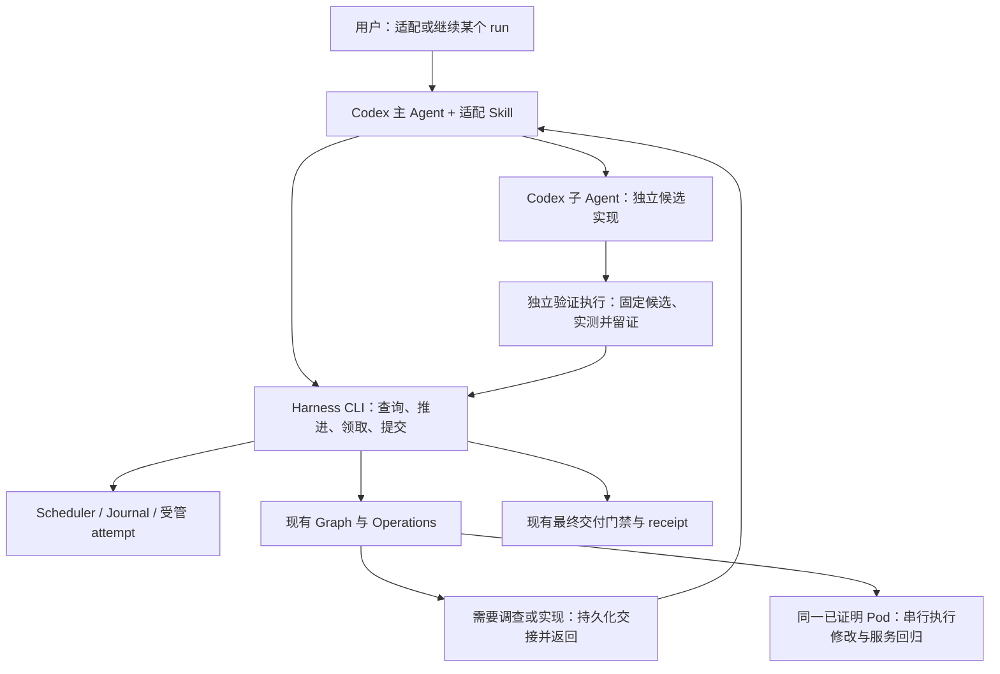

# Codex 驱动的模型适配：审阅与实施计划

状态：P0/P1 已落地；P2 按本地核心、设备侧驱动两个增量推进，尚未整体完成；P3/P4 未启动。审阅日期：2026-09-17；初始源码基线：`9d4b85b`。
本文规划 harness 与 Codex 的接入，不构成任何模型、设备或新工作流已通过验收的声明。

## 1. 推荐方向与范围

默认工作方式采用 **Codex 主 Agent 驱动现有 Harness CLI**。Codex 负责调查、选择实验、编写候选、委派子 Agent、解释失败；Harness 负责运行身份、任务依赖、受管执行、证据校验和交付判定。

首期面向现有 P800 + vLLM-Kunlun、一个主控制者和一个已证明的 Pod。独立算子的阅读、源码实现和 CPU 实验可以并行；共享 Pod 的修改、设备独占测试与服务回归串行。保留今后无交互批量运行的接缝，当前不建设常驻 worker 集群。

结合当前目标，需要修正上一轮建议：

- `TaskScheduler`、lease、attempt、诊断记录继续作为默认保障。它们控制的是领域任务与证据，Codex 会话恢复不能替代这些约束。
- CodexWorker 不作为第一项工程。交互式主 Agent 已能调用 CLI 和委派子 Agent；只有无人值守需求明确后，才增加调用 Codex 的薄执行器。
- Workflow、Task、Operation、Validator 的分层保留。应消除同一字段的多处维护，而非把所有职责压进一个 YAML。
- Task Memory 当前包含独占的观察和 claims；完成这些信息的迁移前，不能将它直接删除或视为可丢弃缓存。
- 原简化 scheduler CLI 最终按仓库迁移协议移除并更新调用者，不新增永久兼容跳板。

## 2. 当前证据与改造重点

| 观察 | 源码位置 | 对计划的影响 |
| --- | --- | --- |
| `status` 已返回下一责任人、动作、证据和恢复命令，并以只读事务查询 | [progress](../../engine/progress.py)、[adaptation CLI](../../cli/adaptation.py) | 复用现有输出，避免另造 planner/next-action 状态机 |
| `claim_ready` 按 stage 从全库领取，CLI 没有 run 过滤；E2E worker 要求单 run 数据库 | [scheduler](../../engine/scheduler.py)、[scenario worker](../../tests/e2e/worker.py) | 先补定向领取，再接多个 Codex 子任务 |
| Graph 有恢复循环，operator 有持久诊断链；AgentBrain 的文件模式会同步等待外部回答 | [brain](../../engine/brain.py)、[recovery](../../engine/recovery.py)、[graph](../../runners/graph_runner.py) | Codex 模式在决策边界返回控制；每次运行只指定一个恢复决策者 |
| Task 已写 consumes/produces/tool/validator，NODES 又维护命令/依赖，Journal 另有 kind 映射 | [toy task](../../tasks/mat-028-toy-bringup/task.yaml)、[graph](../../runners/graph_runner.py)、[Journal](../../engine/state/journal.py) | 逐步收敛重复执行元数据，不重写 DAG |
| 独立验证报告检查 validator 名称、checks、身份与哈希；未认证执行者，也不主动重跑数值测试 | [result validation](../../engine/result_validation.py)、[worker 协议](../migration/worker-results.md) | 接入受管独立验证执行，Codex 的最终回复只作候选提交 |
| 服务重启会清理 Pod 内 VLLM 进程，任务 lease 没有跨任务的 Pod 互斥语义 | [deployment proof](../../runners/deployment_proof.py) | 并行实现与 Pod 执行分别管理 |
| 已有生产拓扑 E2E、旧 lease 拒绝、陈旧回归拒绝与最终交付快照 | [E2E 协议](../../tests/e2e/README.md)、[bridge](../../engine/graph_bridge.py) | 在现有回归上增量扩展，保留最终 service/accuracy 重跑 |

这些结论来自源码与文档审阅，未以模块行数推断质量，也未据此宣称所有测试已通过。

## 3. 与 Codex 的职责衔接

| 责任 | 负责人 | 关键边界 |
| --- | --- | --- |
| 任务理解、调查与实验选择 | Codex 主 Agent | 依据当前 run 的真实输入和证据选择；不猜 tensor 契约 |
| 角色委派、子 Agent 对话、上下文压缩 | Codex | 子 Agent 返回产物定位及摘要；正式结果必须落盘 |
| 阶段依赖、claim、续租、失败、重试资格 | Harness scheduler | 不由聊天记录或 Codex 会话状态决定 |
| 确定性扫描、部署、探针、回归 | 现有 CLI / Operation / Runner | 保留契约和 validator；CLI 不复制实现逻辑 |
| 参考与候选的独立验收 | 受管验证 Runner + 独立 validator Agent | 与 producer 分离；真实执行既定检查，并绑定候选身份 |
| 共享 Pod 修改与服务切换 | 唯一主控制者的受管执行入口 | 子 Agent 可提出变更和测试请求，不能同时改共享运行时 |
| 最终完成 | Harness 交付门禁 | 以当前有效的 delivery receipt 为准 |

Codex 的原生子 Agent 已支持委派、后续指令和等待；Skill 支持按任务加载方法。将它们用于 agent 执行与上下文组织即可。[Subagents](https://learn.chatgpt.com/docs/agent-configuration/subagents)、[Build skills](https://learn.chatgpt.com/docs/build-skills)

### 3.1 Skill 与角色

首期增加一个面向用户的 `infer-forge-adaptation` 编排 Skill。用户可以表达“继续 run X”或“把模型 Y 适配到当前 P800 环境”，Skill 引导主 Agent 查询状态、补全必需输入并推进。

- `.agents/skills/infer-forge-adaptation/` 保存这一个 Codex 编排入口；不复制现有全部方法 Skill。
- 已有 `skills/` 与 catalog 保持任务方法的唯一来源。任务包引用并按现有机制快照所选方法、版本和哈希；按需读取对应 OpenWiki 页面。
- 编排入口与领域方法职责分开：入口描述如何使用 Harness，领域方法描述如何诊断、实现和验证。初期无需迁移现有 Skill registry。
- 根 `AGENTS.md` 保留硬性不变量与导航。操作细节逐步移入所引用的方法文档，避免主 Agent 每次加载所有模型经验。
- 使用少量角色：实现者、诊断者、验证者。PyTorch/XPU 专业要求由 task packet 和方法补充；不为每个 Graph 节点创建一个 Agent。
- 可用项目级 `.codex/agents/` 定义角色；默认继承用户模型设置，能力不可用时仍可用普通子 Agent 指令。角色配置不承担验收。

独立 validator 可以是另一 Codex 子 Agent，但另开对话本身不能证明数值独立。它应读取已冻结的规格与候选，运行验收命令，检查独立参考来源，并记录候选哈希及执行日志。

### 3.2 交互与无人值守两种调用方向

首期方向为 `用户 → Codex → Harness CLI`；后续无人值守方向为 `外部任务 → 薄执行器 → Codex → 同一 Harness 协议`。两种方式使用相同的 run、任务契约、证据和交付门禁。

每个 run 同一时刻只有一个主控制者。Codex 交互模式中，Graph 的自动恢复循环不同时充当另一个决策者。当前 `--auto-recover` 本来就是显式开关；新增模式应明确互斥，并保留现有 headless 路径的回归。

不把桌面 App 的内部任务管理工具当成可分发项目的依赖。需要无交互执行时再选择公开 CLI/SDK；自定义 UI 才需要评估 App Server。上一轮引用的通用 Agents API 不能直接用来证明 Codex 产品接口。

## 4. 最小对接协议

P0 已实现 `context` 与定向 `claim`；P1 已新增 `advance`、`submit-decision`。用户入口继续收敛到 `cli/adaptation.py`；边界和例子见 [交互协议](../migration/codex-interaction.zh-CN.md)。

| 操作 | 复用或扩展 | 行为 |
| --- | --- | --- |
| `status --run-id` | 复用 | 查询已有状态与 next_action；只读、不领取、不自动修复 |
| `context --run-id [--task-id]` | P0 已实现 | 输出身份、现有输入引用、失败上下文、指导资料与验收要求；不重新规划任务 |
| `advance --run-id` | P1 已实现，封装现有 Graph | 使用记录的 workflow/context 推进确定性步骤；在 agent 决策、worker 待办、缺输入或完成边界返回 |
| `claim --run-id [--task-id]` | P0 已实现 | 按 run 及可选 task 原子领取；过期回收也遵循明确作用域 |
| `renew-lease / complete / fail` | 复用 | 保留当前 token 与 attempt 验证；长命令由薄执行 helper 续租 |
| `resolve-diagnosis / apply-diagnosis` | 复用 operator 路径 | 保持已持久化结论先于恢复；未支持的修复动作不能伪装为 RETRY |
| `submit-decision --run-id --handoff-id` | P1 已实现 | 另需 decision-id / expected-version / decision 文件；校验源 attempt 与版本，持久化后执行一次恢复并返回凭据 |

Graph 的 `advance` 需要保存首次执行解析出的必要上下文，后续只凭 run_id 就能恢复。复用现有 `resume_command` 与 `progress`，但在重新执行前验证当前身份及输入，不能盲目执行历史命令字符串。

定向领取必须在 scheduler 查询中限定 run，不能先全库 claim 再检查返回值。可选 task_id 还应验证所属 run、阶段和依赖。

### 4.1 给 Agent 的上下文

直接扩展现有 claimed `input/task.json` 与 Skill 快照，不另建一套 Job/Task 数据模型：

- 必须包含：run_id、task_id、stage、attempt、当前 workspace、OperatorSpec、环境引用、上游证据及验收要求。
- 主 Agent/执行 helper 持有 lease；子 Agent 获得所需的工作身份及指定路径，续租和最终提交由明确的持有者负责。
- 分别记录 controller/lease 持有者、实际 producer Agent 与 validator 身份。当前 `complete` 把 lease_worker 用作 producer 检查；接入时显式绑定委派关系，不能因主 Agent 代提交而错误认定独立验证。
- 增补：候选 commit/tree/patch 身份、所需读写范围、测试请求、证据角色和失败提交方式。
- 按需附带短失败摘要与原始日志路径。摘要不能替代完整 OperatorSpec 或验收契约。
- Codex session/agent ID 仅作关联索引；更换会话仍从 scheduler 与 attempt 恢复。

`context` 的只读快照不等于领取凭证；执行时必须重新检查 claim、证据及环境仍有效。

### 4.2 Graph 的交接和恢复

在 Graph 需要开放式诊断/实现时，保存包含原错误、源节点/attempt、输入哈希、剩余恢复预算和允许动作的交接记录，然后返回。外层 Codex 消费后提交结构化结论，Runner 验证并执行允许动作。

图节点恢复和 operator 诊断共享交接格式，但保持源类型及各自执行语义。优先复用 `DecisionRequest`/`Decision`、现有诊断契约和 budget；必要时以兼容的版本化扩展承载源信息，不在第一版重建全部 task 表。

新交接入口须绑定 handoff_id、当前失败 attempt 和预期状态版本，并保存决策标识、payload 哈希及受理/执行凭据。同一标识和相同 payload 重试返回已有凭据，不再次执行；新的过期请求或同标识的冲突 payload 拒绝。已受理但执行状态未知时，先检查原执行，不能自动重做。未知动作、缺少证据、预算耗尽均保留原始证据并返回阻塞；不把所有问题转换为无条件重试。

当前同步文件等待仍用于已有外部 decider 场景；Codex 交互模式不能把“主 Agent 等 shell，shell 等主 Agent 写文件”作为正常控制流。

### 4.3 独立验证与候选交付

候选完成后固定源码/patch 哈希及测试契约，由受管验证 Runner 实际执行检查，并保存命令、运行环境、原始日志、测量结果和验证者身份。正式报告放在当前 claimed attempt 的 `output/`，由 Harness 汇总身份、哈希并提交现有 result envelope。

不可变的环境基线指纹与本次候选代码身份分别记录：每次执行绑定实际应用的 candidate tree/patch hash，保留其相对基线的来源。Pod 未变化不等于代码未变化；若底层 runtime、基线 worktree 或 Pod 身份变化，必须显式失效并处理受影响证据。已有 operator 的 run 不允许静默重绑新环境指纹，按当前契约要求进入环境变更/诊断流程。

数值参考须独立于候选中可能出错的索引、布局和缩放逻辑；负对照应能击穿验收阈值。阈值来自已接受的 OperatorSpec，不能让实现者临时调整到通过。Codex 审查可帮助发现测试不足，最终数值/dispatch/服务结论仍来自执行证据。

验证执行记录由 Runner 产生并与当前 candidate/attempt 绑定；单独提交一个 validator 名称不同的 JSON 不足以通过新增接入门禁。producer 与 validator 对源码的权限/操作约定分开，验证者只写自己的报告目录。

沿用现有 stage：`torch → xpu → integration`；独立验证是阶段内的受管子执行，暂不增加第二套验证调度系统。已有历史证据保持原语义，新增受管验证来源通过显式协议版本处理，不追认旧报告为受管执行。

### 4.4 并发、长任务和中断

- 源码候选：按算子隔离工作目录或 worktree；Codex 子 Agent 不自动等于独立 worktree。记录基线 commit、候选 tree/patch hash；由主控制者依次接入。
- Pod：以 cluster/namespace/Pod UID 标识串行执行资源，不能仅用会随修复变化的 fingerprint 作为锁键。固定执行权限归属，状态跨 run 可见；首期限定一个共享状态库/主控制者，跨机器多控制者不宣称已支持。
- 串行范围：运行时修复、安装/切换候选、设备独占测试、toy bring-up、服务重启及服务/精度组合回归。多个 task 的有效 lease 不授予它们同时修改 Pod 的权利。
- 长任务：helper 记录本地/远端执行身份、日志位置及心跳，定期续租；丢失 lease 后停止新修改操作并处理已知自有子进程。拿不到进程状态时保留现场、阻止另一执行者直接覆盖。
- 崩溃恢复：先查 scheduler 是否已接受结果，再查旧执行是否仍活着；lease 过期并不证明远端进程已退出。重领创建新 attempt，旧目录继续保留。
- 本方案遵循仓库现有 cooperating-tool 边界。没有把状态库锁描述成对任意 shell 命令的隔离；共享 Pod 的可变操作必须经过统一受管入口。

补丁继续遵守 committed、幂等、可重放要求；复用已证明 Pod，不为每个 operator 创建新环境。候选依次集成后仍由现有门禁重新执行最终组合服务与精度回归。

## 5. 分阶段实施与验收

阶段按顺序落地，每个增量独立可审查。P0–P2 构成首期接入；P3 收敛重复，P4 按实际无人值守需求启动。

| 阶段 | 交付 | 主要改动位置 | 验收条件 |
| --- | --- | --- | --- |
| P0：稳定 run 对接面 | run/task 定向 claim；扩展既有 status/context；固定 task packet；记录恢复必需上下文 | `cli/adaptation.py`、`engine/scheduler.py`、`engine/progress.py`、相关 contracts/tests | 同库两个 run 不串领；查询无写入；错误身份、旧 token 拒绝；现有生产拓扑 E2E 保持 |
| P1：Codex 交互闭环 | 一个编排 Skill；少量子 Agent 角色；advance 在决策边界返回；submit-decision 受理、执行与恢复 | `runners/graph_runner.py`、`engine/brain.py`、`engine/recovery.py`、`skills/` 方法引用、Codex 项目入口 | 新会话仅凭 run_id 和证据继续；失败无需前台等决策文件；相同决策幂等重放、陈旧/冲突决策拒绝；运行到正确的 worker/诊断边界 |
| P2：可验证的并行实现 | 独立实测 Runner、候选身份绑定、Pod 串行执行、执行身份与续租/中断恢复 | `runners/`、`operations/validation/`、`engine/result_validation.py`、`engine/scheduler.py`、`core/storage.py`、`validators/` | 错数值/错 dispatch/遗漏 fallback 不通过；旧进程与第二个执行者不并发改 Pod；中断重启不重复交付；最终回归绑定当前候选集合 |
| P3：减掉重复维护 | Task 执行元数据单一来源；Graph 只遍历/调用；Task Memory 可重建；统一公开 CLI | `tasks/`、`catalog/`、`runners/graph_runner.py`、`engine/state/`、两个现有顶层 CLI | 修改一个节点不必同步改多份同义字段；旧运行可读取；完整本地 E2E 与引用检查通过 |
| P4：可选无人值守 | 受管 `codex exec` 薄调用器；必要时用 Codex SDK；复用同一任务与验证协议 | `cli/` 参数、`runners/` 执行序列；不把代码放到 `tools/` 顶层 | 假 Codex 边界可测完成/拒绝/崩溃；真实 Codex 本地兼容 smoke；之后单独授权设备 tier |

P1 可以先在本地模拟环境证明交互接缝。**真实并行 Pod 执行与自动接受 worker 结果，要等 P2 的验证和资源边界通过后开启。**

### P0 落地边界

- `engine/context.py` 只投影既有状态，并扩展 claim-time `input/task.json`；没有新建第二套 Task 或 Agent runtime。
- 指定 run/task 的领取、过期恢复与状态建议使用同一作用域；无 scope 的旧 worker pool API 保留。
- Graph 保存版本化恢复输入，包含 workflow 哈希、绝对路径、显式设置和恢复策略；不从聊天记录推断，也不复制宿主机完整环境。
- 只读查询不重新验收证据、不分配 attempt、不返回 lease token；历史 run 缺失新快照时明确返回空值。
- 新增本地场景验证同库双 run 隔离，以及从持久化配置重建现有 Graph 命令并完成模拟交付；真实设备仍需独立授权。

详细字段与使用方式见 [worker 协议](../migration/worker-results.md)。P0 仅提供恢复数据，后续 P1 增加以下控制接口。

### P1 落地边界

- 一个项目编排 Skill 和三个角色；没有调用模型 API、SDK 或桌面内部任务接口，不覆盖用户的模型/权限设置。
- `advance` 校验并加载已记录的 Graph 输入，遇到待办/缺输入/决策/完成即返回；首次完整配置仍走现有 Graph CLI。
- Graph 交接与决策凭据保存在现有 scheduler metadata/events；没有另建任务表。一次 submit 只执行一次已有节点恢复，validator 与最终交付门禁不变。
- 相同决策 ID/payload 返回原凭据；冲突、陈旧 source、非法参数拒绝。失败重试的剩余预算与新交接原子保存，跨进程不重置。
- 首版仅开放 `RETRY`、`RETRY_WITH_PARAMS`、`BLOCKED`。旧 default_actions 的其它命令尚未具备完整上下文，因此不暴露为可执行的交互动作。
- 本地受管控制者按 state/run 互斥；已受理而执行结果未知时停止，不自动重做。跨 run Pod 锁、进程取消和独立数值执行器仍属于 P2。

实现与使用说明见 [Codex 交互协议](../migration/codex-interaction.zh-CN.md)。本地端到端覆盖真实生产 CLI/Graph/validators 与模拟外部运行时，不把其结果描述为真实硬件适配。

### P2 当前增量与剩余边界

本地核心通过显式 `managed-v2` 接入：固定候选 tree、三路独立执行与数值比较、Runner 凭据、跨 run 稳定资源预留、本地执行身份与续租/取消/恢复、最终候选快照。见 [受管 worker 协议](../migration/managed-worker.zh-CN.md)。

剩余设备侧增量：可信 Pod UID 采集，托管安装/修复/设备测试/toy/服务组合操作，远端进程身份及终止观测，真实 XPU dispatch/fallback/service 驱动。未接入前 managed-v2 真实 Graph/environment 和 XPU/integration 明确阻断；不能绕回 legacy 路径。本地模拟不是硬件证明，P2 完成条件不因拆分而降低。

### P3 的收敛策略

先定义只读的执行描述，由 Task 读取 `consumes/produces/validator/exit_states`，以类型化 argv 和输入映射表达可执行命令。不要从现有 `spec.runs_with` 的说明性 shell 字符串直接 eval，也不要为了消灭 NODES 引入完整脚本语言。

先迁移一个简单节点验证设计，再逐节点替换重复字段。需要 fan-out、聚合或复杂参数装配的逻辑留在 Python Runner/Operation；Workflow 继续只描述节点、边和执行策略。实际 Task 文档形状与 schema 一并核对迁移，不假设当前全部任务已经使用统一 schema。

状态职责明确为：SQLite 管任务与控制事件，Journal 管环境绑定的证据索引，artifacts 管原始输入/输出；Task Memory 是最终要变为可重建的摘要视图。先迁移独占 claims/observations 并验证重建，再减少双写。暂不做整个存储系统合并。

统一到 `cli/adaptation.py` 后，盘点并迁移 `cli/scheduler.py` 的调用者、测试和文档，在单独变更中移除旧入口。保持当前可恢复 run 的读取和原始证据不变；协议升级需要显式版本处理。

### P4 的 Codex 选择

当前公开 CLI 支持 `codex exec`、JSONL 事件、schema 约束输出和指定会话恢复，可作为 Python Harness 最小进程边界。本机只读核查版本为 `0.154.0-alpha.6.2`，help 确认上述选项及额外可写目录参数；不将这个预发布版本自动认定为项目支持基线。[Non-interactive mode](https://learn.chatgpt.com/docs/non-interactive-mode)

实施时固定并记录经过兼容测试的 Codex 版本，输出解析容忍未知事件，结构化最终响应仍需经过领域验收。保存 session ID 并显式恢复；并发运行不使用 `resume --last`。恢复授权始终来自当前 lease，不能因会话可恢复就继续旧 attempt。

若需要直接管理流式事件、会话或取消，再评估官方 Codex SDK；目前官方文档包含 Python 和 TypeScript 接口，Python 项目无需为了 SDK 强制引入 Node。App Server 留给需要深度客户端控制的场景。[Codex SDK](https://learn.chatgpt.com/docs/codex-sdk)

外部 attempt 根目录必须显式在执行器可写范围内。由已有登录或用户配置提供认证，记录所选模型/执行配置，不把凭据放进 task packet。权限/额度/服务故障按执行器错误持久化；不得为了运行顺利默认关闭现有审批或隔离配置。

## 6. 必须覆盖的回归场景

继续执行[现有生产场景协议](../../tests/e2e/README.md)，新增接缝场景注册到现有 E2E 体系。真实 CLI、Graph、scheduler、validator、存储参与；仅替换 Codex、集群和运行时这些外部边界。

1. **完成**：创建 run、环境证明、发现、定向领取、独立验收、任务完成、最终服务/精度回归、持久化 receipt 全链路。
2. **拒绝**：缺失产物、坏 JSON、退出码 0 但无证据、换 validator 字符串、错环境、验证后改候选、陈旧 service/accuracy 均不得通过。
3. **范围**：同库双 run；指定 task 的身份冲突；两个算子源码/CPU 工作并行，Pod 修改串行；单算子失败不终止其他调查。
4. **中断**：claim 后、执行中、候选落盘但提交前、提交成功但响应丢失，分别重启；保留旧 attempt，拒绝旧 token，避免重复派发/交付。
5. **旧执行仍存活**：模拟旧远端命令持续运行；新的控制者必须识别冲突，不能仅按 lease 超时启动另一次服务修改。
6. **上下文恢复**：清空 Codex 聊天上下文，以 run_id 读取 packet/status 后继续；过期图决策不能应用到新 attempt。
7. **层级含义**：模拟场景只生成 `SIMULATION_PASS`；真实 Codex 在模拟集群上运行也不能升级为硬件就绪。

每一阶段运行受影响单测、必选 local_e2e 与仓库引用检查。真实 Codex 本地 smoke 用小任务验证 Skill/角色、命令和输出兼容性；需要模型调用时由实际执行任务授权。真实 XPU/模型回归沿用显式授权 tier，不在设计评审期间启动。

## 7. 范围控制与首期完成定义

首期暂缓：新通用多 Agent 框架、常驻分布式调度服务、新平台适配、性能平台、独立 Web UI、MCP 服务、同时实现多种 Agent provider。未来需要 connector 时让 MCP 调用同一 CLI/Operation，不再复制验收逻辑。

P0–P2 的完成定义：用户从 Codex 发起或继续一个 run；主 Agent 能查到可信下一步，委派独立实现与验收，按既有状态机推进；中断后依赖持久证据继续；共享 Pod 不发生受管执行冲突；只有实际满足最终回归门禁才能得到交付凭据。首个可审查增量应是 **P0 的定向领取和上下文接口**。

衡量效果时记录：首次进入环境证明的配置项数量、需要手工拼接的路径数量、从中断到恢复所需步骤、一次节点修改涉及的重复声明数量、因调度/证据接缝导致的返工次数。用现有真实适配过程建立基线后再定目标，不以目录数或代码行数作为成功标准。

## 8. 初始计划核验记录（实施前）

- 完成仓库协议、执行入口、调度、状态、Skill、验证与 E2E 的源码审阅，并由两项独立子 Agent 审阅交叉检查职责与验收边界。
- 核对 Codex 官方 Skill、Subagent、非交互执行和 SDK 文档，并只读检查本机 Codex 版本/help。
- 本次仅新增计划与文档导航；未执行模型适配、集群操作或设备测试，未修改运行状态。
- 本轮不复跑产品测试套件；计划文件使用仓库引用检查与 diff 检查核验。此前主机默认 Python 缺少 pytest 的结果，不能当作产品测试失败或通过。
