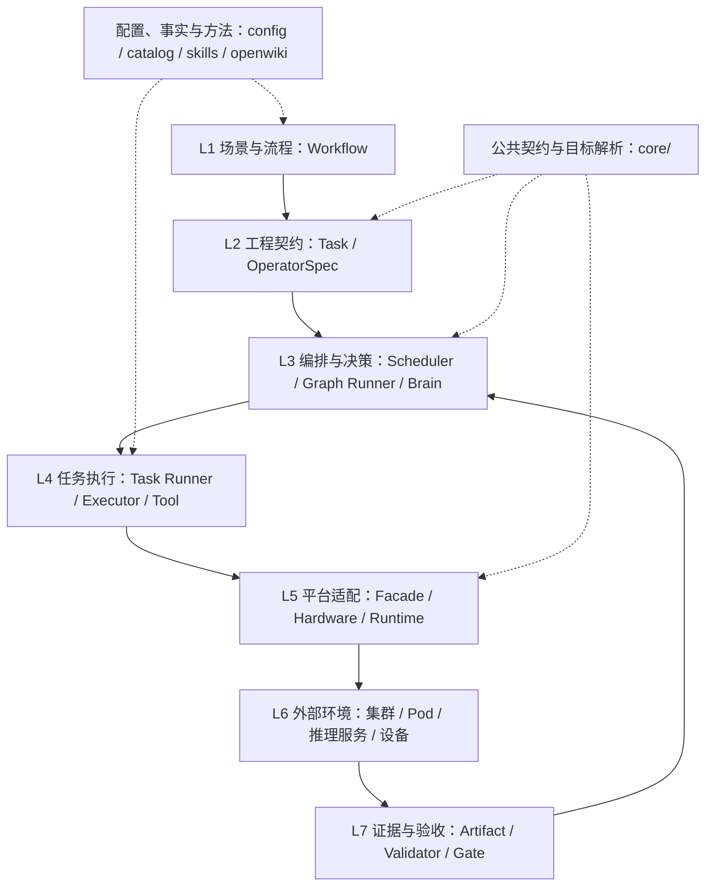
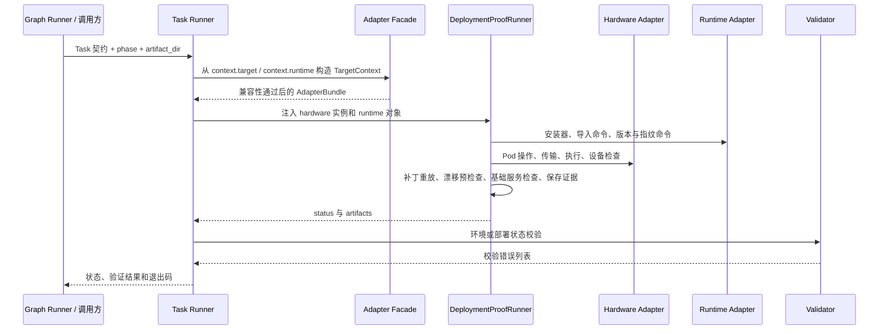

# Infer-Forge 技术实现：抽象层级与职责边界

> 基于提交 `d9f855439132638ae0a39f2b5b5812b4d7852fc7`（2026-09-16，`Add platform-neutral target abstraction`）。
> 本文描述这个代码快照的实现，不代表所有接口都已完成多平台接入，也不是模型适配或硬件验收报告。
> 执行规则以根目录 [AGENTS.md](../../AGENTS.md)、任务契约和实际证据为准。
> 后续可靠性改动已收紧调度门禁、租约和证据复用，并修正性能判定。
> 本文仍保留上述提交的架构快照；最新执行要求参见
> [Worker 结果迁移说明](../migration/worker-results.md)及
> [性能分析指南](../guides/performance-analysis.md)。
> 本文中的源码链接已适配后续目录迁移；当前命令入口、实现目录和依赖约束
> 见[源码归类说明](source-layout.zh-CN.md)。

## 1. 核心设计：固定工程流程，隔离平台差异

Infer-Forge 不是推理引擎，也不负责重新实现模型网络。它是一个**以任务契约、持久化状态和执行证据为核心的工程编排系统**：把环境准备、模型检查、算子适配、诊断、验证和交付组织成可恢复的闭环。

抽象主要解决三个问题：

| 问题 | 抽象方法 | 意义 |
| --- | --- | --- |
| 换硬件或推理框架就要改整套流程 | 用 Target 标识平台组合，用 Adapter 隔离实现 | 尽量复用任务流程，而不是复制一套 P800 流程再改成 B200 |
| Agent 的判断只存在于对话中 | 用 Task、OperatorSpec、事件和产物保存工程状态 | 中断后可以恢复，其他 Agent 可以接手 |
| 命令成功被误认为模型可用 | 把执行、证据和验收分开 | 区分“安装成功”“设备路径正确”“真实服务可用” |

理解系统时，需要区分**纵向职责层级**和**横向平台维度**。Workflow、Task、Runner 是职责层；hardware、engine、backend、plugin 是平台身份维度。两者不能混为一条继承链。

## 2. 总体层级

以下是便于理解的逻辑分层，不是当前 Python 包之间严格、单向的依赖约束。Validator 和证据机制贯穿多层；Runner 既可能调用 Tool，也可能直接通过 Adapter 执行操作。



### L1：场景与流程层 —— 决定“要完成什么，以及先后顺序”

**代码位置：** [workflows/](../../workflows/)、[model_adaptation.yaml](../../workflows/model_adaptation.yaml)。

Workflow 描述任务节点、入口、依赖和成功／失败后的流向，不应该放平台命令。当前模型适配工作流通过 `spec.nodes` 中的 `task`、`on_success`、`on_failure` 表达任务图。

它的意义是把工程流程从脚本中提取出来。例如服务启动失败不是整个流程立即结束，而是进入故障分类和修复路径；内存预算与 API 一致性有各自的任务和判定，不混进部署就绪条件。

**边界：** Workflow 负责路线，不负责张量语义、`kubectl` 参数或服务启动命令。工作流走到 `DELIVERED` 也不必然意味着模型功能全部通过：供应商问题交接同样可以是合法交付。

### L2：工程契约层 —— 决定“具体交付什么，怎样才算完成”

**代码位置：** [tasks/](../../tasks/)、[contracts/task_contract.schema.yaml](../../contracts/task_contract.schema.yaml)、[engine/contracts.py](../../engine/contracts.py)。

这里有两种不同粒度的任务：

| 对象 | 表达内容 | 使用场景 |
| --- | --- | --- |
| YAML Task | `context`、`actions`、`acceptance`、`execution`、`checks`、`artifacts`、退出状态 | 环境证明、模型扫描、服务回归等工程目标 |
| `OperatorSpec` | 输入输出的 shape、dtype、layout、语义、版本、环境和发现证据 | 将确认的算子缺口交给独立实现 Agent |
| `OperatorTask` | 所属 run、operator key、stage、输入输出、状态和租约 token | 算子队列中的一次阶段任务 |
| `BugReport` / `DiagnosticTask` | 原始错误、来源任务、上下文和诊断输入 | 失败后的可追溯处理 |

`OperatorSpec.operator_key` 根据模型／插件版本、backend、环境、输入输出和语义生成哈希。算子任务用 `run_id + operator_key + stage` 标识幂等工作，避免相同上下文下重复派发同一阶段。

**意义：** 把“帮我实现一个算子”变成明确、可验证的交付约束。Worker 不必猜测主 Agent 的意图，也不能用任意 shape 或宽松容差替代实际需求。

**边界：** 契约是要求，不是证据。YAML 符合 Schema 只说明结构合法，不说明环境已准备好或数值结果正确。

### L3：编排与决策层 —— 决定“谁来做、何时做、失败后怎么办”

**代码位置：** [engine/scheduler.py](../../engine/scheduler.py)、[engine/brain.py](../../engine/brain.py)、[engine/recovery.py](../../engine/recovery.py)、[Graph Runner 实现](../../runners/graph_runner.py)；命令入口为 [cli/workflow/graph.py](../../cli/workflow/graph.py)。

当前有两个协作但尚未合并为单一执行器的机制：

| 机制 | 实现职责 | 持久化方式 |
| --- | --- | --- |
| 工作流图执行 | `graph_runner` 解析任务类型、补齐上游事实、生成命令、执行节点、选择后续节点和恢复动作 | Journal、Task Memory、节点产物和日志 |
| 算子生命周期调度 | `TaskScheduler` 创建 run、发现算子、领取任务、阶段推进、失败转诊断 | SQLite `runs`、`operators`、`tasks`、`events` |

`TaskScheduler` 使用事务领取任务，记录 worker、租约和 attempt；过期租约可在后续领取时回收。正常阶段链是 `torch -> xpu -> integration`。某个算子失败会产生诊断任务，而不是要求其他算子停止。

决策通过 `Brain.decide(DecisionRequest) -> Decision` 抽象。`AgentBrain` 通过请求／响应文件对接外部决策者，`RuleBrain` 提供规则决策；`RecoveryController` 在预算内组织决策、动作和重跑。**决策者提出下一步，不直接替代任务结果或验证器。**

**意义：** 将“流程控制”“工程判断”和“实际执行”分离。Agent 可以更换，任务仍能保留身份、原始失败和恢复记录。

**边界：** `engine/` 指编排引擎，不是 Target 中的 `engine: vllm`。当前 Scheduler 的结果门禁主要拒绝显式失败字段，不会替代完整的证据审查；不能把数据库中的 `succeeded` 单独当成功能验收证明。

### L4：任务执行层 —— 决定“怎样把一个契约变成可观察的动作”

**代码位置：** [Task Runner 实现](../../runners/task_runner.py)、[runners/deployment_proof.py](../../runners/deployment_proof.py)、[operations/](../../operations/)、[tools/](../../tools/)；命令入口位于 [cli/](../../cli/)。

Runner 协调一次任务的执行步骤、运行上下文、产物收集及校验。Tool 承担具体动作，例如模型信息采集、漂移扫描、数值比较或补丁应用。

`task_runner` 默认输出计划，只有显式 `--execute` 才进入执行。当前其 `execute()` 接通的是 `deployment_proof`、`environment_proof`、`service_proof` 三种任务，而不是所有 Task 的通用执行插件系统；其他节点大量通过 `graph_runner.NODES` 映射到工具命令。

`DeploymentProofRunner` 负责 Pod 准备或 attach、运行时安装、补丁重放、环境检查、服务检查和证据收集。安装器、导入命令、版本查询、启动命令构造和 fallback 标记等行为已部分移至 Runtime Adapter。

**意义：** 让任务契约与执行细节独立演进，并把长任务、中断、重试产生的结果保存在文件中，而不是只打印到终端。

**边界：** Runner 负责执行，不应自行扩大验收条件，也不能因安装或编译返回 0 就宣称设备路径正确。当前仍有平台专用逻辑留在 Runner 中，不能把这一层描述成已经完全平台无关。

### L5：平台适配层 —— 决定“同一个操作在这个平台上如何实现”

**代码位置：** [core/facade.py](../../core/facade.py)、[adapters/](../../adapters/)、[runtimes/](../../runtimes/)。

平台适配不是一个大接口，而是按变化原因拆分：

| 抽象 | 关注的问题 | 当前实现与边界 |
| --- | --- | --- |
| `HardwareAdapter` | 在哪里执行、如何传输文件、如何观察设备 | Protocol 暴露 `exec`、`copy_into`、`xpu_smi`；`KunlunP800Adapter` 还封装 Kubernetes 操作和资源归属保护 |
| `RuntimeAdapter` | 安装什么软件、如何导入、怎样启动、如何识别 fallback | `VllmKunlunRuntime` 已实现主要运行时命令；实际 Runner 使用的方法多于当前 Protocol 声明 |
| `EngineAdapter` | 通用服务命令与 readiness 语义 | 已声明 `build_serve_command`、`readiness_probe`，尚未成为独立装配的实现层 |
| `PerformanceAdapter` | 如何准备 workload、压测、采集 trace、提取指标 | 已有 Protocol 和消费它的 `PerformanceRunner`，尚无真实平台实现接入该路径 |

`resolve_adapters()` 是新目标解析路径的组合入口，返回 `AdapterBundle(target, hardware, runtime, compatibility)`。其中 `hardware` 是待实例化的类，`runtime` 是加载完成的运行时对象。部署入口再用集群配置实例化硬件适配器，并注入 Runner。

**意义：** 上层任务表达工程意图，适配器集中承担厂商、引擎和集群差异。例如 Kunlun 的设备路径通过 `torch.cuda` API 暴露，日志包含 CUDA 名称不等于回退到其他设备；这种判断由运行时实现提供，不能放进通用门禁作为全平台规则。

**当前边界：** 硬件与集群仍合并在 `KunlunP800Adapter`；engine、backend、plugin 的行为仍组合在 `VllmKunlunRuntime`，尚未各自拆成独立 Adapter。Facade 是新路径的集中入口，不代表旧工具已全部禁止直接调用 registry 或默认 runtime。

### L6：外部运行环境层 —— 提供“真实执行发生在哪里”的事实

**代码位置：** [config/clusters/](../../config/clusters/)、[config/profiles/](../../config/profiles/)、[config/manifests/](../../config/manifests/)、[tools/patches/](../../tools/patches/)。

这里包含配置所指向的集群、Pod、设备、运行时安装、固定代码 worktree 和模型服务。配置文件留在仓库，运行状态与日志等证据留在仓库外的 artifact root；凭据和模型权重不进入 Git。

环境证明把 Pod、代码、可导入运行时、设备以及基础模型服务检查绑定到 run。后续运行时扫描、toy bring-up 和算子任务复用这个准备好的 Pod；换一个临时 Pod 不能自动继承原有证明。

修复运行时必须有仓库内可幂等重放的补丁。部署证明会在安装／attach 路径应用补丁，并执行漂移预检查，防止修复只存在于某个 Pod 的 site-packages 中。

**意义：** 让结果可复现，避免把“某次手工调通的环境”误认为可交付的软件能力。

### L7：证据与验收层 —— 决定“哪些结论有资格被宣称”

**代码位置：** [validators/](../../validators/)、[runners/evidence.py](../../runners/evidence.py)、[engine/state/journal.py](../../engine/state/journal.py)、[engine/state/task_memory.py](../../engine/state/task_memory.py)。

这是横切层，而不是执行结束后才追加的总结：

| 对象／机制 | 职责 |
| --- | --- |
| 原始 Artifact | 保存命令输出、错误栈、环境指纹、数值结果、服务响应或设备路径记录 |
| 状态与报告 | 用机器可读字段关联结论、失败原因和证据 |
| Validator | 独立检查契约要求，返回缺失项或不满足条件的原因 |
| `GateResult` | 统一表达门禁名、verdict、reason 和 evidence 引用 |
| Journal / Task Memory | 记录可复用事实、环境上下文、当前进度与下一步 |
| Watch / 崩溃日志归档 | 保存长任务心跳和失败现场，避免重跑覆盖原始证据 |

**意义：** 把“做过某件事”与“证明某件事正确”分开。PyTorch 参考正确、设备实现正确、真实模型 dispatch 正确、服务回归正确是不同证据门槛。

**边界：** 独立验证是执行协议要求，单独定义一个 Validator 函数并不自动保证生产者与验证者身份独立。产物路径存在、结果含有 `PASS` 字样，也不足以替代对应验证过程。

## 3. 四个正交平台维度

当前 [core/contracts.py](../../core/contracts.py) 中的实际结构为：

```text
TargetContext
  model
  hardware
  engine
  backend
  plugin          # 可选
  revisions

RunContext
  target
  artifact_root
  workload        # 可选
  environment_fingerprint  # 可选
```

| 维度 | 含义 | 示例 | 为什么不能省略 |
| --- | --- | --- | --- |
| hardware | 目标加速器型号 | `kunlun/p800`、`nvidia/b200` | 同类后端在不同设备上仍可能有资源或算子约束 |
| engine | 推理框架 | `vllm`、`sglang` | 模型注册、调度、服务启动和内部 API 不同 |
| backend | 引擎使用的计算后端 | `kunlun`、`cuda` | 同一引擎可能有多条设备执行路径 |
| plugin | 为特定栈补充适配能力的软件包 | `vllm-kunlun`、`sglang-kunlun`、`null` | 软件包存在与否及版本不同，会影响算子和引擎兼容性 |

`model` 是任务对象，`revisions` 固定版本身份，二者不是额外平台层。集群 namespace、Pod、服务端口不属于 `TargetContext`，由部署契约和运行上下文承载。

“模型适配”“性能分析”是工程场景，当前示例中的 `capability` 字段也不属于 `TargetContext`。它还应与 `Capability(name, status, constraints, evidence)` 区分：后者是描述一项能力声明的公共数据结构，不是 workflow 路由器。

公共层还定义 `ResourceSnapshot`、`Workload`、`Metric`、`Artifact` 等结构，目的是统一跨场景的数据语言。**有公共类型不等于所有旧路径已经迁移到这些类型**；当前仍有大量字典、JSON 和专用报告。

## 4. 目标解析和兼容性门禁

以 [p800-vllm-kunlun.yaml](../../config/examples/p800-vllm-kunlun.yaml) 为例：

```yaml
target:
  model: <model-id>
  hardware: kunlun/p800
  runtime:
    engine: vllm
    backend: kunlun
    plugin: vllm-kunlun
capability: model_adaptation
```

解析过程如下：

```text
YAML
  -> load_target / target_from_mapping
  -> 规范化 hardware 别名
  -> TargetContext
  -> compatibility/matrix.yaml 精确匹配四个平台字段
  -> resolve_adapters
  -> hardware registry + runtime registry
  -> AdapterBundle
```

`p800`、`kunlun-p800`、`Kunlunxin-3-P800` 在边界归一化为 `kunlun/p800`。兼容性不能由“目录存在”或“可以 import”推断。

当前 [compatibility/matrix.yaml](../../compatibility/matrix.yaml) 的声明是：

| hardware | engine | backend | plugin | 状态 |
| --- | --- | --- | --- | --- |
| `kunlun/p800` | `vllm` | `kunlun` | `vllm-kunlun` | `supported` |
| `kunlun/p800` | `sglang` | `kunlun` | `sglang-kunlun` | `planned` |
| `nvidia/b200` | `sglang` | `cuda` | 无 | `planned` |
| `nvidia/b200` | `vllm` | `cuda` | 无 | `unsupported` |
| 未列出的组合 | — | — | — | `unknown` |

`supported` 允许进入执行，不代表具体模型已经通过验收；`planned` 是计划接入但禁止执行；`unsupported` 是明确不支持；`unknown` 是未声明。

`require_supported()` 和 `resolve_adapters(..., require_supported=True)` 提供严格门禁。后者是部署任务使用的入口。Runtime registry 还要求 catalog 中有声明且实现 loader 已注册，不会把未实现 runtime 静默换成默认栈。

`graph_runner --target` 会在加载任务图前解析组合并检查状态，但当前只将目标字段加入 environment，上下文还没有完整传播到每条子命令和部署契约。未传 `--target` 时保留旧行为。此外，非严格 `resolve_adapters()` 仍尝试查找硬件；对没有注册硬件的目标，可能先抛出“未注册 adapter”的错误，而不是返回兼容性状态供调用方展示。

因此，**当前 `--target` 是前置门禁接入，不是已完成的端到端多平台路由**。

## 5. 一条实际调用链：从部署任务到环境证明



在算子调度入口 [cli/adaptation.py](../../cli/adaptation.py) 中，Main Agent 创建或恢复同一个 `AdaptationRun`，执行／导入环境证明后通过 `bind_environment` 绑定。该入口创建的 run 默认要求环境门禁，未绑定时不能发现算子。

绑定检查包括 Pod、runtime、代码、设备、基础模型 prefill／decode，以及 `environment_fingerprint.txt`、`runtime_import.txt`、`code_readiness.json`、`device_readiness.json` 和基础服务相关产物。后续才进入缺口发现、`OperatorSpec` 和 Worker 阶段。

这里的环境证明与目标模型服务证明要分开：基础模型证明部署底座能工作，不等于目标模型已经正确。模型工作流可以先做不占 XPU 的身份 intake；真正的运行时调查必须复用环境证明留下的 Pod。

## 6. 配置、事实、方法与知识为什么分开

| 目录 | 回答的问题 | 不应承担的职责 |
| --- | --- | --- |
| `config/` | 这次计划用什么集群、运行时路径、部署模板和参数 | 不能证明这些配置已经执行成功 |
| `compatibility/` | 哪个平台组合允许执行 | 不替代模型级支持验收 |
| `catalog/` | 已登记哪些工具、runtime、skill、设备事实和模型支持证据 | 不因名称注册就推断实现可用 |
| `skills/` | 某类任务如何调查、决策、验证和退出 | 不取代 Task 的明确输入输出 |
| `openwiki/` | 上游架构、插件机制与工程经验是什么 | 不覆盖任务契约，也不充当本次执行证据 |

例如，`catalog/runtime_catalog.yaml` 加载资格、`compatibility/matrix.yaml` 平台组合门禁、`catalog/support_matrix.yaml` 模型支持结论是三个不同层面的事实，不能合并为一个“支持／不支持”布尔值。

## 7. 当前完成度与后续扩展边界

本次版本的主要成果是**显式目标模型、兼容性门禁和部署链路的部分依赖注入**，不是已经完成所有平台行为解耦。

| 范围 | 当前状态 |
| --- | --- |
| Target 类型、别名归一化、兼容性矩阵 | 已实现 |
| Facade、硬件 registry、runtime registry | 已实现；实际可执行组合为 P800 + vLLM-Kunlun |
| 部署入口注入 runtime、运行时命令下沉 | 已接入；P800 配置、部分安装／检查逻辑仍留在入口和 Runner |
| 通用 Core 与旧实现的关系 | `core/` 提供公共契约与解析；`engine/` 保留持久调度；Journal、Memory 等仍在旧位置 |
| 独立 Engine Adapter、硬件与集群拆分 | 尚未完整接线 |
| SGLang-Kunlun、B200 + SGLang | 矩阵中为 `planned`，尚无对应可执行适配器组合 |
| 性能流程 | 有公共类型、`PerformanceAdapter` 和 `PerformanceRunner` 原语，不能视为真实硬件性能链路完成 |

[PerformanceRunner](../../runners/performance_runner.py) 当前调用 `prepare_workload -> run_benchmark -> collect_trace -> extract_metrics -> compare_metrics`，返回指标、产物引用和门禁字典。它会创建产物目录，但本身没有把完整报告写入持久化任务系统；无 baseline 时门禁可以是 `UNKNOWN`，外层仍可返回 `PASS`，不能解释为性能达标。

[performance_analysis.yaml](../../workflows/performance_analysis.yaml) 目前采用顶层 `stages` 声明；现有 Graph Runner 读取的是 `spec.nodes`，也没有为这些性能阶段接好全部执行映射。因此它是流程骨架，不是可以直接替换模型工作流运行的完整任务图。功能就绪和性能优化仍须分开验收。

后续扩展应按以下顺序选择改动位置：

1. **只改变参数，先改配置。** 不同环境路径、服务参数不应复制 Runner。
2. **已有实现能够组合，扩展 registry／组合关系。** 同时声明准确的平台兼容性。
3. **出现新的平台行为，增加 Adapter。** 隔离设备、集群、运行时或 profiler 的变化。
4. **出现新的工程目标，增加 Task、Tool 和 Validator。** 需要新顺序时再调整 Workflow。
5. **只有真正跨平台的概念才进入 Core。** 不向 Core 加入厂商专属命令分支。

接入新平台不能只把矩阵改成 `supported`：还需要实现、能力声明、目标环境证据、独立验证和干净环境重放，才能形成可靠支持。对于模型适配，应先复用引擎或插件已注册的模型网络；剩余算子缺口进入 `OperatorSpec` 链路，而不是为每个模型另造一个网络实现。

## 8. 按职责定位代码

| 想理解或修改的内容 | 优先阅读 |
| --- | --- |
| 平台目标和公共数据结构 | [core/contracts.py](../../core/contracts.py)、[core/target.py](../../core/target.py) |
| 目标如何选到实现 | [core/facade.py](../../core/facade.py)、[adapters/__init__.py](../../adapters/__init__.py)、[runtimes/registry.py](../../runtimes/registry.py) |
| 多阶段任务和断点恢复 | [engine/scheduler.py](../../engine/scheduler.py)、[Graph Runner](../../runners/graph_runner.py) |
| 部署的真实执行链路 | [Task Runner](../../runners/task_runner.py)、[runners/deployment_proof.py](../../runners/deployment_proof.py) |
| 平台专属行为 | [adapters/kunlun_p800/adapter.py](../../adapters/kunlun_p800/adapter.py)、[runtimes/vllm_kunlun.py](../../runtimes/vllm_kunlun.py) |
| 验收条件 | [validators/deployment_validator.py](../../validators/deployment_validator.py)、[validators/operator_lifecycle_validator.py](../../validators/operator_lifecycle_validator.py)、[tasks/](../../tasks/) |
| 性能扩展接口 | [runners/performance_runner.py](../../runners/performance_runner.py)、[core/performance.py](../../core/performance.py) |

这一架构的核心不是层数，而是职责边界：**Workflow 管路线，Task 管交付，Scheduler 管状态，Runner／Tool 管执行，Adapter 管平台差异，Validator 管结论资格，证据把它们连接成可恢复的工程闭环。**
