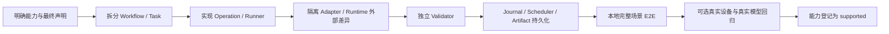
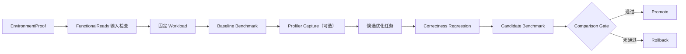

# 接入新的工程流程

本文说明如何把一个新的推理工程流程接入 Infer-Forge Harness。适用场景包括：

- 把已有 Shell、Python、Kubernetes 或人工操作流程迁移进来；
- 新增模型性能优化、上下文长度评估、显存优化等能力；
- 在现有模型适配流程中增加一个有独立验收条件的新阶段；
- 为新的 Agent 协作任务增加持久化调度、失败诊断和恢复。

如果待迁移资产是一个把目标、执行脚本和经验混在一起的旧 Skill，请先阅读
[旧 Skill 迁移指南](migrate-legacy-skill.zh-CN.md)，完成职责拆分后再按本文
接入 Workflow。

模型适配是当前第一套完整模板：

- 生产工作流：[`workflows/model_adaptation.yaml`](../../workflows/model_adaptation.yaml)
- 本地场景契约：[`tests/e2e/scenarios/model_adaptation.yaml`](../../tests/e2e/scenarios/model_adaptation.yaml)
- 场景实现：[`tests/e2e/test_model_adaptation.py`](../../tests/e2e/test_model_adaptation.py)
- Graph/Scheduler 衔接：[`engine/graph_bridge.py`](../../engine/graph_bridge.py)

## 1. 接入目标

接入 Harness 不是把脚本移动到仓库里，而是把隐式流程转换成以下闭环：



完成接入以后，另一个 Agent 应该只依赖版本化契约和持久化证据就能继续工作，不需要读取原作者的聊天记录，也不需要猜测上一次执行到哪里。

## 2. 先判断需要接入哪一层

| 变化 | 应修改的主要层 | 不应该做什么 |
| --- | --- | --- |
| 增加一个完整能力，例如性能优化 | `workflows/`、多个 `tasks/`、场景 E2E | 复制模型适配工作流并改几个名字 |
| 在现有流程中增加一个验收阶段 | Workflow 节点、Task、Operation、Validator | 把判定直接写进 Graph Runner |
| 增加一个确定性命令 | `cli/` + `operations/` | 在 `tools/` 根目录新增 Host 脚本 |
| 增加复杂执行序列或恢复循环 | `runners/` | 在 CLI 中堆积状态机 |
| 增加并行、异步 Agent 工作 | `engine/` Scheduler 和 Bridge | 用文件名或内存队列模拟持久化任务 |
| 增加硬件行为 | `adapters/` | 在 Task 或 Validator 中直接执行 `kubectl` |
| 增加推理框架或插件行为 | `runtimes/` | 把 vLLM/SGLang 差异散落到通用 Runner |
| 增加是否通过的规则 | `validators/` | 用退出码 0 或 Agent 文本作为 PASS |
| 增加方法和经验 | `skills/`、`catalog/skill_catalog.yaml` | 把工程经验硬编码成模型名称分支 |
| 增加平台组合 | `compatibility/matrix.yaml` | 没有真实证据就标记 `supported` |

源码责任边界以[源码归类说明](../architecture/source-layout.zh-CN.md)为准。

## 3. 在编码前定义能力合同

先写清楚下面这些内容。任何无法确定的字段都应成为诊断或 `BLOCKED`，不能在实现时猜测。

| 问题 | 示例 |
| --- | --- |
| 能力 ID 是什么？ | `performance_optimization` |
| 输入事实是什么？ | 已通过功能验收的模型、固定 workload、基线 revision |
| 最终能声明什么？ | 相同正确性条件下，候选吞吐提升且延迟未越界 |
| 明确不能声明什么？ | 一次 profiler 运行不等于性能提升 |
| 哪些步骤可本地模拟？ | workload 生成、报告解析、比较和 promote/rollback 决策 |
| 哪些步骤必须真实执行？ | 设备 benchmark、真实服务正确性回归 |
| 哪些身份必须固定？ | 模型、plugin、镜像、硬件、并行度、输入输出长度、并发、seed |
| 失败后怎么恢复？ | 重试、回滚候选、重新采样、诊断或阻塞 |
| 最终证据有哪些？ | baseline、candidate、correctness、comparison、promotion receipt |

建议先在设计说明或 Task 契约中写一句不可歧义的完成定义：

> 在相同模型、环境和固定 workload 下，候选通过正确性回归，性能指标满足门限，并生成带输入身份和证据哈希的 promotion receipt。

如果这句话不能写清楚，流程还不适合开始实现。

## 4. 把现有流程拆成任务图

### 4.1 拆分原则

每个 Task 应当：

- 只有一个可独立验收的目标；
- 明确消费哪些上游事实，产出哪一种事实；
- 有自己的状态文件和 Validator；
- 失败时留下足够诊断的信息；
- 可以单独重试，不覆盖上一次 attempt；
- 不把下一节点的业务逻辑藏在脚本里。

不要按“原脚本有几个文件”拆任务，应按**证据边界**拆分。例如性能流程可以拆成：



Profiler 是诊断输入，不是性能通过条件；正确性回归必须先于性能晋升。

### 4.2 Workflow 只表达拓扑

在 `workflows/<capability>.yaml` 中声明节点和边：

```yaml
api_version: infer.kunlun/v1alpha1
kind: Workflow
metadata:
  name: example_capability
  regression_scenario: tests/e2e/scenarios/example_capability.yaml
spec:
  description: Evidence-backed example capability.
  entry_task: ex-001-intake
  nodes:
    - id: ex-001-intake
      task: tasks/ex-001-intake/task.yaml
      on_success: ex-002-execute
      on_failure: ex-900-diagnosis
    - id: ex-002-execute
      task: tasks/ex-002-execute/task.yaml
      on_success: ex-003-validate
      on_failure: ex-900-diagnosis
    - id: ex-003-validate
      task: tasks/ex-003-validate/task.yaml
      on_success: DELIVERED
      on_failure: ex-900-diagnosis
```

Workflow 不放 shell 命令、张量语义、平台地址或 PASS 规则。它只表达流程顺序和失败路由。

当前 Graph Runner 读取 `spec.nodes`。使用其他顶层结构的 YAML 只是流程草案，不能声称已经接入可执行 Graph。

## 5. 为每个节点定义 Task

在 `tasks/<task-id>/task.yaml` 中定义工程契约：

```yaml
api_version: infer.kunlun/v1alpha1
kind: Task
metadata:
  name: ex-002-execute
  family: example_capability
  task_type: example_execute
  version: 0.1.0
spec:
  question: does the candidate execute the declared workload
  consumes: [ExampleInput, EnvironmentProof]
  produces: ExampleExecution
context:
  model: {}
  target:
    hardware: Kunlunxin-3-P800
execution:
  mode: execute
  scope: prepared_environment
actions:
  - load_declared_inputs
  - execute_candidate
  - collect_raw_evidence
checks:
  identity:
    require_model_revision: true
    require_environment_fingerprint: true
acceptance:
  required_fields: [state, inputs, outputs, environment]
  evidence_required: true
artifacts:
  directory: ${ARTIFACT_DIR}
  files:
    - execution.json
    - execution_status.json
validator: <validator-module>:validate_example
exit_states:
  pass: EXECUTION_READY
  blocked: BLOCKED
  invalid: CONTRACT_INVALID
```

注意：

- `task_type` 是执行器和 Skill 解析的稳定键；
- `produces` 是 Journal 中的事实类型，应保持语义清晰；
- `exit_states` 必须与实际状态文件及 Graph 成功状态一致；
- `acceptance` 只写可观察、可验证的条件；
- 当前通用 Task Schema 仍带有 Kunlun 历史命名。跨平台流程如果不满足现有 Schema，应该先演进 Schema 和迁移说明，而不是绕过校验。

## 6. 实现 CLI、Operation 与 Runner

### 6.1 简单确定性任务

建议结构：

```text
cli/<capability>/                   参数解析、外部输出目录保护
operations/<capability>/            读取输入、执行任务、写原始结果
validators/<capability>/            独立读取结果并判定
```

CLI 只负责：

- 解析参数；
- 调用 `core.storage` 约束输出路径；
- 委托给 `execute(args)`；
- 返回明确退出码。

Operation 负责业务动作，但不能自己给自己做独立认证。Validator 必须能够只根据契约和落盘证据重新判定。

### 6.2 多步状态机

如果任务内部包含轮询、恢复、多个原子动作或长时间心跳，将序列放到 `runners/`。不要让 CLI 或 Workflow 同时承担执行状态机。

### 6.3 注册 Graph 执行器

当前 Graph Runner 通过 `runners/graph_runner.py` 的 `NODES` 映射 `task_type`：

```python
"example_execute": {
    "produces": "ExampleExecution",
    "needs": {
        "--input": "fact:ExampleInput:input.json",
        "--env-status": "fact:EnvironmentProof:status.json",
    },
    "command": [
        "python3", "<CLI_ENTRY>",
        "--out", "{artifacts}",
    ],
    "state_file": "execution_status.json",
},
```

同时需要：

- 将真实通过状态加入 Graph 可接受状态；
- 确保 `state_file` 与 Task/Operation 一致；
- 为 `needs` 声明的每个事实提供上游节点；
- 对动态 fan-out 使用节点自己的 list/aggregate 命令，不能由 Graph 猜测子任务；
- 为命令解析、缺失事实、状态不匹配和失败边增加测试。

如果没有注册执行器，Graph 必须停止并返回 `NO_EXECUTOR`，不能跳过节点继续。

## 7. 判断是否需要持久化 Scheduler

不是所有 Task 都要进入 SQLite Scheduler。顺序、短时、由 Graph 直接执行的节点通常只需要 Journal 和 Task Memory。

以下情况应使用 Scheduler：

- 多个 Agent 可并行处理独立任务；
- 任务可能跨进程、跨会话或长时间等待；
- 需要领取、租约、续租和过期回收；
- 失败必须产生持久化 diagnosis；
- 后续阶段只能在前序证据通过后创建；
- 最终交付必须重新验证所有分支。

典型阶段链：

```text
discover durable work
  -> claim with lease
  -> write evidence inside current attempt/output
  -> independent validation
  -> complete or fail
  -> create successor or diagnosis
```

### 7.1 Graph 与 Scheduler 的 Bridge

Bridge 的职责是：

- 校验 Graph 和 Scheduler 是否属于同一个 run、模型、环境及 artifact root；
- 把 Graph 发现的完整任务契约转换成幂等持久化任务；
- 在等待任务时返回明确状态，而不是把“已派发”当“已完成”；
- 在最终交付前重新验证 live DB 状态和落盘证据；
- 原子地发布最终 receipt，避免新任务在最终检查和发布之间插入。

模型适配使用 `GraphSchedulerBridge`。新流程如果复用相同的算子阶段，可以扩展共享 Bridge；如果任务生命周期不同，应在 `engine/` 增加面向该能力的 Bridge 或通用抽象。

禁止：

- 从 Graph 或测试直接修改 SQLite；
- 为了让流程继续而预写 `succeeded`；
- 用普通 JSON 请求文件代替 Scheduler 任务；
- 只查看缓存的 Journal 状态，不重新检查 live Scheduler；
- 在最终检查和 receipt 发布之间留下并发窗口。

## 8. 隔离外部边界

以下行为属于外部边界：

| 外部变化 | 接入位置 |
| --- | --- |
| Kubernetes、Pod exec、文件传输、设备观察 | `adapters/<hardware>/` |
| vLLM/SGLang 安装、启动、fallback 特征 | `runtimes/<runtime>/` |
| benchmark 或 profiler 提供者 | 对应 workload/performance adapter |
| 外部 Agent 决策或实现 | 文件/API/worker 协议边界 |
| 远端 revision 查询 | 可替换的 source-resolution 边界 |

本地 E2E 应替换这些边界，但保留真实的：

- CLI 参数解析；
- 生产 Workflow；
- Operation 和 Runner；
- Validator；
- Scheduler 状态转换和租约；
- Journal、Task Memory；
- ArtifactStore 和 manifest。

外部替身必须：

- 只在显式测试环境变量下启用；
- 对未知命令、网络访问和进程调用 fail closed；
- 生成原始观察结果，不直接写内部 Task 的 PASS 状态；
- 明确标记 `evidence_mode: simulation`；
- 不复用真实凭据或连接共享集群。

参考实现见 [`tests/e2e/external.py`](../../tests/e2e/external.py) 和 [`tests/e2e/bootstrap/sitecustomize.py`](../../tests/e2e/bootstrap/sitecustomize.py)。

## 9. 设计独立证据门禁

每个结果至少应绑定：

- run、task、stage 和 attempt 身份；
- model/plugin revision；
- environment fingerprint；
- `real` 或 `simulation` 证据模式；
- 每个正式证据文件的 SHA-256；
- 非空、具名且全部通过的检查；
- 与生产者不同的 validator 标识；
- 原始错误和可复现上下文。

常见错误：

| 错误做法 | 正确做法 |
| --- | --- |
| 命令返回 0 就进入成功边 | 读取状态文件并运行 Validator |
| Agent 返回 `{"status": "PASS"}` | 检查完整 result envelope 和证据哈希 |
| 编译成功就声明设备算子可用 | 增加 device test、dispatch proof 和独立数值验证 |
| 服务能回答就声明适配完成 | 检查所有持久化任务，再重新运行服务和精度回归 |
| 用旧 baseline 证明新候选 | baseline 用于比较，最终服务/精度必须重新执行 |
| 一次 benchmark 更快就 promote | 固定 workload、正确性回归、统计比较和 rollback |

## 10. 使用统一运行目录

所有运行状态都必须位于源码目录之外：

```text
<external-root>/runs/<run-id>/
  run.json
  journal.jsonl
  task_memory.json
  tasks/<task-id>/attempts/000001/
    input/
    scratch/
    output/
    logs/
    manifest.json
```

使用 `core.storage.RunPaths` 分配 run 和 attempt，使用 `ArtifactStore` 写入和登记正式产物。

- `input/`：不可变任务快照和复制的输入；
- `scratch/`：临时调查，不进入正式 inventory；
- `output/`：当前 attempt 的正式候选证据；
- `logs/`：命令、watch、stderr 和 crash 记录。

重试必须分配新 attempt。不能覆盖旧结果，也不能让新任务引用前一个 attempt 的 worker 输出。

## 11. 为能力注册完整场景

每个可支持能力都必须在 `tests/e2e/scenarios/` 下注册本地场景：

```yaml
schema_version: 1
capability: example_capability
workflow: workflows/example_capability.yaml
entrypoint: cli/workflow/graph.py
tiers:
  local:
    required: true
    evidence_mode: simulation
    test: tests/e2e/test_example_capability.py
    cases:
      - test_example_delivers
      - test_invalid_evidence_is_rejected
      - test_restart_resumes_same_run
    real_components:
      - cli
      - workflow
      - operations
      - validators
      - scheduler
      - journal
      - task_memory
      - artifact_store
    simulated_boundaries:
      - cluster_adapter
      - external_agents
    proves: orchestration_and_persistence
    does_not_prove:
      - real_device_correctness
  device_smoke:
    required: false
    evidence_mode: real
    marker: device_smoke
    authorization: EXAMPLE_RUN_DEVICE_SMOKE
  real_model:
    required: false
    evidence_mode: real
    marker: real_model
    authorization: EXAMPLE_RUN_REAL_MODEL
```

本地场景至少覆盖：

1. 正常完成：Graph、DB、证据、manifest 和 receipt 一致；
2. 拒绝路径：缺失证据、错误身份或坏输出不能得到成功；
3. 重启恢复：新进程恢复同一个 run，不重复任务，不覆盖 attempt；
4. 源码写入：执行前后源码文件内容一致；
5. 模拟隔离：simulation 证据不能导入 real run。

如果流程包含 promote/rollback、并发任务或最终回归，还要覆盖对应的竞态和旧证据拒绝。

禁止通过以下方式让 E2E 通过：

- 替换 Validator 为固定成功函数；
- 使用缩短后的测试专用 Workflow 代替生产拓扑；
- 预先写入最终 PASS 报告；
- 直接编辑 Scheduler 数据库；
- 在测试中跳过最关键的 Graph/Scheduler 交界。

## 12. 将旧流程迁移进来

先做资产映射：

| 旧资产 | Harness 中的归属 |
| --- | --- |
| 顺序 Shell 脚本 | 多个 Task + Workflow |
| 一个确定性 Python 工具 | `cli/` + `operations/` |
| Kubernetes YAML | deployment contract / manifest |
| 手写启动参数 | deployment plan 或 Runtime Adapter |
| 人工查看日志判断成功 | 原始 artifact + Validator |
| 人工选择下一步 | Brain Decision 或显式失败边 |
| 临时补丁 | `tools/patches/` 下幂等、可重放 patch |
| 本地结果目录 | 外部 RunPaths / attempt |
| 多人领取任务表格 | Scheduler task + lease |
| 目标、脚本、经验混合的旧 Skill | 先按[旧 Skill 迁移指南](migrate-legacy-skill.zh-CN.md)拆分，再接入 Workflow |

推荐迁移顺序：

1. 保留旧流程作为 golden reference；
2. 先定义输入、输出、环境身份和最终声明；
3. 一次迁移一个可独立验证的 Task；
4. 对相同输入并行运行旧流程和新 Task；
5. 比较原始证据和 Validator 结果；
6. 完成本地完整场景后再移除旧入口；
7. 真实环境通过后再把能力或平台改成 `supported`。

不要在迁移过程中把模型权重、凭据、私有地址、原始流量或大型 trace 提交到仓库。

## 13. 示例：接入上下文长度评估与优化

可以按以下任务拆分：

```text
environment proof
  -> functional-ready input
  -> model/config context declaration
  -> fixed prompt-length matrix
  -> capacity probe
  -> boundary search
  -> long-context correctness
  -> candidate memory/config change
  -> correctness regression
  -> capacity regression
  -> promote or rollback
```

关键门禁：

- 区分“配置声明的最大长度”和“实际可正确服务的长度”；
- 记录输入长度、输出长度、并发、KV dtype、block size、并行度和显存预算；
- boundary search 的超时、OOM 和错误输出是不同结果；
- 候选修改后必须重新执行短上下文和长上下文正确性；
- 不能只根据一次成功请求推导稳定容量；
- 本地 E2E 可以模拟容量边界，但最终只能得到 simulation verdict。

## 14. 接入完成检查表

### 设计

- [ ] 能力 ID、输入事实、最终声明和不声明内容明确
- [ ] 功能阶段与性能阶段分开
- [ ] 环境、模型、插件和 workload 身份可持久化
- [ ] 每个失败都有诊断或明确 `BLOCKED`

### 实现

- [ ] Workflow 使用 `spec.nodes` 且所有边有效
- [ ] 每个节点有 Task、Operation/Runner、状态文件和 Validator
- [ ] 新 `task_type` 已注册 Graph 执行器和 Skill
- [ ] 工具命令已登记 `catalog/tool_catalog.yaml`
- [ ] 外部行为只通过 Adapter/Runtime/Provider
- [ ] 运行输出使用 RunPaths 和独立 attempt
- [ ] 异步任务使用 Scheduler，不直接修改数据库

### 证据

- [ ] PASS 不依赖退出码或 Agent 文本
- [ ] 证据绑定 run/task/attempt/revision/environment
- [ ] 文件哈希和独立验证报告完整
- [ ] simulation 和 real 不能互相提升
- [ ] 最终 receipt 在 live 状态复查后原子发布

### 回归

- [ ] 本地完整 E2E 使用生产 Workflow
- [ ] 覆盖成功、拒绝和进程恢复
- [ ] 外部替身 fail closed
- [ ] 执行不会写入源码目录
- [ ] 可选真实层级必须显式授权
- [ ] 文档和兼容性状态已更新

## 15. 验证命令

```bash
python -m pip install -e '.[test]'

python cli/maintenance/check_repo_references.py
python -m pytest -q -m local_e2e tests/e2e
```

根据改动范围再运行对应 unit/integration 测试。真实设备测试不能作为普通本地命令执行，必须提供明确的环境配置和授权变量。

完成上述步骤后，新流程才算真正接入 Harness；只有 Workflow YAML、脚本入口或一份成功 JSON 都不构成可支持能力。
