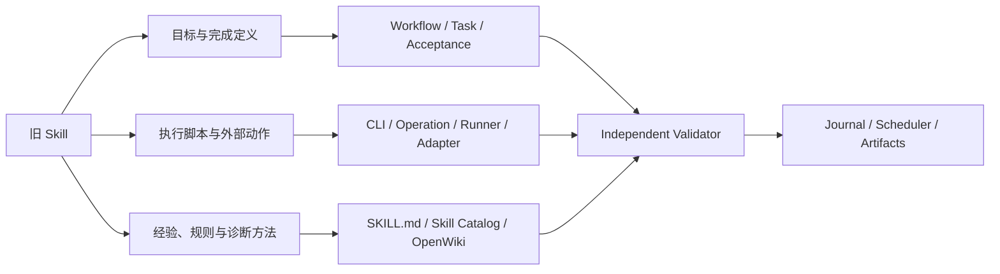

# 迁移旧 Skill

本文说明如何把一个同时包含目标、执行脚本和工程经验的旧 Skill
迁移到 Infer-Forge Harness。

适用的旧资产通常类似：

```text
legacy-skill/
  SKILL.md             目标、步骤、经验和成功判断混在一起
  scripts/             Shell 或 Python 执行脚本
  templates/           命令、配置或报告模板
  notes.md             历史问题和处理经验
  examples/            某次成功运行留下的输出
```

迁移的目标不是保持原目录形状，而是保留其有效能力，同时把不同责任放入
可调度、可验证和可恢复的 Harness 层级。

## 1. 核心建议

不要把旧 Skill 当成一个可以直接执行的黑盒。先把内容拆成三条独立链路：



三条链路必须在 Task 和 Validator 处重新汇合：

- **目标**决定 Task 要回答什么问题、消费和产出什么事实；
- **脚本**只负责执行动作和产生原始证据；
- **经验**帮助 Agent 选择方法、实验和失败分支；
- **Validator**独立判断证据是否满足目标；
- **Graph/Scheduler**决定下一步，而不是由 Skill 文本或脚本私自跳转。

这可以避免旧 Skill 中最常见的问题：脚本自己执行、自己解释结果、自己宣布
成功，且失败后没有可恢复状态。

## 2. 先做资产盘点，不要先复制文件

为旧 Skill 建立迁移清单。每一项至少记录：

| 字段 | 说明 |
| --- | --- |
| 来源版本 | Git revision、发布版本或不可变归档哈希 |
| 原始用途 | 旧 Skill 声称解决的问题 |
| 输入 | 参数、环境变量、配置、模型和上游文件 |
| 输出 | 文件、日志、环境修改和远端资源 |
| 副作用 | 只读、写 artifact、写 Pod、写集群或修改源码 |
| 成功判断 | 当前由谁、根据什么证据判断 |
| 失败模式 | 已知异常、重试条件、人工判断点 |
| 敏感内容 | 凭据、私有地址、模型权重或真实流量 |
| 可复现性 | 是否固定版本、seed、环境和依赖 |

原始 Skill 可以保留在原仓库或外部只读归档中作为 golden reference。
不要为了迁移把整个旧目录复制进 Harness，也不要把凭据、权重、私有地址、
原始流量或大型 trace 带入本仓库。

## 3. 使用归属矩阵拆分内容

| 旧 Skill 内容 | Harness 归属 | 迁移规则 |
| --- | --- | --- |
| 总体目标、完成定义 | `workflows/` 和一个或多个 `tasks/` | 按证据边界拆分，不按旧文件数量拆分 |
| 输入、输出、验收条件 | Task contract | 未知字段保留为未知并进入诊断，不能猜测 |
| 顺序执行步骤 | `operations/` | 只实现确定性业务动作 |
| 参数解析和宿主机入口 | `cli/` | 只做解析、路径保护和委托 |
| 长循环、轮询、恢复序列 | `runners/` | 不把状态机堆进 CLI |
| 集群、设备操作 | `adapters/` | Task 和 Skill 不直接散落厂商命令 |
| 推理框架、插件操作 | `runtimes/` | 通过 Runtime 边界封装 |
| 可传入 Pod 的独立探针 | `tools/probe/` | 不承担宿主机编排 |
| 运行时修复 | `tools/patches/` | 必须幂等、可重放并验证已应用状态 |
| Torch 参考实现 | `tools/torch/` | 只作为独立参考，不冒充设备实现 |
| 可执行命令清单 | `catalog/tool_catalog.yaml` | 声明命令、副作用、重试性和输出 |
| 通用方法和决策规则 | `skills/<skill-id>/SKILL.md` | 描述如何调查和决策，不保存运行状态 |
| 机器可解析的 Skill 路由 | `catalog/skill_catalog.yaml` | 绑定 `task_type`、工具、验证器和退出条件 |
| Skill 包描述 | `skills/<skill-id>/skill.yaml` | 绑定 ID、任务类型、方法文档和 catalog |
| 平台或设备稳定事实 | `catalog/`、`compatibility/` | 只有真实证据才能提升为 supported |
| 上游源码分析和背景知识 | `openwiki/` | 是参考材料，不覆盖 Task 合同 |
| 单次运行发现 | Journal、Task Memory、artifact | 不写回 Skill 作为无条件规则 |
| 是否通过的逻辑 | `validators/` | 必须独立于生产者重新判定 |
| 临时输出和日志 | 外部 RunPaths / attempt | 不能写入源码目录 |

判断一段内容属于“经验”还是“事实”时，可以使用这个标准：

- 跨模型、跨运行仍成立的决策原则，可以进入 Skill；
- 只对特定 revision、环境或一次故障成立的内容，属于运行证据；
- 可以由命令确定性验证的结论，优先变成 Validator 规则或 catalog 事实；
- 只是来源代码的解释和背景材料，放入 OpenWiki；
- 尚未验证的推测必须明确标为 hypothesis，不能写成 Skill 强规则。

## 4. 选择迁移模式

### 4.1 旧 Skill 只是经验手册

如果它没有新的目标和执行动作，只是对已有任务提供更精确的方法：

1. 找到它适用的现有 `task_type`；
2. 将通用方法整理到独立 `SKILL.md`；
3. 在 Skill Catalog 中增加带 `when` 的窄化条目；
4. 保留同一 `task_type` 的无条件默认 Skill；
5. 用上下文解析测试证明正确场景选择窄化 Skill，其他场景仍选择默认 Skill。

当前 registry 会选择满足上下文且 `when` 最具体的条目。不要用模型名称作为
唯一条件；优先使用 `issue`、`dimension`、runtime capability 等稳定事实。

示例：

```yaml
- id: long-context-kv-layout
  task_types: [context_failure_triage]
  when:
    issue: kv_layout
  purpose: distinguish block layout, capacity and read-back failures
  tools: [context_probe]
  verification: context_triage_validator
  preconditions: [ContextFailure]
  exit_conditions: [TRIAGE_READY, NEEDS_HUMAN]
  rules:
    - derive layout from observed tensor shape and runtime contract
    - reproduce both boundary and below-boundary requests
```

`when` 条目是补充，不是默认项。每个可执行 `task_type` 仍应有且只能有一个
不带 `when` 的默认 Skill，否则普通上下文无法稳定解析。

### 4.2 旧 Skill 是一个确定性工具

如果核心只是“给定输入，执行命令，生成输出”：

1. 将业务实现迁入 `operations/`；
2. 为宿主机调用增加 `cli/` 入口；
3. 把命令注册到 Tool Catalog；
4. 定义 Task 输入输出和独立 Validator；
5. 在 Graph Runner 中为对应 `task_type` 注册执行器；
6. 为成功、错误输出和重试增加测试。

不要把脚本继续嵌在 `SKILL.md` 中让 Agent 复制执行。Skill 只能引用已登记
工具；工具的副作用和预期输出必须是机器可读的。

### 4.3 旧 Skill 是端到端流程

如果它自己完成环境准备、执行、修复、验证和发布，它不是一个 Skill，而是
一个尚未拆分的 Workflow：

1. 按输入事实和证据边界拆成多个 Task；
2. 用生产 Workflow 表达成功边和失败边；
3. 为每类 Task 选择或新建窄职责 Skill；
4. 将异步 Agent 工作接入 Scheduler；
5. 将环境证明、最终回归和发布收据设为独立门禁；
6. 建立使用生产 Workflow 的本地完整场景 E2E。

端到端旧 Skill 不应迁移成一个巨大的 `task_type`，否则 Harness 只能知道它
“正在运行”或“已经结束”，无法恢复中间状态、并行处理独立分支或判断证据
在哪一步失效。

### 4.4 旧 Skill 仍依赖人工判断

先把人工判断结构化：

- 人工需要查看哪些输入；
- 可以选择哪些离散结论；
- 每个结论需要什么理由和证据；
- 选择后进入哪个显式状态。

在自动化完成前，让流程明确停止为 `NEEDS_HUMAN`。不要用默认值替人做决定，
也不要把“Agent 看起来认为可以”当成验证结果。

## 5. 重建 Skill 包

一个迁移后的 Skill 包至少包含：

```text
skills/<skill-id>/
  SKILL.md
  skill.yaml
```

`SKILL.md` 面向执行该类工作的 Agent，建议使用固定结构：

```markdown
---
name: example-skill
description: 一句话说明适用问题和边界。
---

# Example Skill

## Preconditions

列出开始前必须存在的事实和证据。

## Method

按顺序描述调查、决策和最小实验。

## Decision rules

说明观察结果如何映射到下一步，区分事实与假设。

## Verification

说明必须由哪个独立证据证明，列出必要的负向控制。

## Exit conditions

说明每个状态的含义，以及何时必须 NEEDS_HUMAN。
```

`skill.yaml` 是包描述，不承载完整方法：

```yaml
api_version: infer.kunlun/v1alpha1
kind: Skill
id: example-skill
task_types: [example_task]
catalog: catalog/skill_catalog.yaml
method_document: skills/example_skill/SKILL.md
```

Skill Catalog 是 Graph Runner 当前使用的机器可读入口。一个默认条目至少要有：

```yaml
- id: example-skill
  task_types: [example_task]
  purpose: produce an evidence-backed example result
  tools: [example_tool]
  verification: example_validator
  preconditions: [ExampleInput]
  exit_conditions: [EXAMPLE_READY, EXAMPLE_BLOCKED, NEEDS_HUMAN]
  rules:
    - do not infer readiness from process exit code
    - bind every result to the declared environment identity
```

当前 registry 要求 `id`、`task_types`、`tools`、`verification` 和
`exit_conditions` 非空；引用的每个工具也必须存在于 Tool Catalog。
新增默认 `task_type` 时，还要更新 registry 单元测试中的期望集合。

## 6. 迁移脚本时必须收紧执行合同

旧脚本常常依赖当前目录、隐式环境变量和固定文件名。迁移时至少处理：

### 输入

- 所有业务输入显式传入，不从聊天历史推断；
- 模型、插件、源码、镜像和环境 revision 可持久化；
- secret 只通过运行环境注入，不写入参数快照和 artifact；
- 相对路径必须相对于明确资源根，不依赖调用者当前目录。

### 输出

- 输出只写当前 attempt 的 `output/`、`logs/` 或 `scratch/`；
- 重试创建新 attempt，不覆盖旧证据；
- 状态文件采用稳定 schema，并绑定输入身份；
- 大型 trace 和模型文件保存在外部 artifact 存储。

### 副作用

- 在 Tool Catalog 中声明 `read_only`、`pod_exec`、`pod_write`、
  `cluster_write` 等副作用；
- 集群写入需要明确授权和资源所有权；
- 修改 Pod、site-packages 或 worktree 的修复必须同时存在于
  `tools/patches/`，且可重复应用；
- 不能在失败时静默回退到 CPU/Torch 并仍返回成功。

### 结果

- 退出码 0 只表示命令正常结束；
- 生产者只能生成候选结果和原始证据；
- Validator 根据 Task contract 独立写出 PASS、FAIL、REWORK 或 BLOCKED；
- 最终证据需要绑定 run、task、attempt、revision、environment 和哈希。

## 7. 经验迁移要经过“提炼”而不是“复制”

旧 Skill 中的经验建议分四步处理：

1. **保留原话和来源**：先记录它来自哪个版本、案例和证据；
2. **改写为可判定规则**：说明适用前提、观察量和预期结论；
3. **加入反例或负向控制**：证明规则可以排除至少一种错误解释；
4. **决定权威位置**：Skill、Validator、catalog、OpenWiki 或单次 artifact。

例如旧经验：

> 长上下文失败时把 block size 调小。

不应直接写入 Skill。应拆为：

- hypothesis：失败可能由 KV block 分配或碎片造成；
- precondition：已固定模型、并行度、KV dtype、输入输出长度和并发；
- experiment：在同一环境执行固定长度矩阵，只改变 block size；
- evidence：记录容量边界、OOM 类型、正确性、显存和吞吐；
- rule：只有容量边界提高且正确性未回归时，才把 block size 作为候选原因；
- exit：证据不能区分时进入 diagnosis，而不是自动修改生产配置。

经验一旦能由数据直接判断，尽量下沉为 Validator 规则；仍需要选择调查路径的
部分保留在 Skill。这样 Skill 不会成为无法测试的大段提示词。

## 8. 使用 Golden Task 做影子迁移

为每个新 Skill 准备至少一个 Golden Task：

- 固定输入、环境身份和期望状态；
- 包含足以区分正确与错误方法的证据；
- 包含至少一个失败或负向控制；
- 由独立 Validator 判断，不读取旧 Skill 的结论；
- 产物位于受管 attempt 中。

推荐迁移步骤：

```text
冻结旧 Skill 版本
  -> 资产盘点与敏感内容清理
  -> 拆出 Task 合同
  -> 迁移一个工具
  -> 建立独立 Validator
  -> 旧 Skill 与新 Task 对同一输入并行运行
  -> 比较原始证据和退出状态
  -> 接入生产 Workflow
  -> 本地完整场景 E2E
  -> 可选真实设备/真实模型回归
  -> 移除旧执行入口
```

影子阶段不要只比较最终的 PASS。还要比较：

- 输入身份是否相同；
- 实际执行的命令和代码 revision；
- 原始输出和关键中间量；
- 副作用是否一致且受控；
- 失败分类和下一步路由；
- retry 是否保留旧 attempt；
- simulation verdict 是否被错误提升为真实能力。

如果旧结果与新 Validator 冲突，应先创建诊断结论。不要为了保持旧行为而降低
新门禁，也不要默认认为旧 Skill 是正确答案。

## 9. 示例：迁移“上下文长度优化”旧 Skill

假设旧 Skill 包含：

- 目标：“自动找到并提升最大上下文长度”；
- `scan_config`、`probe_length`、`patch_config` 三个脚本；
- OOM、KV cache、block size 和并行度的经验笔记；
- 一份人工确认成功的报告。

建议拆成：

| 旧内容 | 新归属 |
| --- | --- |
| 最大上下文目标 | `context_capacity` Workflow 的最终声明 |
| 读取模型声明长度 | context declaration Task + 确定性 Operation |
| 长度探测脚本 | capacity probe Tool，输出固定矩阵的原始结果 |
| 二分查找逻辑 | boundary search Runner |
| 修改配置脚本 | candidate configuration Operation，禁止原地覆盖基线 |
| OOM 分类经验 | context failure triage Skill |
| block size 经验 | 带上下文条件的窄化 Skill |
| “请求成功”判断 | 只作为服务可用证据之一 |
| 输出内容正确性 | independent long-context correctness Validator |
| 人工成功报告 | golden reference 输入，不直接作为新 PASS |

生产拓扑至少应包含：

```text
environment proof
  -> declared context intake
  -> fixed length matrix
  -> capacity boundary
  -> long-context correctness
  -> candidate change
  -> short/long correctness regression
  -> capacity regression
  -> promote or rollback
```

最终声明必须是“在指定身份和 workload 下可正确服务的长度”，不能只报告
配置文件中的 `max_model_len`，也不能根据一次 HTTP 成功推导稳定容量。

## 10. 常见错误

| 错误 | 后果 | 正确处理 |
| --- | --- | --- |
| 原样复制旧 Skill 目录 | 目标、动作和判断继续耦合 | 按归属矩阵拆分 |
| 在 `SKILL.md` 中保留可复制执行的长脚本 | 命令、版本和副作用不可审计 | 迁入 Operation/Tool 并登记 |
| 一个旧 Skill 对应一个巨大 Task | 无法恢复、并行或定位失败阶段 | 按证据边界拆 Task |
| 把案例结论写成全局规则 | 对其他模型或版本产生错误路由 | 记录适用条件和负向控制 |
| 只有带 `when` 的 Skill | 普通上下文无法解析 | 保留唯一默认条目 |
| Skill 自己声明 PASS | 生产者和验证者不独立 | 使用独立 Validator |
| 复用旧输出目录 | retry 覆盖证据 | 每次使用新的 attempt |
| 把历史成功当成当前支持状态 | revision 和环境已经变化 | 重新运行真实门禁 |
| 直接修改 Scheduler SQLite | 绕过状态机和事件 | 通过 Scheduler API/CLI |
| 自动执行未知旧脚本 | 可能携带危险或隐式副作用 | 先审查依赖、输入和副作用 |

## 11. 完成检查表

### 资产和合同

- [ ] 原 Skill 的来源版本、输入、输出和副作用已盘点
- [ ] 敏感内容和大型 artifact 未进入仓库
- [ ] 总体目标已拆为可独立验收的 Task
- [ ] 每个未知条件会进入 diagnosis 或 BLOCKED

### Skill

- [ ] `SKILL.md` 只描述方法、决策、验证和退出条件
- [ ] `skill.yaml` 与 Skill Catalog 的 ID 和 `task_types` 一致
- [ ] 每个默认 `task_type` 只解析到一个无条件 Skill
- [ ] 窄化 Skill 使用稳定上下文事实，而不是硬编码模型名称
- [ ] 新经验有来源、适用前提和负向控制

### 执行与证据

- [ ] 脚本已经迁入正确的 CLI、Operation、Runner、Adapter 或 Tool 层
- [ ] Tool Catalog 声明命令、副作用、重试性和输出
- [ ] 运行输出使用外部 RunPaths 和独立 attempt
- [ ] PASS 由独立 Validator 产生
- [ ] 结果绑定 run、task、attempt、revision、environment 和哈希

### 回归和切换

- [ ] Golden Task 同时覆盖通过和拒绝路径
- [ ] registry、工具引用和 Graph 执行器有单元测试
- [ ] 新旧路径已对相同输入执行影子比较
- [ ] 本地 E2E 使用生产 Workflow 和真实内部组件
- [ ] 真实能力状态只由显式授权的真实环境证据提升
- [ ] 旧入口只在新路径通过后移除

## 12. 验证命令

```bash
python cli/maintenance/check_repo_references.py
python -m pytest -q tests/unit/test_skill_registry.py
python -m pytest -q -m local_e2e tests/e2e
```

如果迁移增加了新 Workflow、Tool 或 Validator，还应运行对应的 Graph Runner、
Operation 和 Validator 测试。只有方法文档存在、脚本可以运行或旧案例曾经
成功，都不足以证明 Skill 已完成迁移。
