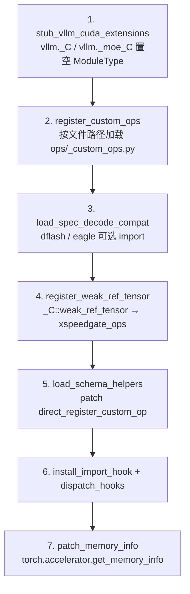

# 插件架构与挂载机制

## 1. 发现：entry points

`setup.py#L74-L81` 与 `pyproject.toml#L21-L27` 声明四个 entry point：

| group | name | target |
| --- | --- | --- |
| `vllm.platform_plugins` | `kunlun` | `vllm_kunlun:register` |
| `vllm.general_plugins` | `kunlun_model` | `register_model`（模型注册） |
| `vllm.general_plugins` | `kunlun_reasoning_parser` | `register_reasoning_parser`（reasoning parser 注册） |
| `vllm.general_plugins` | `kunlun_tool_parser` | `register_tool_parser`（tool parser 注册） |

`register()` 的唯一返回值是平台类的**字符串路径**
（`__init__.py#L20`：`_KUNLUN_PLATFORM = "vllm_kunlun.platforms.kunlun.KunlunPlatform"`，
返回点 `#L63-L91`）。vLLM 拿到这个字符串后把 `current_platform` 绑定过去。

`register()` 用模块级 `_REGISTER_STATE` 做幂等保护（`#L18-L19`、`#L66-L74`）。
只有 `CustomOpsRegistrationError` 会把状态锁定为 `"failed"`（`#L81-L88`）——
因为 torch dispatcher 的注册**无法回滚**，重试没有意义。其他异常不锁定，可重试。

> ⚠️ `pyproject.toml#L18-L19` 还声明了 console script
> `vllm-kunlun = "vllm_kunlun.cmdline:main"`，但仓库里**没有 `cmdline.py`**。
> 这个命令装上就是坏的。

## 2. Bootstrap：七个有序阶段

`__init__.py#L37-L60` 的 `_run_startup_stages()` 按固定顺序执行，
顺序本身是语义的一部分（源码里带编号注释，`#L44-L56`）：



**阶段 1 —— 抢在任何 vLLM kernel 模块之前把 CUDA 扩展位占掉。**
`bootstrap.py#L27,#L41-L51` 往 `sys.modules` 里塞空 `ModuleType` 到
`vllm._C` / `vllm._moe_C`。vLLM 的 kernel 模块 import 这两个名字时拿到空模块，
不会去加载真正的 CUDA `.so`。

**阶段 2 —— 声明裸算子。**`bootstrap.py#L57-L110` 用**文件路径**（不是包名）
把 `ops/_custom_ops.py` 加载为 `_vllm_kunlun_custom_ops_registration`。
失败**不可重试**，理由写在 `#L96-L103`。

**阶段 3 —— 投机解码兼容层。**`bootstrap.py#L31-L34,#L113-L133` 依次 import
`vllm_kunlun.v1.sample.spec_decode.dflash` 和 `.eagle`，纯粹为副作用
（它们在 import 时把 `EagleProposer.propose` 换掉，见 [attention-backend.md](attention-backend.md)）。

**阶段 4 —— 补 `_C::weak_ref_tensor`。**`bootstrap.py#L137-L164` 用
`torch.library.Library("_C", "FRAGMENT")` 把这个名字指到
`torch.ops.xspeedgate_ops.weak_ref_tensor.default`（CUDA dispatch key）。
阶段 1 把 `vllm._C` 置空后该命名空间是空的，而 vLLM 的 CUDA graph capture
（`vllm/utils/torch_utils.py` 的 `weak_ref_tensor`）硬编码调用它。

**阶段 5 —— schema 归一化。**`schema.py#L117` 把
`vllm.utils.torch_utils.direct_register_custom_op` 换成自己的版本
（`#L58-L114`），作用是把 PEP-604 注解（`int | None`）改写成
`torch.library.infer_schema` 能吃的 `Optional[int]`。默认 dispatch key 是
`"CUDA"`（`#L25`）。

**阶段 6 —— 装 import 劫持，然后补已经 import 过的模块。**顺序很关键：
先 `install_import_hook()` 让未来的 import 走重定向，再 `dispatch_hooks()`
把**已经**加载进来的 vLLM 模块就地补掉。

**阶段 7 —— 内存信息。**`bootstrap.py#L163-L196` 把
`torch.accelerator.get_memory_info` 指到 `torch.cuda.mem_get_info`，
因为 `torch_xmlir` 没实现前者。

## 3. import 劫持不是 PEP-302 finder

`import_hooks.py#L123-L125` 直接替换 `builtins.__import__`：

```python
builtins.__import__ = _custom_import
```

原函数存在 `_OLD_IMPORT`（`#L45`）。wrapper（`#L106-L120`）只在
`level == 0`（绝对 import）时做重定向，之后调用 `dispatch_hooks()`。
这是个比 meta path finder 更粗暴但更早生效的钩子。

注册表结构是 `HookRegistration(target, is_applied, apply_patch)`（`#L35-L41`）；
重复注册同一 target 直接 `ValueError`（`#L63-L64`）；
`dispatch_hooks()` 是 **fail-soft** 的，单个补丁抛异常不会中断进程。
它还做两件事保证补丁不会被静默丢掉：跳过 `__spec__._initializing` 为真
（即正在执行模块体）的 target，避免补丁被该模块后续的语句覆盖；
以及用 `_DISPATCHING` 防重入、`_REDISPATCH` 记录被跳过的嵌套 dispatch，
在外层解锁后补跑（上限 `_MAX_DISPATCH_PASSES`）。

## 4. 四种覆盖手段

这是本仓库最需要先建立的心智模型。**选哪一种，取决于目标符号是否已经被
上游用 `from ... import X` 捕获**。

### 4.1 整模块重定向（6 个）

`module_redirects.py` 的 `MODULE_MAPPINGS`：

| 上游模块 | 替换原因（详见对应页） |
| --- | --- |
| `vllm.compilation.wrapper` | 关 dynamo guard、抬高 cache limit → [kunlun-graph.md](kunlun-graph.md) |
| `vllm.model_executor.model_loader.bitsandbytes_loader` | bnb 在 XPU 上不可用 |
| `vllm.v1.sample.ops.topk_topp_sampler` | 换成 `kunlun_ops` 融合采样核 |
| `vllm.v1.sample.ops.logprobs` | 只是去掉 `torch.compile` |
| `vllm.v1.sample.rejection_sampler` | Triton → 纯 PyTorch |
| `vllm.attention.ops.merge_attn_states` | XPU 实现 |

`preload_mapped()` 把替换模块**同时注册到两个名字**下；
若上游名字已在 `sys.modules` 里就直接放弃。
`from X import Y` 形式单独处理。

### 4.2 post-import 就地补丁（8 + 14 个）

`compat_patches.py` 的 `DEFAULT_HOOKS` 表：

| 目标模块 | 做了什么 |
| --- | --- |
| `vllm.v1.worker.utils` | `KVBlockZeroer._zero_block_ids` 变 no-op |
| `vllm.model_executor.models.qwen3_vl` | `module.HAS_TRITON = False` |
| `vllm.v1.worker.block_table` | slot mapping 换成 `kunlun_ops.compute_slot_mappings` |
| `vllm.v1.structured_output.utils` | grammar bitmask 走 `torch_native` |
| `vllm.v1.worker.gpu_worker` | memory pool → `nullcontext()` |
| `vllm.model_executor.warmup.kernel_warmup` | `qwen_triton_warmup` → no-op |
| `vllm.model_executor.custom_op` | import `vllm_kunlun.ops` 触发 OOT 层注册 |
| compressed-tensors int8 MoE | `select_int8_moe_backend` → `return None, None` |

后面 14 条由 `_V2_PATCHES` 表经 `_v2_hook()` 生成，形状完全一致
（import-for-side-effect + 按 `__module__` 判定是否已生效）：
Model Runner V2 的 `vllm.v1.worker.gpu.*` 13 个模块，
外加 V1/V2 共用的 `vllm.v1.worker.mamba_utils`。
每个对应 `vllm_kunlun/v1/worker/gpu/` 下的一个同名模块，
import 时把 Triton 启动点换成 torch-native / `kunlun_ops` 实现。

版本兼容靠 `hasattr` 探测，**不是版本号判断**。

除了这张表，还有若干模块**自己**在 import 时打补丁：
`v1/worker/utils.py#L131-L138`、`v1/worker/block_table.py#L114-L120`、
`v1/attention/backends/mla/indexer.py#L218-L226`、
`v1/attention/backends/gdn_attn.py#L505-L512`、
`v1/sample/spec_decode/eagle.py#L340-L341`。
为什么必须就地改而不能重定向，`v1/worker/utils.py#L3-L12` 有逐字说明。

### 4.3 OOT 层注册

`CustomOp.register_oot` / `PluggableLayer.register_oot`，由 vLLM 在
**建层时**解析，所以只要求 `ops/__init__.py#L35-L45` 先跑过即可，
对 import 顺序不敏感。

| 装饰器 | 位置 | 落到哪个算子 |
| --- | --- | --- |
| `register_oot("SiluAndMul")` | `ops/activation.py#L24-L33` | `torch.ops._C.silu_and_mul` |
| `register_oot("RMSNorm")` | `ops/layernorm.py#L51-L105` | `_C.rmsnorm` / `_C.add_rmsnorm` |
| `register_oot("GemmaRMSNorm")` | `ops/layernorm.py#L108-L175` | `gemma_rmsnorm` / `gemma_add_rmsnorm` |
| `register_oot("RotaryEmbedding")` | `ops/rotary_embedding/kunlun_rope.py#L31-L32` | `ops.rotary_embedding` |
| `register_oot("MRotaryEmbedding")` | `ops/rotary_embedding/kunlun_mrope.py#L32-L33` | `mrotary_embedding_neox` |
| `register_oot("DeepseekScalingRotaryEmbedding")` | `ops/rotary_embedding/kunlun_deepseek_rope.py#L32-L33` | — |
| `register_oot("VocabParallelEmbedding")` | `ops/vocab_parallel_embedding.py#L82-L83` | `get_masked_input_and_mask_kunlun` |
| `register_oot("ReplicatedLinear")` | `ops/linear.py#L29-L30` | **权重加载**，非计算 |
| `register_oot("MergedColumnParallelLinear")` | `ops/linear.py#L48-L49` | **权重加载**，非计算 |
| `register_oot("UnquantizedFusedMoEMethod")` | `ops/fused_moe/layer.py#L16-L17` | → [moe-and-ep.md](moe-and-ep.md) |

> ⚠️ **`PluggableLayer` 陷阱**（`ops/vocab_parallel_embedding.py#L30-L36` 原文记录）：
> `PluggableLayer` **没有** `forward_native`/`forward_oot` 分派。
> 按 `CustomOp` 的习惯写 `forward_oot()` 会**永远不被调用**，静默退回基类
> `forward()`，从而触发 vLLM 那个被 `torch.compile` 过的
> `get_masked_input_and_mask`，在 XPU 上可能失败。必须覆写 `forward()`。

`ops/__init__.py#L27-L28` 用 `if "_vllm_kunlun_custom_ops_registration" not in sys.modules`
保证裸算子只注册一次；`#L35-L45` 顺序 import
`activation, fused_moe, layernorm, linear, rotary_embedding, vocab_parallel_embedding`
纯为副作用，最后置 `_KUNLUN_OOT_REGISTRATIONS_LOADED = True` 作为哨兵。

### 4.4 安装期文件覆盖（最隐蔽）

这两处**不在任何运行时机制里**，只写在安装文档和脚本里：

| 被覆盖的文件 | 覆盖来源 | 证据 |
| --- | --- | --- |
| `torch/_dynamo/eval_frame.py` | `vllm_kunlun/patches/eval_frame.py` | `installation.md#L100`、`ci/scripts/env/install_env.sh#L55-L56` |
| `vllm/model_executor/layers/quantization/__init__.py` | `vllm_kunlun/quantization/__init__.py` | `installation.md#L106`、`ci/scripts/env/install_env.sh#L58-L60` |

第二个文件头部有 `# patched by vLLM-Kunlun` 标记（`#L3`）。
`patches/eval_frame.py` 的分析见 [kunlun-graph.md](kunlun-graph.md)。

**排障提示**：如果某个改动"看起来没生效"，先确认它属于上面哪一类。
重定向类改动在上游模块已加载时静默失效；安装期覆盖类改动在
重装 torch / vLLM 后被冲掉。

## 5. 自定义算子的三个命名空间

| 命名空间 | 谁声明 | 怎么调 |
| --- | --- | --- |
| `torch.ops._C` / `torch.ops._moe_C` | 本仓库 `ops/_custom_ops.py`：`@custom_op("_C::X")` 声明 schema + 独立 `@impl("_C::X", "CUDA")` 提供实现，约 55 个算子（`rms_norm` 在 `#L20`，一直到 `lora_matmul_inplace` `#L2842/#L2863`） | 实现体再下沉到 `torch.ops.xspeedgate_ops.*` |
| `torch.ops.xspeedgate_ops` / `torch.ops.custom_ops` | 厂商 wheel，import pybind 模块时自动注册（`ops/_kunlun_ops.py#L22-L35`） | 直接调 |
| `kunlun_ops` pybind 模块 | 厂商 wheel | `ops/_kunlun_ops.py` 的 `KunlunOps` 静态门面（`#L46-L47`） |

第四类是 Kunlun 往 vLLM 自己命名空间里加的算子
`torch.ops.vllm::*`，用于 torch.compile 图切分：
`unified_attention_with_output_kunlun`（`ops/attention/layer.py#L223-L239`，
fake impl `#L255-L257`，调用点 `#L110-L112`）、
`gdn_attention_core`（`models/qwen3_next.py#L1471-L1508`）、
`sparse_attn_indexer_vllm_kunlun`（`models/deepseek_v2.py#L472-L473`，`#L637-L655`）。

`_C::weak_ref_tensor` 不来自 C++ 扩展：`bootstrap.register_weak_ref_tensor`
在 Python 侧把它转发到 `torch.ops.xspeedgate_ops.weak_ref_tensor`
（要求 `xspeedgate_ops>=1.5.0`）。**仓库内没有 Python 调用方**——
`utils.py#L13` 用的是 vLLM 自带的版本，真正的消费者是 vLLM 的 graph capture。

## 6. 通信层

`distributed/kunlun_communicator.py#L12-L13` 声明
`class KunlunCommunicator(CudaCommunicator)`，但实际上系统性地**跳过父类**、
直接委托到祖父类 `DeviceCommunicatorBase`：

- `__init__` 不调 `CudaCommunicator.__init__`（`#L28-L30`）
- `ca_comm = None`（`#L31`）—— 没有 custom all-reduce
- 建一条 `torch.cuda.Stream()`（`#L33-L34`），做一次 1 元素 all_reduce 预热（`#L36-L40`）
- `all_reduce` / `all_gather` / `gather` / `send` / `recv` 全部直通（`#L42-L60`）
- `destroy` 是空 `pass`（`#L62-L64`）

> ⚠️ `change_state`（`#L66-L86`）在 `finally` **之外**恢复状态，
> 中间抛异常会泄漏状态。

## 7. 环境变量：两套互不相交的集合

这是本仓库最容易踩的坑之一。

**代码里的集合**：`platforms/envs.py#L34-L71` 定义 9 个变量
（惰性 `__getattr__` 在 `#L76-L92`，`# begin/end-env-vars-definition` 标记在
`#L32`/`#L73`）：`VLLM_MULTI_LOGPATH`、`ENABLE_VLLM_MULTI_LOG`、
`ENABLE_VLLM_INFER_HOOK`、`ENABLE_VLLM_OPS_HOOK`、`ENABLE_VLLM_MODULE_HOOK`、
`ENABLE_VLLM_MOE_FC_SORTED`、`ENABLE_CUSTOM_DPSK_SCALING_ROPE`、
`ENABLE_VLLM_FUSED_QKV_SPLIT_NORM_ROPE`、`VLLM_KUNLUN_ENABLE_INT8_BMM`。

其中**只有 `VLLM_KUNLUN_ENABLE_INT8_BMM` 有真实消费者**
（`mla/common.py#L1152`、`#L1459`、`#L1969`）。9 个里有 6 个没有任何消费者；
另外 2 个（日志/hook）的消费者在 `vllm_kunlun/utils.py`，而**没有任何模块 import 它**。

**文档里的集合**：`docs/source/user_guide/configuration/env_vars.md`
记录了 12 个**完全不同**的 XPU/XMLIR 变量：`XPU_VISIBLE_DEVICES`、
`XPU_USE_MOE_SORTED_THRES`（仅 legacy `moe_ffn_block` 使用）、
`XFT_USE_FAST_SWIGLU`、`XPU_USE_FAST_SWIGLU`、
`XMLIR_CUDNN_ENABLED`、`XPU_USE_DEFAULT_CTX`、`XMLIR_FORCE_USE_XPU_GRAPH`、
`VLLM_HOST_IP`、`XMLIR_ENABLE_MOCK_TORCH_COMPILE`、
`XMLIR_DYNAMO_WORKAROUND`（由 torch_xmlir 的 `nn/linear.py` 读取，
将 `F.linear` 注册为自定义算子以规避 Dynamo tracing 问题）、`FUSED_QK_ROPE_OP`、
以及 `unset XPU_DUMMY_EVENT`。这些是 `torch_xmlir` 运行时读的，不经过本仓库。

`docs/envs.py` 是从 vllm-ascend 抄来的死代码（`#L5` 自己写着
"Adapted from vllm-project/vllm/vllm/envs.py"），没有任何 import 方。

## 相关页面

- [platform-contract.md](platform-contract.md) —— 平台类逐方法契约
- [kunlun-graph.md](kunlun-graph.md) —— 编译与图捕获
- [known-gaps.md](known-gaps.md) —— 死代码与文档冲突清单
