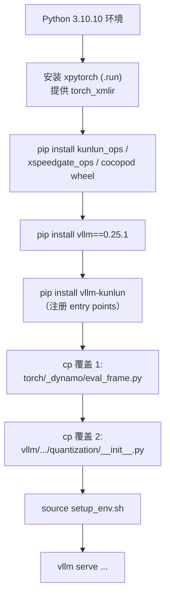

# 构建、安装与版本对齐

## 1. 环境基线

| 项 | 值 | 来源 |
| --- | --- | --- |
| Python | `3.10.10` | `.python-version` |
| transformers | `5.2.0` | `requirements.txt` |
| pydantic | `2.12.0` | `requirements.txt` |
| compressed-tensors | `0.13.0` | `requirements.txt` |
| setuptools | `80.9.0` | `requirements.txt` |
| build backend | setuptools | `pyproject.toml#L6` |
| 声明依赖 | `dependencies = []` | `pyproject.toml#L16` |

> ⚠️ **`vllm` 不在 `requirements.txt` 里，`dependencies` 也是空的。**
> 版本耦合完全靠人工遵守，唯一的书面约定是 `faqs.md#L43`：
> "the version of vllm-kunlun is the same as the version of vllm"。
> 也就是说：**vllm-kunlun 0.25.1 要配 vllm 0.25.1。**

> ⚠️ README 说构建后端是 hatchling，`pyproject.toml#L6` 实际是 setuptools。
> 以 `pyproject.toml` 为准。

## 2. 厂商组件（闭源二进制）

| 组件 | 版本 | 形式 |
| --- | --- | --- |
| `kunlun_ops` | `0.1.58+ee39020a` | wheel |
| `xspeedgate_ops` | `1.5.0+`（最低版本） | wheel |
| `cocopod` | `1.1.0` | wheel |
| `xpytorch`（提供 `torch_xmlir`） | — | `.run` 安装包 |

`xpytorch` 是整套伪装的基础：它让 `torch.cuda.*` 在 XPU 上可用，
从而使 `KunlunPlatform` 能声称 `device_name = "cuda"`
（见 [platform-contract.md](platform-contract.md#1-cuda-伪装)）。

三个 wheel 之间的调用关系见
[architecture.md](architecture.md#5-自定义算子的三个命名空间)。

## 3. 安装流程

### 两处安装期文件覆盖（不可跳过）

| 被覆盖的文件 | 覆盖来源 | 文档 / 脚本 |
| --- | --- | --- |
| `torch/_dynamo/eval_frame.py` | `vllm_kunlun/patches/eval_frame.py` | `installation.md#L100` / `ci/scripts/env/install_env.sh#L55-L56` |
| `vllm/model_executor/layers/quantization/__init__.py` | `vllm_kunlun/quantization/__init__.py` | `installation.md#L106` / `ci/scripts/env/install_env.sh#L58-L60` |

**这两个覆盖在任何重装 torch 或 vLLM 之后都会被冲掉，必须重做。**
判断第二个是否生效：看目标文件 `#L3` 是否有 `# patched by vLLM-Kunlun`。
第一个的分析见 [kunlun-graph.md](kunlun-graph.md#3-patcheseval_framepy安装期覆盖-torch-自身)。

## 4. `build.sh` 不编译任何东西

`build.sh#L22-L23` 只是把源码树打成 tarball。插件**已经没有 C++ 扩展**了：
原先唯一需要编译的 `vllm_kunlun/csrc/utils.cpp`（提供 `_C::weak_ref_tensor`）
已删除，改由 `bootstrap.register_weak_ref_tensor` 在 Python 侧转发到
`torch.ops.xspeedgate_ops.weak_ref_tensor`（要求 `xspeedgate_ops>=1.5.0`），
所以安装不再需要编译器。

也就是说：**本插件是纯 Python**，所有 kernel 都在厂商 wheel 里。
`ci.yml`（百度内部 CI）也只是 `sh build.sh`。

## 5. `setup_env.sh`

启动前必须 `source setup_env.sh`。它设置 `torch_xmlir` 侧的环境变量
（这些变量**不经过** `platforms/envs.py`，见
[architecture.md](architecture.md#7-环境变量两套互不相交的集合)）。

`torch_xmlir` 会读的变量清单在
`docs/source/user_guide/configuration/env_vars.md`。其中
`XPU_USE_MOE_SORTED_THRES` 只影响未被当前主 MoE 路径调用的 legacy 算子，
所以启动脚本不设置它。

## 6. 分支与版本号

- **默认分支是 `v0.25.1-dev`，不是 `main`。**`main` 的 README 陈旧
  （仍宣称 v0.15.1 / "Initial release"）。**读代码一定要切到 `v0.25.1-dev`。**
- 但 `CONTRIBUTING.md`、`docs/source/conf.py`、各 workflow 文件里
  写的都还是 `main`。
- 版本号两处不一致：`platforms/version.py#L3` = `0.25.1`，
  `pyproject.toml#L10` = `0.25.1.dev0`。
- `versioning_policy.md` / `release_notes.md` 是 "Coming soon..." 占位；
  `CHANGELOG.md` 停在 `0.1.0 - 2025-08-12`。

## 7. 常见安装期问题排查

| 症状 | 先查 |
| --- | --- |
| `--quantization awq` 拿到的是上游实现 | 覆盖 2 是否被冲掉（看 `# patched by vLLM-Kunlun`） |
| dynamo 报奇怪的 frame 错误 | 覆盖 1 是否在位；torch 是否还是 2.5.1 |
| 找不到 `vllm-kunlun` 命令 | 正常——`pyproject.toml#L18-L19` 指向不存在的 `cmdline.py` |
| import 时报 `vllm._C` 相关错误 | entry point 是否注册成功（`register()` 的阶段 1 负责占位） |
| 版本对不上导致的属性缺失 | 没有运行时版本校验，需人工核对 vllm 版本 == 0.25.1 |

## 相关页面

- [architecture.md](architecture.md) —— entry point 与 bootstrap
- [kunlun-graph.md](kunlun-graph.md) —— `eval_frame.py` 覆盖的作用
- [quantization.md](quantization.md) —— quantization 覆盖的作用
- [testing-and-ci.md](testing-and-ci.md)
- [known-gaps.md](known-gaps.md)
