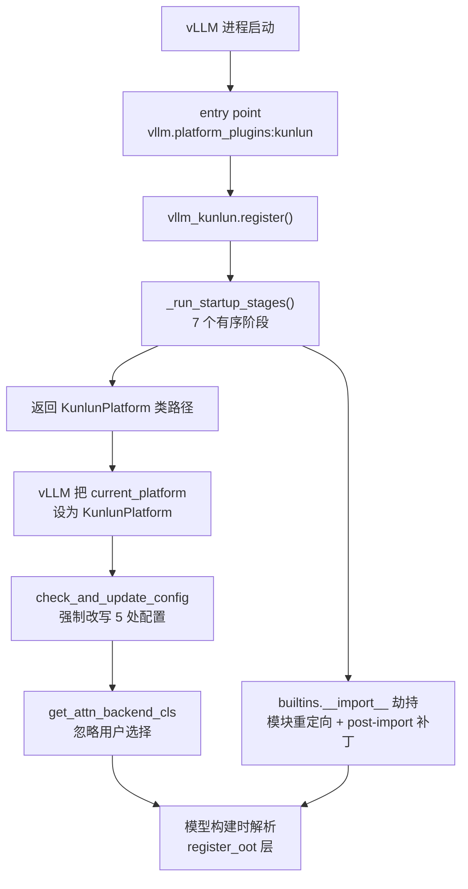

# vLLM-Kunlun Wiki

vLLM-Kunlun 是百度开源的 **vLLM 树外硬件插件**（Apache-2.0），按 vLLM
Hardware-pluggable RFC（vllm-project/vllm#11162）把昆仑芯 **Kunlun3 P800 XPU**
接入 vLLM。它**不 fork vLLM**：整个仓库以插件形式安装，在进程启动时通过
entry point 被 vLLM 发现，然后用 import hook、`sys.modules` 重定向、
post-import 补丁和安装期文件覆盖，把 vLLM 的 CUDA 代码路径改写到 XPU 上。

理解本仓库最重要的一句话：**它对 vLLM 自称自己是 CUDA**
（`device_name = "cuda"`、`dispatch_key = "CUDA"`、`dist_backend = "nccl"`），
底层由 [`torch_xmlir` 运行时与 PyTorch 兼容层](torch-xmlir/README.md)把 `torch.cuda.*` 映射到 XPU。
所有"为什么这里写着 cuda"的疑问都由此解释。该子 Wiki 记录 XMLIR 运行时构建的行为快照；本 Wiki 仍以 vLLM-Kunlun 源码事实为准。

## 从哪里开始读

| 你想知道 | 去哪一页 |
| --- | --- |
| 插件怎么被加载、四种覆盖手段的区别 | [architecture.md](architecture.md) |
| `KunlunPlatform` 对 vLLM 承诺了什么、强制改写了哪些配置 | [platform-contract.md](platform-contract.md) |
| `torch.cuda` 如何映射到 XPU、Dispatcher 和运行时如何工作 | [torch-xmlir/README.md](torch-xmlir/README.md) |
| torch.compile / 图捕获在 XPU 上怎么跑 | [kunlun-graph.md](kunlun-graph.md) |
| 4 个 attention backend、KV cache 布局、前缀缓存 | [attention-backend.md](attention-backend.md) |
| GDN / FLA / Mamba 线性注意力路径 | [linear-attention.md](linear-attention.md) |
| EAGLE / DFlash / rejection sampler / 采样快路径 | [spec-decode-and-sampling.md](spec-decode-and-sampling.md) |
| W8A8 / W4A16 / AWQ / GPTQ 怎么接进来 | [quantization.md](quantization.md) |
| fused MoE 的小 batch 分支、EP 路径的性能陷阱 | [moe-and-ep.md](moe-and-ep.md) |
| 支持哪些模型、每个模型为什么需要 OOT 实现 | [model-support.md](model-support.md) |
| 怎么装、厂商 wheel 版本、版本对齐规则 | [build-and-install.md](build-and-install.md) |
| CI 里哪些是真门禁 | [testing-and-ci.md](testing-and-ci.md) |
| 已知的代码/文档冲突、死代码、未实现特性 | [known-gaps.md](known-gaps.md) |

## 一分钟总览

四种覆盖手段，**它们的差别决定一个改动对"已经 import 过的代码"是否可见**：

1. **模块重定向**（`sys.modules` 双名注册）—— 上游模块对象根本不会被创建；
   但只有在上游名字尚未被 import 时才生效。
2. **post-import 就地补丁** —— 类对象已被上游 `from ... import X` 捕获时唯一可行的办法。
3. **OOT 层注册**（`CustomOp.register_oot` / `PluggableLayer.register_oot`）——
   由 vLLM 在**建层时**解析，只要求注册模块先跑过。
4. **安装期 `cp` 覆盖** —— 直接改写 site-packages 里 torch 和 vLLM 的文件，
   运行时机制完全看不见，最容易被忽略。

详见 [architecture.md](architecture.md)。

## 硬件与规模

- 单卡 `num_compute_units = 64`（`platforms/kunlun.py#L136-L140`）。
- 支持 dtype 仅 `float32 / float16 / bfloat16 / int8`（`kunlun.py#L390-L405`）——
  **没有 fp8**，尽管 sparse MLA 的 KV cache 有 fp8 token 布局。
- 官方 tutorial 全部是**单机 TP-only**（TP=8），没有任何 `--pipeline-parallel-size`、
  `--data-parallel-size`、`--enable-expert-parallel` 示例，尽管特性矩阵声称支持专家并行。
- **PD 分离（Prefill/Decode disaggregation）不支持**，见 [known-gaps.md](known-gaps.md)。

## 证据约定

本 wiki 的每条实质性论断都绑定到 `v0.25.1-dev` 分支 commit `c53e090` 的具体行号，
引用形式 `repo://<path>#L<start>-L<end>`。结构化 Claim 见 `openwiki/.claims/`。
生成范围与优先级见 [INSTRUCTIONS.md](INSTRUCTIONS.md)。
