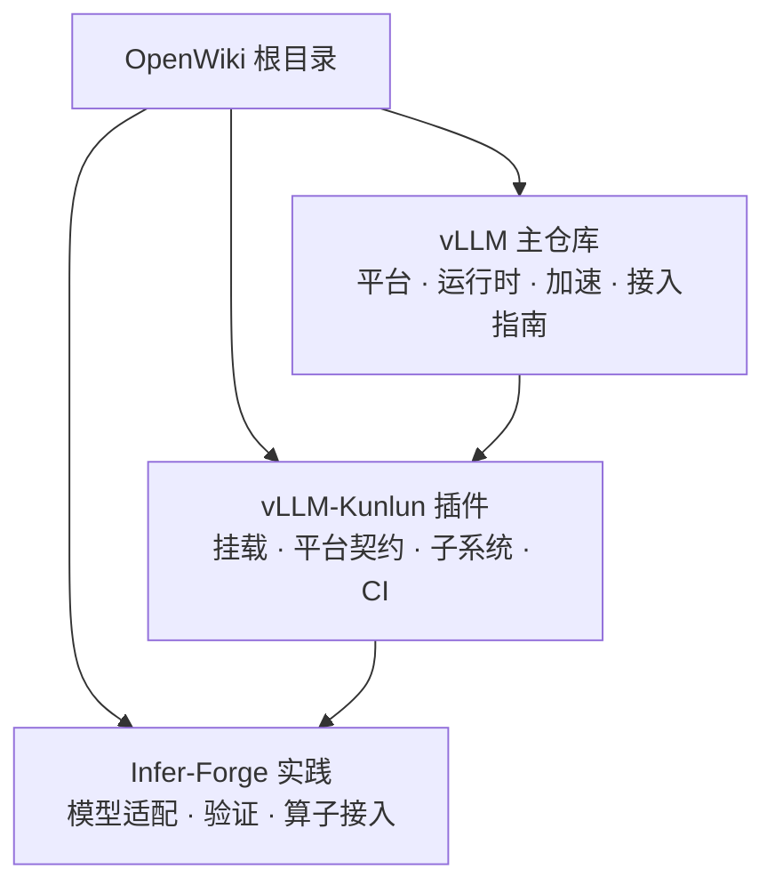

# Infer-Forge OpenWiki

本知识库把**上游设计、硬件插件实现和项目实践**分为相互独立的模块。这样的边界避免把 vLLM 的通用契约、vLLM-Kunlun 的具体兼容策略与 Infer-Forge 的工程决策混为同一层事实。

## 阅读路径

| 目标 | 建议入口 | 内容边界 |
|---|---|---|
| 理解 vLLM 如何发现平台、选择运行时并接入后端 | [vLLM 主仓库接入体系](vllm-core/index.md) | 基于指定 vLLM main commit 的上游结构参考。 |
| 理解 Kunlun3 P800 插件如何适配这些契约 | [vLLM-Kunlun Wiki](vllm-kunlun/index.md) | 基于 `baidu/vLLM-Kunlun` 指定分支的下游实现快照。 |
| 执行本项目的模型适配、验证与算子集成 | [Infer-Forge 工程实践](harness/index.md) | 基于本仓库任务、工具与验证器的项目经验。 |

## 信息架构

推荐按“**主仓库契约 → 插件实现 → 项目验证**”的顺序阅读：先从 `vllm-core/platform/` 建立接口与加载顺序，再在 `vllm-kunlun/` 对照 P800 的实现取舍，最后使用 `harness/` 中可复用的验证经验完成适配工作。

## 维护边界

每个模块保留独立的证据版本与来源说明。上游和插件模块中的 `repo://` 引用指向其各自的源仓库快照；项目实践模块中的 `repo://` 引用指向 `infer-forge-harness`。更新某一模块时，不应将其版本化事实复制为另一模块的无来源结论。完整来源登记见 [SOURCE.md](SOURCE.md)。
