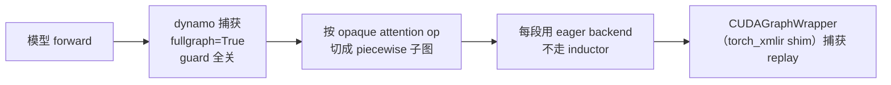

# Piecewise Kunlun Graph 与编译路径

## 1. 名字容易误导

"Kunlun Graph" **不是**一个新的图后端类。`KunlunPlatform` 直接返回上游实现：

- `get_piecewise_backend_cls()` → `vllm.compilation.cuda_piecewise_backend.CUDAPiecewiseBackend`（`platforms/kunlun.py#L128-L130`）
- `get_static_graph_wrapper_cls()` → `vllm.compilation.cuda_graph.CUDAGraphWrapper`（`#L132-L134`）

真正的 XPU 化发生在两个更低的层次：[`torch_xmlir` 的 CUDA Graph shim](torch-xmlir/05-device-runtime.md)
以及本仓库替换掉的 `vllm.compilation.wrapper` 模块。`torch_xmlir` 对 `torch.compile` 和 Dynamo 的运行时快照见 [torch-xmlir/08-compile-dynamo.md](torch-xmlir/08-compile-dynamo.md)。

## 2. `compilation/wrapper.py`：被裁剪过的 dynamo

这个模块通过 [模块重定向](architecture.md#41-整模块重定向7-个) 装上，
上游 `vllm.compilation.wrapper` 根本不会被创建。

核心类 `TorchCompileWithNoGuardsWrapper`（`#L72-L85`），名字已经说明一切：

| 改动 | 位置 | 目的 |
| --- | --- | --- |
| guard installer 全部替换为 no-op | `#L26-L37` | 消除 guard 检查开销与失败 |
| `cache_size_limit = 2048`、`accumulated_cache_size_limit = 8192` | `#L40-L69`（`_compilation_context()`） | 避免 recompile 上限触发 |
| `options["guard_filter_fn"] = lambda x: [False for _ in x]` | `#L166` | 让 dynamo 生成的 guard 一个都不保留 |
| `fullgraph=True, dynamic=False` | `#L188-L198` | 强制整图 + 静态 shape |
| buffer-mutation 守卫 | `#L285-L300` | cudagraph 开启且 `"update" in co_names` 时直接抛异常 |
| `reset_compile_wrapper` | `#L316-L318` | 空实现（no-op stub） |

**代价与后果**：guard 全关意味着一旦输入形状/属性发生 dynamo 本应捕获的变化，
不会触发 recompile，而是**静默复用旧图**。这就是为什么 `dynamic=False`
必须成立、为什么 `check_and_update_config` 要把 batch/block 相关配置固定住。
`#L285-L300` 那个 buffer-mutation 守卫是对这套设计的兜底：如果被编译的函数
名字里出现 `update`（暗示它在原地改 buffer），在 cudagraph 模式下直接报错，
而不是产出错误结果。

## 3. `patches/eval_frame.py`：安装期覆盖 torch 自身

`ci/scripts/env/install_env.sh#L55-L56`（文档 `installation.md#L100`）在安装时用
`vllm_kunlun/patches/eval_frame.py` **覆盖** site-packages 里的
`torch/_dynamo/eval_frame.py`。

这个文件是 **torch 2.5.1 原文件的逐字副本**，
全文 0 次出现 kunlun / xmlir / xpu / baidu），只有两处功能差异：

1. `set_eval_frame` 被提升到模块作用域（`#L98`，原位置在 `#L104` 被注释掉）；
2. 删掉一处无用赋值（`#L1683`）。

**推论**：这个补丁的目的不是加 XPU 逻辑，而是把 `set_eval_frame`
变成模块级可见符号，供 `torch_xmlir` 或 wrapper 从外部替换/调用。
同时它把 dynamo 的 eval frame 实现**锁定在 torch 2.5.1**——
换 torch 版本后这个覆盖会引入不匹配的风险。

## 4. 图切分点

Piecewise 图的切分依赖一个不透明算子。`KunlunPlatform.opaque_attention_op`
返回 `True`（`platforms/kunlun.py#L407-L411`），切分算子是：

```
vllm::unified_attention_with_output_kunlun
```

- 定义：`ops/attention/layer.py#L223-L240`（`@custom_op(..., mutates_args=())`）
- fake 实现：`#L255-L257`
- 调用点：`#L110-L112`

另外两个也参与切图的 Kunlun 自定义算子：
`vllm::gdn_attention_core`（`models/qwen3_next.py#L1471-L1508`）和
`vllm::sparse_attn_indexer_vllm_kunlun`（`models/deepseek_v2.py#L472-L473`、`#L637-L655`）。

## 5. 支持矩阵

`docs/source/developer_guide/feature_guide/Kunlun_Graph.md#L74-L75` 明确不支持：

| 特性 | 状态 |
| --- | --- |
| `CUDAGraphMode.PIECEWISE` | 支持 |
| `CUDAGraphMode.FULL` | **不支持** |
| `CUDAGraphMode.FULL_AND_PIECEWISE` | **不支持** |
| `use_inductor` | **不支持** |

`use_inductor` 不支持这一点与 `check_and_update_config#L276-L279`
一致——只要启用任何 cudagraph mode，`backend` 就被强制成 `"eager"`
（注释：`avoid inductor/Triton`）。



## 6. 排障要点

- **图捕获打开后 Python 插桩不命中**：piecewise 图 replay 时不执行 Python，
  想在算子层观测必须先加 `--disable-cuda-graph`。
- **改了源码但行为没变**：guard 全关 + 高 cache limit 意味着旧编译产物
  可能被继续复用；确认是否需要清 dynamo cache 或重启进程。
- **升级 torch 后 dynamo 报奇怪错误**：检查
  `torch/_dynamo/eval_frame.py` 是否还是被 2.5.1 版本覆盖的状态。

## 相关页面

- [architecture.md](architecture.md) —— 模块重定向与安装期覆盖机制
- [platform-contract.md](platform-contract.md) —— `check_and_update_config`
- [attention-backend.md](attention-backend.md) —— 图捕获在各 backend 的限制
