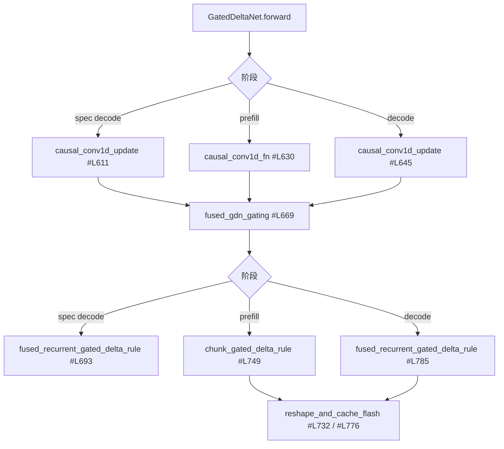

# 线性注意力：GDN / FLA / Mamba

## 1. 谁在用

只有 `qwen3_next.py` 声明 `mamba_type`，`qwen3_5.py` 继承它：

- `models/qwen3_next.py#L264-L265` —— `return MambaAttentionBackendEnum.GDN_ATTN`
- `models/qwen3_5.py#L112` —— `class Qwen3_5GatedDeltaNet(Qwen3NextGatedDeltaNet):`
- `models/qwen3_5.py#L90` —— `from .qwen3_next import (...)`

注册入口：`models/__init__.py#L14-L16`（`Qwen3NextForCausalLM`）、
`#L47-L55`（`Qwen3_5MoeForConditionalGeneration` / `Qwen3_5ForConditionalGeneration`）。

> ⚠️ **`MiMoV2Flash` 不是线性注意力模型**，尽管名字里有 "Flash"。
> 它是普通 attention + MoE，文件里没有任何 `mamba` / `causal_conv1d` 引用
> （`models/mimo_v2_flash.py#L190`、`#L639`）。

## 2. 层内三路分派

`Qwen3NextGatedDeltaNet` 在 forward 里按 spec-decode / prefill / decode 三分：



相关导入与接线：

- `#L98-L102` —— `from vllm_kunlun.ops.fla import RMSNormGated, chunk_gated_delta_rule, fused_recurrent_gated_delta_rule`
- `#L103` —— `from vllm_kunlun.ops.mamba.causal_conv1d import causal_conv1d_fn, causal_conv1d_update`
- `#L104` —— `from vllm_kunlun.v1.attention.backends.gdn_attn import GDNAttentionMetadata`
- `#L529` —— `torch.ops.vllm.gdn_attention_core(...)`（切图点）
- `#L568` —— `assert isinstance(attn_metadata, GDNAttentionMetadata)`
- `#L1001-L1007` —— `self.linear_attn = Qwen3NextGatedDeltaNet(...)`
- `#L383` —— `self.norm = RMSNormGated(...)`
- Qwen3.5 走同一个 core：`models/qwen3_5.py#L177`、`#L217-L223`

## 3. FLA prefill：Triton 逐算子换成 `xspeedgate_ops`

`ops/fla/chunk.py` 源自 flash-linear-attention（`#L3-L9` 有归属声明），
但每个 Triton kernel 都被替换成厂商算子。`chunk_size = 64`（`#L34`）：

| 步骤 | 调用 | 位置 |
| --- | --- | --- |
| 局部累积和 | `xspeedgate_ops.chunk_local_cumsum(g, chunk_size=64, reverse=False, ...)` | `#L44-L51` |
| K·Kᵀ 缩放 | `xspeedgate_ops.chunk_scaled_dot_kkt_fwd(k, beta, g, ...)` | `#L53-L55` |
| 下三角求解 | `xspeedgate_ops.solve_tril_ns(A, ...)` | `#L57` |
| 重算 w/u | `xspeedgate_ops.recompute_w_u_fwd(...)` | `#L81-L90` |
| 状态递推 | `xspeedgate_ops.chunk_gated_delta_rule_fwd_h(...)` | `#L101-L113` |
| 输出 | `xspeedgate_ops.chunk_fwd_o(q=..., k=..., v=v_new, h=h, g=g, scale=..., chunk_size=64)` | `#L115-L125` |

外层封装：`class ChunkGatedDeltaRuleFunction(torch.autograd.Function)`（`#L143-L163`），
`@torch.amp.custom_fwd(device_type="cuda")`（`#L147`），
`use_qk_l2norm_in_kernel` 时先做 `l2norm_fwd`（`#L161-L163`）。
入口函数带 `@torch.compiler.disable`（`#L181`）。

**约束**（会直接报错，值得记住）：

- `assert q.dtype != torch.float32, "Please use bfloat16"`（`#L258-L264`）
- `assert len(beta.shape) == 3`（同上）
- 传 `cu_seqlens` 时**要求 batch size = 1**（`#L283-L293`）

`#L297-L321` 有一段 `if False:` 的死分支（本来会调
`kunlun_ops.chunk_gated_delta_rule`），实际走的是 `#L322-L334`。

辅助算子：`ops/fla/l2norm.py#L16-L22` → `kunlun_ops.l2norm(x, out, eps)`（`eps=1e-6`）；
`ops/fla/layernorm_guard.py#L54-L56` → `torch.ops._C.rms_norm_gated(...)`，
`RMSNormGated` 类在 `#L131-L167`（`norm_before_gate=False`，无 bias）。
`ops/fla/index.py#L17-L40` 的 `prepare_lens` / `prepare_chunk_indices` /
`prepare_chunk_offsets` 带 `@tensor_cache`；`#L11` import triton 只为用 `triton.cdiv`。

## 4. FLA decode：单个融合递推核

`ops/fla/fused_recurrent.py#L34-L48`：

```python
o, ht_output = kunlun_ops.fused_recurrent_gated_delta_rule_fwdv2(
    q.contiguous(), k.contiguous(), v.contiguous(), g.contiguous(), beta.contiguous(),
    scale, initial_state, inplace_final_state=..., cu_seqlens=...,
    h0_indices=ssm_state_indices, num_accepted_tokens=num_accepted_tokens,
    use_qk_l2norm_in_kernel=..., is_h0_transposed=True)
```

同样要求：传 `cu_seqlens` 时 batch size = 1（`#L66-L70`）。

## 5. `causal_conv1d` 的 CPU 镜像契约

**这是 GDN metadata 被扩展的直接原因。**昆仑的 conv1d kernel 需要若干张量的
**host 侧副本**（否则 kernel 内部会触发 device→host 同步）：

`ops/mamba/causal_conv1d.py#L35-L43` 的断言：
`conv_states is not None`、`query_start_loc is not None`。
`#L46-L66` 的完整调用把 `query_start_loc_cpu` / `cache_indices_cpu` /
`has_initial_state_cpu` 与各自的 XPU 版本**成对**传进去。

于是 `GDNAttentionMetadata` 多了这些字段（注释里逐字写了用途）：

| 字段 | 位置 | 注释 |
| --- | --- | --- |
| `has_initial_state_cpu` | `gdn_attn.py#L50-L51` | `# [Kunlun] CPU mirror — consumed by causal_conv1d_fn(has_initial_state_cpu=...)` |
| `non_spec_query_start_loc_cpu` | `#L57-L58` | `# [Kunlun] CPU mirror — consumed by causal_conv1d_fn(query_start_loc_cpu=...)` |
| `non_spec_state_indices_tensor_cpu` | `#L64-L65` | — |
| `chunk_indices` / `chunk_offsets` | `#L76-L78` | `# Pre-computed FLA chunk metadata (avoids GPU->CPU sync in prepare_chunk_indices)` |

预计算发生在 `#L333-L351`（import 上游 `prepare_chunk_indices` /
`prepare_chunk_offsets` + `FLA_CHUNK_SIZE`）与 `#L353-L363`
（`compute_causal_conv1d_metadata(...)`）。

**新旧 `causal_conv1d_update` 的差异**（`#L190-L206` 注释原文）：新版本
把输出**原地写回 x**，并去掉了 legacy 的 `state_seq_stride` / `act="SWISH"` /
成对 `*_cpu` + `*_xpu` 参数：

```python
kunlun_ops.causal_conv1d_update(x, conv_state, weight, bias=bias,
    silu_activation=..., cache_seqlens=None, conv_state_indices=...,
    is_ncw=False, pad_slot_id=pad_slot_id)
```

`num_accepted_tokens is not None`（即投机解码）时走纯 PyTorch 的
逐请求循环 `torch_causal_conv1d_update_spec`（`#L71-L109`，调用点 `#L207-L216`）。

## 6. GDN metadata：spec 与 non-spec decode 互斥

`gdn_attn.py#L369-L371`：`assert not (num_decodes > 0 and num_spec_decodes > 0)`。
为了满足它，`#L246-L250` 在存在 spec decode 时把普通 decode **重分类为 prefill**。
`spec_token_masks` 在 `#L68-L70`。

**含义**：混合模型上开投机解码时，同一个 batch 里不能既有普通 decode
又有 spec decode，调度器必须二选一。这会影响吞吐。

## 7. Worker 侧的 Mamba state 搬运

`vllm.v1.worker.mamba_utils` 被[整模块重定向](architecture.md#41-整模块重定向7-个)：

- `#L41-L45` —— `batch_memcpy` → `torch.ops.xspeedgate_ops.batch_memcpy(...)`。
  Triton 版 `batch_memcpy_kernel`（`#L23-L38`）保留但被绕过，
  旧的 launch 在 `#L48-L50` 被注释。
- `#L173-L245` —— `preprocess_mamba(...)`。`#L192`
  `assert cache_config.enable_prefix_caching`。
  `#L196-L203` 清理 finished / preempted / resumed 请求的 `mamba_state_idx`，
  注释解释了原因：强制抢占（`reset_prefix_cache` / KV cache flush）时请求会
  出现在 `resumed_req_ids` 里却没有对应的 `preempted_req_ids` 条目，
  导致 `mamba_state_idx` 残留。
- `#L344-L395` —— `postprocess_mamba(...)`
- `#L248-L287` —— `class MambaBuffers`，其中 `postprocess_align: None = None`，
  且 `#L277-L281` 直接抛
  `NotImplementedError("Speculative decoding on hybrid Mamba models is not yet supported on Kunlun XPU. Need to implement MambaSpecDecodeGPUContext.")`

> ⚠️ 注意第三条与第 6 节的组合：**混合 Mamba 模型上的投机解码在 worker 层
> 明确未实现**，尽管 GDN 层内有 spec 分支。
- `#L315-L340` —— 混合 KV cache 的 stride 改写，与
  `kunlun_attn.py#L692-L713` 的 block table 缩放必须一致。

## 8. 纯 PyTorch 调试旁路

`ops/native_ops.py#L1-L9` 的 docstring 写明用途：
`Pure PyTorch native implementations for: 1. causal_conv1d_update ... 4. fused_recurrent_gated_delta_rule (decode SSM)` /
`Purpose: bypass ALL XPU kernels to isolate state corruption bug.`

函数：`_l2norm`（`#L15`）、`native_causal_conv1d_update`（`#L24`）、
`native_causal_conv1d_fn`（`#L74`）、`native_chunk_gated_delta_rule`（`#L123`）、
`native_fused_recurrent_gated_delta_rule`（`#L205`）。

**没有任何模块 import 它**——纯诊断用，需要手工接线。
排查 SSM state 被污染类问题时，这是现成的对照实现。

## 相关页面

- [attention-backend.md](attention-backend.md) —— `GDNAttentionBackend` 注册与 KV 布局
- [spec-decode-and-sampling.md](spec-decode-and-sampling.md)
- [model-support.md](model-support.md) —— Qwen3-Next / Qwen3.5
