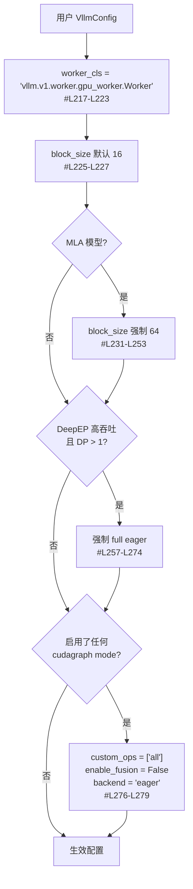

# KunlunPlatform 契约

`vllm_kunlun/platforms/kunlun.py` 是插件与 vLLM 之间的全部正式接口。
读这一页之前建议先读 [architecture.md](architecture.md)。

## 1. CUDA 伪装

类属性（`#L22-L29`）：

```python
_enum = PlatformEnum.OOT
dist_backend = "nccl"
ray_device_key = "GPU"
device_name = "cuda"
dispatch_key = "CUDA"
```

`device_type` property 也返回 `"cuda"`（`#L31-L38`）。
这套伪装让 vLLM 里所有 `torch.cuda.*` / NCCL / Ray GPU 资源声明原封不动可用，
底层由 [`torch_xmlir` 运行时与 PyTorch 兼容层](torch-xmlir/README.md)转到 XPU。

但身份判定函数是**诚实的**：

| 方法 | 返回 | 位置 |
| --- | --- | --- |
| `is_cuda()` | `False` | `#L71-L73` |
| `is_cuda_alike()` | `False` | `#L103-L105` |
| `is_out_of_tree()` | `True` | `#L99-L101` |
| `is_kunlun()` | `True` | `#L67-L69` |
| `get_device_name()` | `"kunlun"` | `#L111-L126` |

**实践含义**：上游代码里凡是 `if current_platform.is_cuda()` 的分支都走不到，
而凡是读 `device_name` / `dispatch_key` 字符串的地方都以为在 CUDA 上。
这条不对称是很多兼容补丁存在的根本原因。

## 2. 其他关键方法

| 方法 | 行为 | 位置 |
| --- | --- | --- |
| `get_piecewise_backend_cls` | 返回**上游** `CUDAPiecewiseBackend` | `#L128-L130` |
| `get_static_graph_wrapper_cls` | 返回**上游** `CUDAGraphWrapper` | `#L132-L134` |
| `num_compute_units` | 常量 `64` | `#L136-L140` |
| `get_device_total_memory` | **宿主机** `psutil.virtual_memory().total` | `#L142-L163` |
| `inference_mode` | `torch.no_grad()`（不是 `inference_mode()`） | `#L165-L173` |
| `is_async_output_supported` | `False` | `#L339-L356` |
| `check_if_supports_dtype` | 仅 `{fp32, fp16, bf16, int8}` | `#L390-L405` |
| `opaque_attention_op` | `True` | `#L407-L411` |
| `support_hybrid_kv_cache` | `True` | `#L413-L415` |
| `support_static_graph_mode` | `True` | `#L417-L419` |
| `get_device_communicator_cls` | `KunlunCommunicator` | `#L376-L381` |
| `get_punica_wrapper` | `PunicaWrapperKunlun` | `#L383-L388` |
| `pre_register_and_update` | import 5 个量化符号（纯副作用） | `#L421-L431` |

三点值得单独强调：

1. **"Kunlun Graph" 不是一个新类。**`get_piecewise_backend_cls` 与
   `get_static_graph_wrapper_cls` 都返回上游 CUDA 的实现，图捕获走的是
   [`torch_xmlir` 的 CUDA Graph shim](torch-xmlir/05-device-runtime.md)。vLLM 侧的图执行约束详见 [kunlun-graph.md](kunlun-graph.md)。
2. **`get_device_total_memory` 返回宿主内存**，不是显存。凡是用它推算
   KV cache 容量的上游逻辑在这里都不可信，实际容量靠
   `--gpu-memory-utilization` 手工调（tutorial 里的取值在 0.95~0.97）。
3. `opaque_attention_op`（`#L407-L411`）**漏了 `@classmethod` 装饰器**。
   当前调用方式下没暴露问题，但这是个隐患。

## 3. `check_and_update_config`：五处强制改写

`#L181-L279`。这是插件对用户配置**单方面改写**最集中的地方，
用户传什么都可能被覆盖：



细节：

1. **worker_cls**（`#L217-L223`）—— 两个分支赋的是同一个值，
   分支结构是历史残留。
2. **block_size 默认 16**（`#L225-L227`）。
3. **MLA 强制 block_size 64**（`#L231-L253`）。稀疏 MLA 的判定是
   `use_sparse = hasattr(hf_config, "index_topk")`（`#L235`）——
   DeepSeek V3.2 就是靠这个属性被识别的。
   `VLLM_ATTENTION_BACKEND` 在这里**只影响 block size 的强制**（`#L236-L239`），
   不影响 backend 选择。
4. **DeepEP 高吞吐 + DP>1 → full eager**（`#L257-L274`）。
5. **任何 cudagraph mode → `backend = "eager"`**（`#L276-L279`），
   同时 `custom_ops = ["all"]`、`enable_fusion = False`。
   源码注释：`# v0.15.1: set backend="eager" to avoid inductor/Triton`。
   也就是说**图捕获与 inductor 编译在这里是互斥的**。

> ⚠️ `#L183-L184` 的 docstring 仍写着 `TODO Update here for v0.15.1`，
> 而当前版本号是 0.25.1。文档滞后，以代码为准。

## 4. `get_attn_backend_cls`：忽略用户选择

`#L281-L313`。**`selected_backend` 参数被完全忽略**，纯靠模型特征分派：

| 条件 | 返回 backend | 位置 |
| --- | --- | --- |
| MLA 且 sparse（`index_topk`） | `FlashMLASparseBackend` | `#L304-L310` |
| MLA | `FlashMLABackend` | `#L311` |
| 其他全部 | `KunlunAttentionBackend` | `#L313` |

所以设 `VLLM_ATTENTION_BACKEND=FLASH_ATTN` 之类**不会改变实际 backend**，
只会影响上面第 3 节的 block size 强制路径。`#L293-L299` 的 docstring 已过期。

各 backend 的细节见 [attention-backend.md](attention-backend.md)。

## 5. 版本号

| 来源 | 值 | 位置 |
| --- | --- | --- |
| 运行时 | `0.25.1` | `platforms/version.py#L3` |
| 构建元数据 | `0.25.1.dev0` | `pyproject.toml#L10` |

两条构建路径给出不同版本号。**没有任何运行时版本校验**：
`vllm` 既不在 `requirements.txt` 里，`pyproject.toml#L16` 的
`dependencies = []` 也是空的。与 vLLM 的版本耦合只有一句散文约定——
`faqs.md#L43`："the version of vllm-kunlun is the same as the version of vllm"。

`docs/source/conf.py#L64-L79` 保存了文档替换用的版本 pin
（`pip_vllm_version: "0.25.1"` 等），`#L63` 注释 `# Change this when cut down release`。

`versioning_policy.md` 与 `release_notes.md` 都是两行 "Coming soon..." 占位；
`CHANGELOG.md` 停在 `0.1.0 - 2025-08-12`。

## 相关页面

- [architecture.md](architecture.md) —— 插件挂载与四种覆盖手段
- [attention-backend.md](attention-backend.md) —— backend 实现
- [build-and-install.md](build-and-install.md) —— 版本对齐实操
- [known-gaps.md](known-gaps.md) —— 版本号不一致等问题清单
