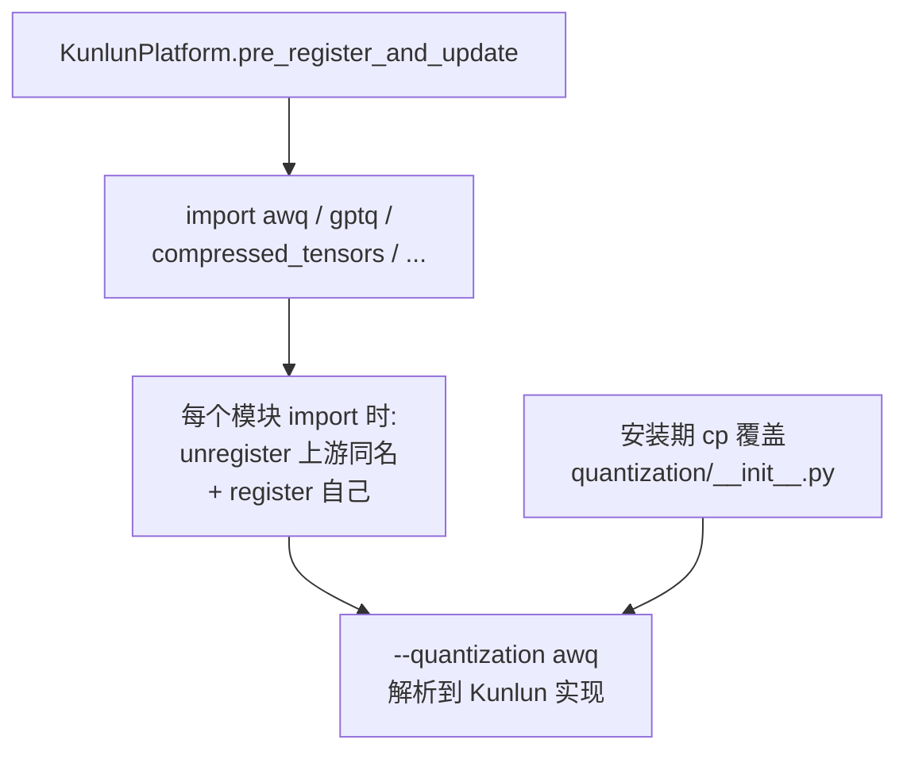

# 量化

## 1. 注册机制：先注销，再注册同名

**唯一的注册入口**是 `KunlunPlatform.pre_register_and_update`
（`platforms/kunlun.py#L421-L431`），它 import 五个量化符号，纯为副作用。

每个 config 模块在 import 时执行同一个套路——把上游注册表里的同名条目**移除**，
再把自己注册进去：

| 模块 | 位置 |
| --- | --- |
| 通用 helper | `quantization/utils.py#L19-L24` |
| AWQ | `quantization/awq.py#L39-L44` |
| GPTQ | `quantization/gptq.py#L51-L56` |
| compressed-tensors | `quantization/compressed_tensors/compressed_tensors.py#L43-L48` |

这样用户仍然用 `--quantization awq` 这类标准名字，拿到的是 Kunlun 实现。

除此之外还有[安装期覆盖](architecture.md#44-安装期文件覆盖最隐蔽)：
`vllm/model_executor/layers/quantization/__init__.py` 被
`vllm_kunlun/quantization/__init__.py` **整文件替换**
（`installation.md#L106`、`ci/scripts/env/install_env.sh#L58-L60`，替换文件 `#L3` 有
`# patched by vLLM-Kunlun` 标记）。



## 2. AWQ（W4A16）

**核心启发式**（`quantization/awq.py#L161`）：

```python
FP16_MATMUL_HEURISTIC_CONDITION = x.shape[:-1].numel() >= 256
```

- token 数 ≥ 256（大 batch / prefill）→ `awq_dequantize` 反量化后走普通 matmul
- token 数 < 256（decode）→ 融合 `awq_gemm`

分支在 `#L164-L171`。

**权重重排序表**（`#L92`、`#L107-L111`）：

```python
AWQ_TO_KUNLUN_ORDER_NORMAL = [4, 0, 5, 1, 6, 2, 7, 3]
```

还有一个 FAST 变体。这是 AWQ 打包顺序到昆仑 kernel 期望顺序的映射，
改动它会直接导致输出乱码。

> ⚠️ **AWQ MoE 没有 Kunlun 实现**：`#L58-L70` 回落到**上游**的
> `MoeWNA16Config`。也就是说 AWQ 量化的 MoE 模型走的是通用路径，
> 不享受 [moe-and-ep.md](moe-and-ep.md) 里描述的融合优化。

## 3. GPTQ

`quantization/gptq.py#L140-L148` → `torch.ops.xspeedgate_ops.gptq_gemm`。

exllama kernel 通过平台枚举注册：
`quantization/kernels/exllama.py#L52-L53` —— `_POSSIBLE_KERNELS[PlatformEnum.OOT]`。

## 4. W8A8（int8）

- kernel 注册：`quantization/kernels/__init__.py#L7` ——
  `_POSSIBLE_INT8_KERNELS[PlatformEnum.OOT] = [KunlunScaledMMLinearKernel]`
- **scale 语义转换**：`quantization/kernels/scale_mm.py#L43-L50` ——
  `w_s.mul_(127.0)`。上游存的是 scale，昆仑 kernel 要的是 max，
  两者差一个 127 因子。**这行是 W8A8 数值正确性的关键，改动前务必确认 kernel 契约。**

W8A8 是官方 tutorial 里用得最多的量化格式（DeepSeek-V3.2-Exp-W8A8、
GLM-5-W8A8-INT8、Qwen3-Coder-480B-A35B W8A8），见 [model-support.md](model-support.md)。

## 5. compressed-tensors

MoE 方法分派在
`quantization/compressed_tensors/compressed_tensors_moe.py#L46-L117`：

| 格式 | 状态 |
| --- | --- |
| W4A16 | 支持 |
| W8A8（int8） | 支持，实现见 [moe-and-ep.md](moe-and-ep.md#4-量化-int8-单体路径) |
| W4A8 | **整块注释掉**（`#L109-L113`） |

另有一处 post-import 补丁把上游 int8 MoE backend 选择直接短路：
`registration/compat_patches.py#L188` —— `select_int8_moe_backend` → `return None, None`
（表项在 `#L225`）。目的是阻止上游选到 CUDA/Triton 专用 backend。

## 6. 死代码：`moe_wna16.py`

`quantization/moe_wna16.py` **完全不可用**：

- `#L27` 的 import 是坏的：
  `from vllm_kunlun.ops.quantization.kernels.quant_ops import dequant_int4`
  —— 这个路径不存在。
- `#L107` 的 `KunlunMoeWNA16Method` 没有任何引用方。

配合第 2 节：AWQ MoE 回落上游 `MoeWNA16Config`，说明这个文件本来想做的事
（Kunlun 版 WNA16 MoE）**还没接上**。

## 7. 实操：怎么开量化

W8A8 模型的量化**不是靠命令行 flag**，而是**手工编辑模型的 `config.json`**。
DeepSeek-V3.2-Exp-W8A8 的 tutorial 明确要求这样做
（`docs/source/tutorials/multi_xpu_DeepSeek-V3.2-Exp-w8a8.md#L45`、`#L49-L95` 给出完整的
`quantization_config` 片段）。

启动侧只需要保证 dtype 与 block size 匹配，例如：

```
--dtype float16 --block-size 64 --kv-cache-dtype bfloat16
```

完整命令见 [model-support.md](model-support.md)。

## 相关页面

- [moe-and-ep.md](moe-and-ep.md) —— 量化 MoE 的单体实现
- [model-support.md](model-support.md) —— 各量化模型的启动命令
- [known-gaps.md](known-gaps.md) —— `moe_wna16.py` 等死代码汇总
