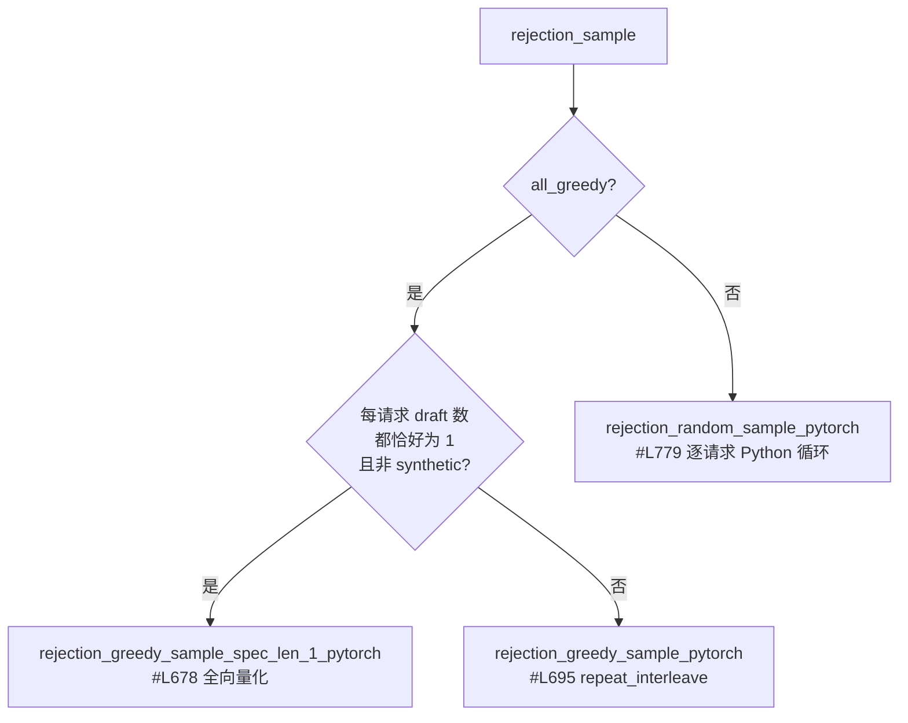

# 投机解码与采样

## 1. EAGLE：`propose` 被整体替换

加载时机是 [bootstrap 阶段 3](architecture.md#2-bootstrap七个有序阶段)：
`bootstrap.py#L27-L34` 定义
`_SPEC_DECODE_COMPAT_MODULES = ("vllm_kunlun.v1.sample.spec_decode.dflash", "vllm_kunlun.v1.sample.spec_decode.eagle")`，
`#L113-L133` 的 `load_spec_decode_compat` 只为副作用 import 它们。

副作用就是两行 monkey-patch（`v1/sample/spec_decode/eagle.py#L340-L341`）：

```python
EagleProposer.propose = propose
EagleProposer.prepare_next_token_ids_padded = prepare_next_token_ids_padded
```

上游类从 `#L13` 导入。属于[就地类补丁](architecture.md#42-post-import-就地补丁8-个)。

替换版 `propose` 里的 Kunlun 专有改动：

| 改动 | 位置 |
| --- | --- |
| 存在 `attn_metadata.decode.spec_num_seq_len` 时置 `-1` | `#L62-L68` |
| DeepSeek-V3.2 稀疏 indexer 层的 draft metadata（`self.indexer_layer_names`） | `#L70-L85` |
| `eagle3` 分支 assert `Eagle3LlamaForCausalLM` + `combine_hidden_states` | `#L43-L46` |
| `mtp` 分支（单返回值，`compute_logits(sample_hidden_states, 0)`） | `#L116-L125` |
| tree attention 分支（`isinstance(attn_metadata, TreeAttentionMetadata)`） | `#L129-L139` |
| `draft_token_ids = logits.argmax(dim=-1)`，`num_speculative_tokens == 1` 提前返回 | `#L141-L146` |
| `exceeds_max_model_len` 裁剪 + `slot_mapping.masked_fill_(..., PADDING_SLOT_ID)`（`PADDING_SLOT_ID = -1` 在 `#L19`） | `#L180-L209` |

最值得记住的是一处**硬件 bug 规避**（`#L295-L306`，源码里带
`# ---- FIX START ----` 标记）：

```
# XPU/XMLIR index_fill_ does NOT accept empty index tensor.
if num_discarded_requests > 0:
    ...
    if idx.numel() > 0:
        valid_sampled_token_ids_gpu.index_fill_(0, idx, -1)
```

即 `index_fill_` 传空索引在 XPU 上会失败，必须显式判空。
这类"上游合法、XPU 不接受空张量"的模式在本仓库出现多次。

attention 侧的 spec 路径见
[attention-backend.md](attention-backend.md#6-投机解码相关的-attention-路径)。

## 2. DFlash：是 EAGLE 的子类，核心机制未实现

`v1/sample/spec_decode/dflash.py#L10-L17` 的 docstring 逐字说明：

> `class DFlashProposer(EagleProposer):` … `Minimal DFlash proposer backport for
> vLLM 0.15.1. This keeps the DFlash method on the EAGLE-style speculative
> decoding path while avoiding the upstream Triton DFlash input expansion kernel.
> The full DFlash parallel-drafting path can be layered on top once the 0.15.1
> runner has all upstream #36847 state fields.`

实际差异只有四点：

| 差异 | 位置 |
| --- | --- |
| `self.parallel_drafting_hidden_state_tensor = None` | `#L19-L21` |
| `_raise_if_multimodal(...)` → `pass`（注释 `DFlash targets Qwen3/Qwen3.5 style models.`） | `#L23-L27` |
| `model_returns_tuple() -> True` | `#L29-L30` |
| 读 `hf_config.dflash_config["use_aux_hidden_state"]`，回落 `eagle_config`，默认 `True` | `#L32-L41` |
| `copy_and_expand_dflash_inputs_native(...)` 纯 torch 输入扩展：`num_query_per_req = num_speculative_tokens + 1`（`#L59`），`input_ids` 用 mask token 填满后 `input_ids[:, 0] = next_token_ids`（`#L67-L73`） | `#L44-L73` |

draft 模型同样是壳：`models/qwen3_dflash.py#L20-L25`
（`class DFlashQwen3Model(Qwen3Model)`，docstring：复用稳定的 Qwen3 实现），
`#L36-L45` 的 `precompute_and_store_context_kv(...)` 是 no-op
（注释：上游在这里预插 cross-attention 的 K/V，本 backport 走 EAGLE 路径所以不需要），
`#L29-L34` 读 `dflash_config`，`#L56-L57` 缺 `draft_vocab_size` 时用 `vocab_size` 兜底。

> ⚠️ **`DFlashQwen3ForCausalLM` 没有出现在 `models/__init__.py#L14-L64`
> 的 `register_model()` 列表里**，因此走不通正常的模型注册表。

**结论**：DFlash 的标志性机制——并行 drafting + 预插 context K/V——**是 stub**。
当前它与 EAGLE 的差别仅在配置面与一个输入扩展 helper。

## 3. Rejection sampler：Triton → 纯 PyTorch

`vllm.v1.sample.rejection_sampler` 被[整模块重定向](architecture.md#41-整模块重定向7-个)。

常量与结构：`PLACEHOLDER_TOKEN_ID = -1`、`GREEDY_TEMPERATURE = 0`、
`MAX_SPEC_LEN = 128`（`#L27-L31`）；`class RejectionSampler(nn.Module)`（`#L34-L55`）；
`assert metadata.max_spec_len <= MAX_SPEC_LEN`（`#L115`）；
主入口 `rejection_sample(...)`（`#L149-L160`）；
形状/连续性断言与输出 buffer 预填（`#L382-L403`）。

分派：



- greedy 分派条件在 `#L418-L446`
- random 路径 `#L465-L480`：`rejection_random_sample_pytorch(..., IS_NGRAM=draft_probs is None, SYNTHETIC_MODE=synthetic_mode)`
- **性能要点**：`#L779-L800` 是 `for req_idx in range(batch_size)` 的
  Python 循环（`if is_greedy[req_idx]: continue`）。**非 greedy 采样 +
  投机解码时，这里是主要开销来源。**
- 辅助：`expand_pytorch`（`#L834`）、`sample_recovered_tokens_pytorch`（`#L859`）
- `compute_probs` 在 `all_greedy` 时直接返回原始 logits（`#L484-L509`）
- 合成接受率模式：`#L69-L82`，`if spec_config.rejection_sample_method == "synthetic":`
  → `unconditional_to_conditional_rates(spec_config.synthetic_acceptance_rates)`。
  用于在不跑真 draft 模型的情况下模拟接受率做性能测算。
- `#L17` `from vllm.v1.sample.ops.topk_topp_sampler import apply_top_k_top_p`
  经重定向解析到 Kunlun 模块，**采样器与 rejection sampler 共用同一份实现**。

## 4. 采样快路径：名字叫 flashinfer，实际是 `kunlun_ops`

`vllm.v1.sample.ops.topk_topp_sampler` 整模块替换。

`#L15-L17` 诚实地写着 FlashInfer 不支持：

```python
def flashinfer_sampler_supported() -> bool:
    """FlashInfer is not supported on Kunlun XPU, always return False."""
    return False
```

但 `#L28-L34` 仍打印 `logger.info_once("Using FlashInfer for top-p & top-k sampling.")`
然后把 `self.forward = self.forward_kunlun`。**这条日志是上游残留文案，误导性的——
没有任何 FlashInfer 参与。**

`forward_kunlun`（`#L57-L76`）：

```python
if (k is None and p is None) or generators:
    return self.forward_native(...)
return flashinfer_sample(logits.contiguous(), k, p, generators), None
```

而 `flashinfer_sample` 才是真正的 Kunlun 快路径，三个融合核：

| 条件 | 调用 | 位置 |
| --- | --- | --- |
| 只有 top-p | `kunlun_ops.top_p_sampling_from_probs(probs, top_p=p, deterministic=True)` | `#L206-L208` |
| 只有 top-k | `kunlun_ops.top_k_sampling_from_probs(probs, top_k=k, deterministic=True)` | `#L211-L213` |
| 两者都有 | `k = k.to(torch.int32)` 后 `kunlun_ops.top_k_top_p_sampling_from_probs(...)` | `#L216-L219` |

**实践含义（重要）**：只要请求里带了 seeded generator，**或者**
既没设 `top_k` 也没设 `top_p`，就退回 `forward_native`（基于排序的实现，
`#L79-L119` `apply_top_k_top_p`、`#L122-L144` `apply_top_k_only`），
融合核不生效。压性能时要确认走的是哪条。

随机噪声生成有两个 Kunlun 专有分支：

- `#L161-L167` —— `FAST_RANDOM_SAMPLE=1` 时用
  `q.uniform_(); q = -torch.log(q); q = q.clamp(min=1e-12)` 替代 `q.exponential_()`
- `#L177-L179` —— 带 generator 时逐个
  `torch.ops.xspeedgate_ops.inplace_exponential(q[i], generator=generator)`，
  然后 `probs.div_(q).argmax(dim=-1)`（Gumbel-max）
- `#L224-L253` —— `empty_exponential_noise_like` / `sample_with_exponential_noise`，
  注释说明被 `vllm.v1.spec_decode.llm_base_proposer` 使用

> 注意 `FAST_RANDOM_SAMPLE` 是直接 `os.getenv` 读的，**不在
> `platforms/envs.py` 的列表里**，也不在文档里。

## 5. logprobs：唯一改动是去掉 `torch.compile`

`v1/sample/ops/logprobs.py#L8` —— `@torch.compile(...)` 被注释掉；
`#L9-L23` 的 `batched_count_greater_than` 函数体与上游一致
（`return (x >= values).sum(-1)`）。

## 相关页面

- [architecture.md](architecture.md) —— 重定向与就地补丁机制
- [attention-backend.md](attention-backend.md) —— spec decode 的 attention 路径
- [linear-attention.md](linear-attention.md) —— 混合 Mamba 模型上 spec decode 未实现
- [known-gaps.md](known-gaps.md)
