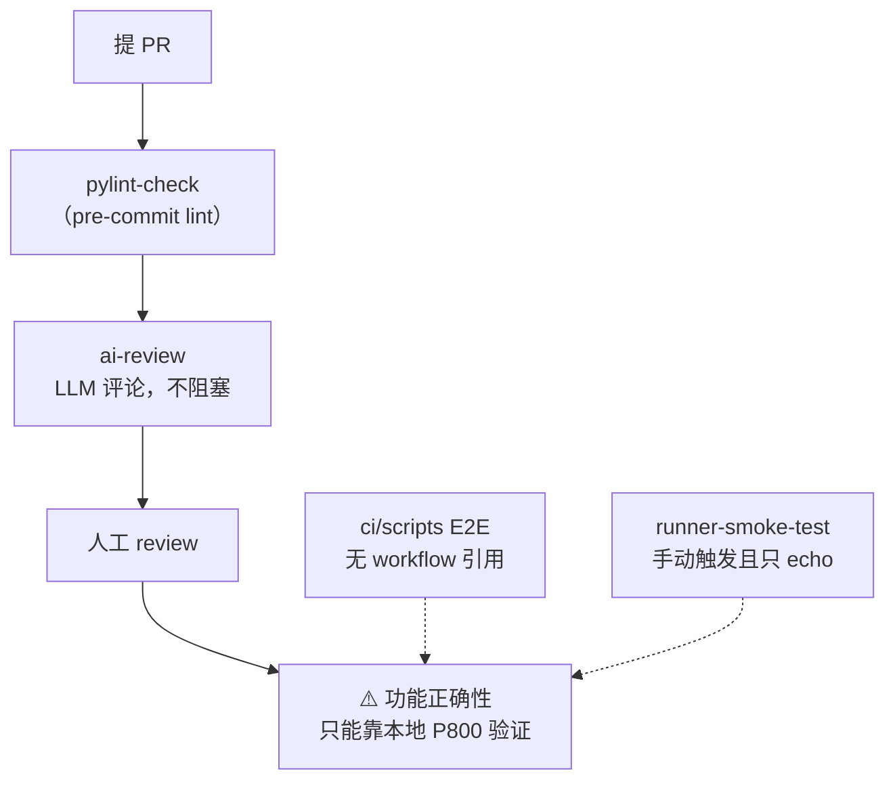

# 测试与 CI 的真实覆盖度

**一句话结论：这个仓库没有功能性 CI 门禁。**唯一真正会拦住 PR 的检查是
pre-commit lint。任何依赖"CI 绿了就说明没坏"的假设都不成立——
改动必须在真实 P800 机器上手工验证。

## 1. GitHub workflows

| workflow | 触发 | 实际做什么 | 是门禁? |
| --- | --- | --- | --- |
| `pylint-check.yml` | PR | 跑 pre-commit（lint） | ✅ 唯一门禁 |
| `runner-smoke-test.yml` | `workflow_dispatch`（**手动**） | `echo` hostname / uname，`curl api.github.com/meta` | ❌ |
| `ai-review.yml` | `pull_request_target` | LLM 代码审查（`MODEL_NAME: gpt-5.6-sol`，评论标记 `<!-- baidu-vllm-kunlun-ai-review -->`） | ❌ 只留评论 |

`ci.yml`（百度内部 CI 配置，不是 GitHub Actions）只执行 `sh build.sh`，
而 `build.sh#L22-L23` 只是打 tarball（见
[build-and-install.md](build-and-install.md#4-buildsh-不编译任何东西)）——
**连编译都不算真正跑了。**

## 2. `ci/scripts/**`：存在但没人调用

仓库里有一套 E2E 脚本，**没有任何 workflow 引用它们**：

| 脚本 | 配置 | 判定 |
| --- | --- | --- |
| E2E | 1 卡，Qwen3-8B，TP=1 | — |
| 精度 | `evalscope eval --datasets gsm8k arc --limit 10` | **无阈值** |
| 性能 | 单一 `1024x1024` 形状，并发 1 | **无阈值** |

即使手工跑，也只是"跑完不报错"，`--limit 10` 的 gsm8k/arc 样本量
无法检出精度回退，并发 1 的单形状也检不出吞吐回退。

## 3. 单元测试

**全仓库只有 6 个真正的单元测试**：`tests/ut/test.py`，全部针对
`TorchCompileWrapperWithCustomDispatcher`（即
[kunlun-graph.md](kunlun-graph.md) 里那个编译 wrapper）。

`vllm_kunlun/tests/test_prefill_attention_prefix_cache.py`
**不是 pytest**：它是一个硬件诊断脚本，用**退出码**表达结果，
用来定位前缀缓存下 prefill attention 的正确性问题。
需要真实 XPU 才能跑。

## 4. Lint 配置的一个坑

`.pre-commit-config.yaml#L75` 把**所有 workflow 文件排除在 actionlint 之外**
——而 workflow 文件正是 actionlint 唯一的检查对象。
换句话说 **actionlint 实际上什么都没检查**。

## 5. 文档构建

`.readthedocs.yaml` 设了 `fail_on_warning: true`，所以文档警告会导致
构建失败。这是仓库里第二严格的检查——**比代码检查还严格**。

## 6. 对贡献者的实际含义

自查清单（对应本 wiki 各页的高风险点）：

1. 改了 MoE？确认 `act=None` + 显式 `silu_and_mul` 的规避还在
   （[moe-and-ep.md](moe-and-ep.md#3-关键actnone--显式-silu_and_mul-不是冗余写法)）——
   否则高并发输出乱码。
2. 改了量化 scale？确认 `w_s.mul_(127.0)` 语义
   （[quantization.md](quantization.md#4-w8a8int8)）。
3. 改了混合 KV cache？`kunlun_attn.py#L692-L713` 与
   `mamba_utils.py#L315-L340` 必须同步。
4. 改了 attention 数值？先看 `ds_alpha` 与 LSE scale 那两处
   （[attention-backend.md](attention-backend.md#prefill-helper-与数值一致性风险)）。
5. 加了覆盖？确认用的是四种手段里正确的那一种
   （[architecture.md](architecture.md#4-四种覆盖手段)）。
6. 改了文档？`fail_on_warning: true`，警告即失败。

## 相关页面

- [build-and-install.md](build-and-install.md)
- [known-gaps.md](known-gaps.md)
