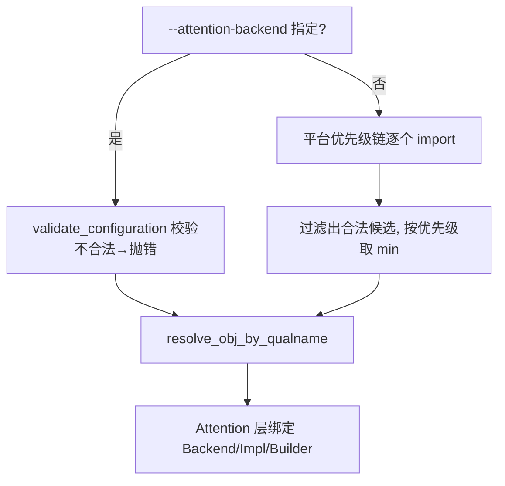

# Attention 后端机制与接入

**勘误**：旧目录 `vllm/attention/` 已不存在，后端全部在 `vllm/v1/attention/backends/`；`VLLM_ATTENTION_BACKEND` 环境变量已删除，改为 CLI `--attention-backend`；Platform 钩子名为 `get_attn_backend_cls`（旧名 `get_attn_backend_cls_name`）。本版本只有 V1 引擎。

## 1. 四个核心抽象（`vllm/v1/attention/backend.py`，1110 行）

一个注意力后端 = **三件套** + 私有 Metadata：

### (a) `AttentionBackend`（ABC）@L59

必须实现的三个方法：

| 方法 | 位置 | 说明 |
|---|---|---|
| `get_name() -> str` | @L76-L79 | 返回枚举成员名（如 `"FLASH_ATTN"`），`Attention` 层用它反查枚举 |
| `get_impl_cls()` | @L81-L84 | 返回 `AttentionImpl` 子类 |
| `get_builder_cls()` | @L86-L89 | 返回 `AttentionMetadataBuilder` 子类 |

可选覆盖的能力探测（自动选择时的合法性过滤）：`get_supported_kernel_block_sizes` @L72、`supports_head_size` @L99、`supports_dtype` @L104、`supports_kv_cache_dtype` @L108、`supports_block_size` @L116、`get_preferred_block_size` @L149、`is_mla` @L160、`supports_sink` @L164、`supports_sliding_window` @L184 等。

**配置校验统一入口** `validate_configuration(...)` @L270-L330：接收 head_size/dtype/kv_cache_dtype/block_size/use_mla/device_capability 等全部选择条件，逐项调 `supports_*`，返回不合法原因列表。**所有 `supports_*` 声明必须与实际一致**，否则选择链会误判。

类属性 `forward_includes_kv_cache_update`（@L69-L70）决定 KV 写入路径（见 §4）。

### (b) `AttentionMetadata` / `CommonAttentionMetadata`

- `AttentionMetadata` @L370-L371：空标记类（类型参数上界）。
- `CommonAttentionMetadata` @L377-L460：跨层、跨后端共享的每批公共元数据（`query_start_loc`、`seq_lens`、`num_actual_tokens`、`block_table_tensor`、`slot_mapping`、`causal` 等）。各后端 builder 用它构造自己的私有 metadata。

### (c) `AttentionMetadataBuilder`（ABC, Generic[M]）@L593

必须实现：`__init__(kv_cache_spec, layer_names, vllm_config, device)` @L610-L622、`build(common_prefix_len, common_attn_metadata, fast_build) -> M` @L668-L686。
可选：`_cudagraph_support` 类属性 @L596（枚举 `AttentionCGSupport`）、`reorder_batch_threshold` @L600、`update_block_table` @L688、`build_for_cudagraph_capture` @L703、`build_for_drafting` @L715、`use_cascade_attention` @L747。

### (d) `AttentionImpl`（ABC, Generic[T]）@L882

固定构造签名 @L892-L906：`__init__(num_heads, head_size, scale, num_kv_heads=None, alibi_slopes=None, sliding_window=None, kv_cache_dtype="auto", logits_soft_cap=None, attn_type=..., kv_sharing_target_layer_name=None)`。
必须实现 `forward(layer, query, key, value, kv_cache, attn_metadata, output, output_scale=None, output_block_scale=None)` @L908-L921。
MLA 后端继承 `MLAAttentionImpl` @L996。

## 2. 注册表与第三方注册（`vllm/v1/attention/backends/registry.py`）

- `AttentionBackendEnum` @L34-L135：全部内置后端的枚举注册表，成员值是类全限定名（`FLASH_ATTN` @L44、`FLASHINFER` @L65、`TRITON_ATTN` @L48、`ROCM_ATTN` @L52、`CPU_ATTN` @L129、MLA 系列 @L66-L102…）。`CUSTOM = None` @L133-L135 是第三方占位。
- `register_backend(backend_enum, class_path=None)` @L248-L300：把实现类路径写入覆盖表 `_ATTN_OVERRIDES` @L244；`get_class()` @L156-L166 优先取覆盖路径。**`CUSTOM` 必须先注册才能使用**（否则 @L148-L151 报 "must be registered before use"）。

第三方后端接入步骤（不改 vLLM 源码）：

```python
from vllm.v1.attention.backend import AttentionBackend, AttentionImpl, AttentionMetadataBuilder
from vllm.v1.attention.backends.registry import AttentionBackendEnum, register_backend

@register_backend(AttentionBackendEnum.CUSTOM)
class MyBackend(AttentionBackend):
    @staticmethod
    def get_name() -> str: return "CUSTOM"
    @staticmethod
    def get_impl_cls(): return MyImpl
    @staticmethod
    def get_builder_cls(): return MyBuilder
```

然后在平台插件（`vllm.platform_plugins`）或启动 import 处触发模块导入，并让选择器命中：用户传 `--attention-backend CUSTOM`，或在你的 `Platform.get_attn_backend_cls` 里返回 `AttentionBackendEnum.CUSTOM.get_path()`（XPU 平台的条件路由示例：`repo://vllm/platforms/xpu.py#L143`）。

## 3. 运行时选择链（`vllm/v1/attention/selector.py`）

`get_attn_backend(head_size, dtype, kv_cache_dtype, use_mla, ...)` @L102-L191：

1. 组装 `AttentionSelectorConfig`（@L21-L38）。
2. **用户显式指定优先**：`vllm_config.attention_config.backend`（`AttentionConfig` 在 `repo://vllm/config/attention.py#L21`，字段 `backend` @L24）；支持按 KV cache 组细粒度覆盖 `backend_per_kind`（@L173-L183，FULL_ATTENTION / SLIDING_WINDOW / MLA 分别指定）。
3. 调 `current_platform.get_attn_backend_cls(backend, attn_selector_config, num_heads)`（@L202-L206）→ 平台返回**类路径字符串** → `resolve_obj_by_qualname` 懒加载（@L211）。为空抛 `ValueError` @L207-L210。
4. Mamba/线性注意力独立选择：`get_mamba_attn_backend` @L215-L234。

### CUDA 平台的自动回退链（`repo://vllm/platforms/cuda.py`）

`get_attn_backend_cls` @L440-L538：

- 用户指定了后端 → `validate_configuration` 校验，**不合法直接抛错，不静默回退**（@L457-L466）。
- 未指定 → `get_valid_backends()` @L473-L477 按 `_get_backend_priorities()` @L82-L172 的优先级逐个 import + 校验，收集候选，`min(..., key=priority)` 选最高。
- 优先级示例：SM100 非 MLA：`FLASHINFER → FLASH_ATTN → TRITON_ATTN → FLEX_ATTENTION`；SM90 MLA：`FLASH_ATTN_MLA → FLASHMLA → FLASHINFER_MLA → TRITON_MLA`。



## 4. `Attention` 层与 KV cache 写入（`repo://vllm/model_executor/layers/attention/attention.py`）

- `class Attention` @L225；`__init__` @L237-L256 接收可选 `attn_backend`，为 None 时走 §3 选择链 @L346-L357，随后绑定 `impl_cls`/`builder_cls` 并实例化 impl（@L416-L429）。
- `self.kv_cache` 先放占位张量 @L456-L459，运行前由 ModelRunner `bind_kv_cache` 替换（`repo://vllm/v1/worker/gpu_model_runner.py#L7454`）。
- builder 不在层内实例化，而在 worker 侧 `vllm/v1/worker/utils.py@L289-L306`（每 ubatch 一个，回填 `set_kernel_block_size`）。
- cudagraph 能力仲裁：`gpu_model_runner.py@L7264-L7290` 取所有后端 `get_cudagraph_support` 的**最小值**，交给 `compilation_config.resolve_cudagraph_mode_and_sizes`。
- forward 最终进 custom op `unified_attention_with_output` @L757-L790。**KV 写入两路径**：
  - **路径 A**：`forward_includes_kv_cache_update=True`（默认，Triton 系）——impl.forward 内含 KV 写入。
  - **路径 B**：False（FlashAttention，`repo://vllm/v1/attention/backends/flash_attn.py#L118`）——`Attention.forward` 先调 `unified_kv_cache_update` → `impl.do_kv_cache_update(layer, key, value, kv_cache, slot_mapping)`（attention.py@L716-L739；FA 参考实现 flash_attn.py@L1220-L1255 调 `reshape_and_cache_flash`），返回 dummy tensor 保证 torch.compile 保序。

## 5. 参考实现：FlashAttention 三件套（flash_attn.py，1836 行）

| 组件 | 位置 | 关键覆盖 |
|---|---|---|
| `FlashAttentionBackend` | @L81 | `get_name` @L128 返回 `"FLASH_ATTN"`；`get_supported_kernel_block_sizes` @L111（`MultipleOf(16)`）；`get_preferred_block_size` @L120；`supported_dtypes/kv_cache_dtypes` @L82-L89；`forward_includes_kv_cache_update=False` @L118；`supports_*` 系列 @L132-L250 |
| `FlashAttentionMetadataBuilder` | @L337 | `__init__` @L422 预分配 scheduler metadata；`build` @L545；`get_cudagraph_support` @L363；`use_cascade_attention` @L826 |
| `FlashAttentionImpl` | @L833 | `forward` @L948（prefill/decode 分支、FP8、DCP）；`do_kv_cache_update` @L1220 |

## 相关页面

- [platform-abstraction.md](../platform/platform-abstraction.md) — `get_attn_backend_cls` 钩子在 Platform 中的位置
- [new-backend-guide.md](../guides/new-backend-guide.md) — 接入清单中注意力部分的步骤
