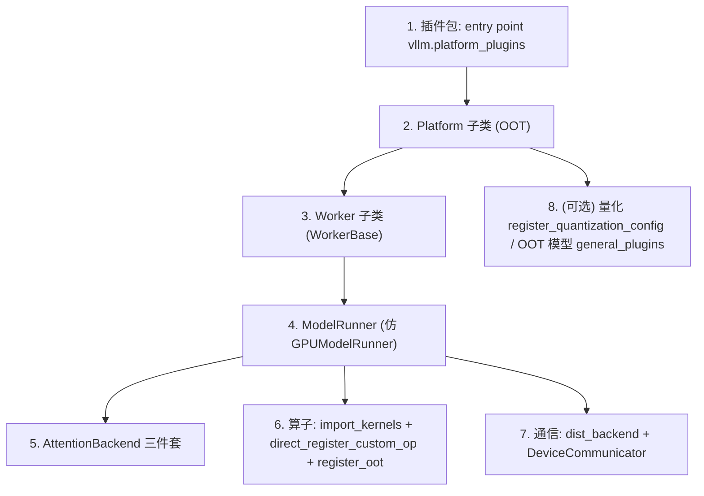

# 新硬件后端接入实操指南（OOT Plugin 路线）

权威指南：`repo://docs/design/plugin_system.md#L66-L149`（"Platform plugins guidelines"）。核心思路：**不改 vLLM 源码**，用 entry point + 子类替换完成接入。参考范本：树内最"薄"的 `XPUPlatform` + `XpuCommunicator` 组合。

## 0. 总览



## 1. 插件包骨架

```
vllm-my-hw/
├── setup.py                # entry_points 声明
└── vllm_my_hw/
    ├── __init__.py          # register() 检测函数
    ├── platform.py          # MyHardwarePlatform(Platform)
    ├── worker.py            # MyHardwareWorker(WorkerBase)
    ├── model_runner.py      # 仿 gpu_model_runner.py
    ├── attention.py         # 三件套
    ├── ops.py               # direct_register_custom_op 批量注册
    └── communicator.py      # (可选) DeviceCommunicator 子类
```

```python
# setup.py
entry_points={
    "vllm.platform_plugins": ["my_hw = vllm_my_hw:register"],
    "vllm.general_plugins":  ["my_hw_models = vllm_my_hw.models:register"],  # 可选
}
```

```python
# vllm_my_hw/__init__.py
def register():
    if not detect_my_hardware():   # 幂等、不抛异常
        return None
    return "vllm_my_hw.platform.MyHardwarePlatform"   # 类全限定名字符串
```

裁决规则（`repo://vllm/platforms/__init__.py#L265-L277`）：**只要你的 OOT 插件激活，就优先于全部内置平台**；同时激活多个 OOT 插件会 `RuntimeError`。

## 2. Platform 子类（必须项 / 可选项）

继承 `vllm.platforms.interface.Platform`（`repo://vllm/platforms/interface.py#L131` 起）。

**必须实现：**

| 项 | 说明 |
|---|---|
| `_enum = PlatformEnum.OOT` | 使 `is_out_of_tree()` 生效；设备路径拼 `f"{device_name}:{idx}"`（parallel_state.py@L535-L538） |
| `device_type` / `device_name` | **必须与 PyTorch 设备类型字符串一致** |
| `check_and_update_config` | 早期改配置；**必须把 `worker_cls`（及 `sd_worker_cls`）从 `"auto"` 改为具体类限定名**（plugin_system.md@L105；范本 cuda.py@L331-L332、xpu.py@L360-L363） |
| `get_attn_backend_cls` | 返回你的注意力后端类全限定名（可参考 XPU 的条件路由 xpu.py@L143） |
| `get_device_communicator_cls` | 默认 `DeviceCommunicatorBase` 也合法（纯 torch.distributed） |
| `get_device_name/uuid/total_memory` | 基类抛 NotImplementedError（@L495-L508） |

**必须设置的类属性**：`dispatch_key`（@L142）、`device_control_env_var`（@L153）、`ray_noset_device_env_vars`（@L158）、`dist_backend`（@L168）、`ray_device_key`（@L147，不支持 Ray 留空）、`supported_quantization`（@L170，空=不限制）、`additional_env_vars`（@L172）。

**按需覆盖**：`import_kernels`（@L363，导入自有扩展——XPU 刻意不导 `vllm._C` 的先例见 xpu.py@L132-L136）、`pre_register_and_update`（@L545，CLI 前注册量化 config 等）、`supported_dtypes`（@L181，第一个是 auto dtype 回退）、`check_if_supports_dtype`（@L1204）、`get_device_capability`（@L419）、`inference_mode`（@L523）、`is_sleep_mode_available`（@L224）、`use_custom_allreduce`（@L1130）、`use_custom_op_collectives`（@L1249）、`support_static_graph_mode`（@L1218）、`get_static_graph_wrapper_cls`（@L1183）、`stateless_init_device_torch_dist_pg`（@L1190）、`can_update_inplace`（@L1053）、`get_current_memory_usage`（@L1030）、`check_runner_kv_caches_multi_layer`（@L1225）、`update_block_size_for_backend`（@L608，block size 对齐）。

**免费获得**：`__getattr__` 属性透传到 `torch.<device_type>` 模块（@L1153-L1172）——若 PyTorch 有你的 device 模块，`synchronize()` 等无需实现。

## 3. Worker 子类

继承 `vllm.v1.worker.worker_base.WorkerBase`（@L44）。必实现：`init_device`（@L134，内含分布式初始化，顺序参考 GPU Worker：**先初始化分布式、再做内存快照**，gpu_worker.py@L425-L453）、`load_model`（@L162）、`get_kv_cache_spec`（@L103）、`determine_available_memory`、`initialize_from_config`（KV cache 分配）、`execute_model`（@L166）、`sample_tokens`（@L177）、`compile_or_warm_up_model`（@L116）、`get_cache_block_size_bytes`（@L183）、`synchronize_device`（@L128，**非 torch.accelerator 设备必须覆写**）、`shutdown`（@L206）。

注意事项：
- `worker_cls` 传**字符串限定名**，传类对象会 `ValueError`（worker_base.py@L274-L283）。
- worker 进程会重新 `load_general_plugins()`（@L269-L271）——插件必须幂等。
- 按特性补：`sleep/wake_up`、`take_draft_token_ids`（投机解码）、LoRA 系列（@L189-L199）。

## 4. ModelRunner

仿 `GPUModelRunner`（`repo://vllm/v1/worker/gpu_model_runner.py#L503`）：`execute_model` @L4274、`sample_tokens` @L4653、`load_model` @L5399、KV cache 三件套 @L7419/L7491/L7633、`profile_run` @L6539、`_dummy_run` @L5923。可复用 kv_connector / lora / ec_connector mixin。

## 5. AttentionBackend 三件套

见 [attention-backend.md](../acceleration/attention-backend.md) §1-§2。要点：
- `get_name()` 必须与 `AttentionBackendEnum` 成员名一致，或用 `register_backend(AttentionBackendEnum.CUSTOM)` 注册到 `_ATTN_OVERRIDES`。
- `AttentionImpl` 构造签名与 `forward` 签名是固定契约（backend.py@L892-L921）。
- 决定 KV 写入路径：`forward_includes_kv_cache_update`（backend.py@L69-L70）；走"分离写入"需实现 `do_kv_cache_update`。
- `validate_configuration` 依赖的 `supports_*` 必须与实际一致。

## 6. 算子与量化

- `Platform.import_kernels()` 导入自有扩展（各平台先例见 [ops-custom-kernels.md](../acceleration/ops-custom-kernels.md) §1）。
- 自有算子用 `direct_register_custom_op`（dispatch_key 缺省取 `current_platform.dispatch_key`），配 `hasattr(torch.ops._C, ...)` 门控 + fake impl。
- 层级接入：能复用 `_C` kernel 的层 `forward_xpu`（或 `forward_oot`）委托 `forward_cuda`；不能复用回落 `forward_native`。
- 整类替换：`@CustomOp.register_oot` / `@PluggableLayer.register_oot`（HPU 的 MoE method 是官方示例）。
- 量化：白名单放行或 `@register_quantization_config`（见 [quantization-integration.md](../acceleration/quantization-integration.md)）。

## 7. 通信

见 [distributed-comm.md](../runtime/distributed-comm.md) §3：`dist_backend` + 最小 `DeviceCommunicatorBase`（仿 `XpuCommunicator`）起步，需要 EP 再挂 all2all manager。

## 8. 环境变量 / 运行时配置

| 变量/配置 | 作用 |
|---|---|
| `VLLM_PLUGINS` | 插件白名单；未设置=除 endpoint 外全部加载 |
| `device_control_env_var` / `ray_noset_device_env_vars` / `additional_env_vars` | 平台类属性，设备可见性与 Ray 集成 |
| `--distributed-executor-backend` | ray / mp / uni / external_launcher / Executor 类限定名 |
| `--worker-cls` / `--worker-extension-cls` | 显式指定/扩展 worker |
| `--attention-backend` | 显式指定注意力后端（旧 `VLLM_ATTENTION_BACKEND` 已删除） |
| `--disable-custom-all-reduce` | 关闭 custom allreduce |

## 9. 接入自检清单

- [ ] 检测函数幂等、异常安全、返回**类限定名字符串**
- [ ] `check_and_update_config` 设置了 `worker_cls`（字符串）
- [ ] `device_name` == PyTorch 设备类型字符串
- [ ] Worker 实现了全部必选方法，`synchronize_device` 已覆写
- [ ] Attention 三件套签名匹配，`supports_*` 声明属实
- [ ] `import_kernels` 导入了自有扩展且失败不崩（基类模式是告警）
- [ ] `dist_backend` 是当前 torch 构建可用的 PG backend（否则静默回退 gloo）
- [ ] 每个进程重复加载插件/平台检测不报错

## 相关页面

- [index.md](../index.md) — 返回目录
- [plugin-system.md](../platform/plugin-system.md) — entry point 组全表
