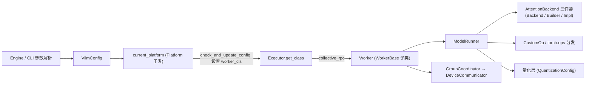

# vLLM 硬件后端接入体系

> [返回 OpenWiki 根目录](../index.md) · [查看 vLLM-Kunlun 的下游实现](../vllm-kunlun/index.md)

本 wiki 聚焦 vLLM 的 **Platform / 硬件后端接入体系**：一个非 CUDA 硬件（ROCm、XPU、CPU、TPU、昆仑芯 XPU 等）要把 vLLM 跑起来，需要挂进哪些抽象、实现哪些类、注册哪些 entry point。

**证据基线**：vLLM main 分支 commit `94848eda600a07c28675f5753a11b2c212c146ed`（2026-09-09）。
注意：本版本 vLLM 只有 **V1 引擎**，且相对老版本有大幅重构——`vllm/attention/`、`PlatformRegistry`、`get_worker_class`、`VLLM_ATTENTION_BACKEND` 均已不存在，读旧文档时需对照本 wiki 的勘误。

## 总体架构

一个硬件后端的"落点"只有五个：**平台类**（[platform-abstraction.md](platform/platform-abstraction.md)）、**插件入口**（[plugin-system.md](platform/plugin-system.md)）、**注意力后端**（[attention-backend.md](acceleration/attention-backend.md)）、**算子与量化**（[ops-custom-kernels.md](acceleration/ops-custom-kernels.md)、[quantization-integration.md](acceleration/quantization-integration.md)）、**Worker/执行链与通信**（[worker-executor.md](runtime/worker-executor.md)、[distributed-comm.md](runtime/distributed-comm.md)）。完整接入清单见 [new-backend-guide.md](guides/new-backend-guide.md)。

## 页面目录

| 层级 | 页面 | 内容 |
|---|---|---|
| 1. 平台与插件 | [Platform 抽象层](platform/platform-abstraction.md) | `Platform` 基类、内置平台清单与硬件能力契约。 |
| 1. 平台与插件 | [平台检测](platform/platform-detection.md) | 平台发现、`current_platform` 懒加载与优先级裁决。 |
| 1. 平台与插件 | [插件系统](platform/plugin-system.md) | Entry-point 组和 `vllm.platform_plugins` 契约。 |
| 2. 运行时执行 | [Worker 与执行链](runtime/worker-executor.md) | Executor → Worker → ModelRunner 的接线与 `worker_cls`。 |
| 2. 运行时执行 | [分布式通信](runtime/distributed-comm.md) | `GroupCoordinator`、`DeviceCommunicator` 与集合通信。 |
| 3. 加速与内核 | [Attention 后端](acceleration/attention-backend.md) | `AttentionBackend` 三件套、选择链与第三方注册。 |
| 3. 加速与内核 | [自定义算子](acceleration/ops-custom-kernels.md) | `torch.library` 注册、`CustomOp` 分发与 OOT kernel 模式。 |
| 3. 加速与内核 | [量化接入](acceleration/quantization-integration.md) | 量化方法注册表与平台白名单。 |
| 4. 接入指南 | [新硬件后端接入](guides/new-backend-guide.md) | 以 OOT plugin 路线完成新平台接入的清单。 |

## 关键事实速览（与旧版文档的差异）

- 平台基类在 `vllm/platforms/interface.py`（1341 行）；内置平台只剩 `cuda/rocm/xpu/cpu/zen_cpu/tpu(代理)` 六个文件，TPU 已外移到 `tpu_inference` 包，neuron/openvino/hpu 均转为 OOT 插件。来源：`repo://vllm/platforms/`。
- 平台选择：OOT 插件激活即优先于内置平台；多个 OOT 同时激活直接 `RuntimeError`。来源：`repo://vllm/platforms/__init__.py#L265-L277`。
- `worker_cls` 由平台在 `check_and_update_config()` 中设置（旧版 `Platform.get_worker_class()` 已删除）。来源：`repo://docs/design/plugin_system.md#L105`。
- 注意力后端选择：CLI `--attention-backend`（旧 `VLLM_ATTENTION_BACKEND` 环境变量已删除）+ `AttentionBackendEnum` 注册表 + 平台优先级回退链。来源：`repo://vllm/v1/attention/selector.py#L102-L191`。

## 维护信息

本模块的来源、许可证提示与导入边界见 [SOURCE.md](SOURCE.md)。页面生成范围与证据约定见 [INSTRUCTIONS.md](INSTRUCTIONS.md)，初始导入记录见 [CHANGELOG.md](CHANGELOG.md)。
