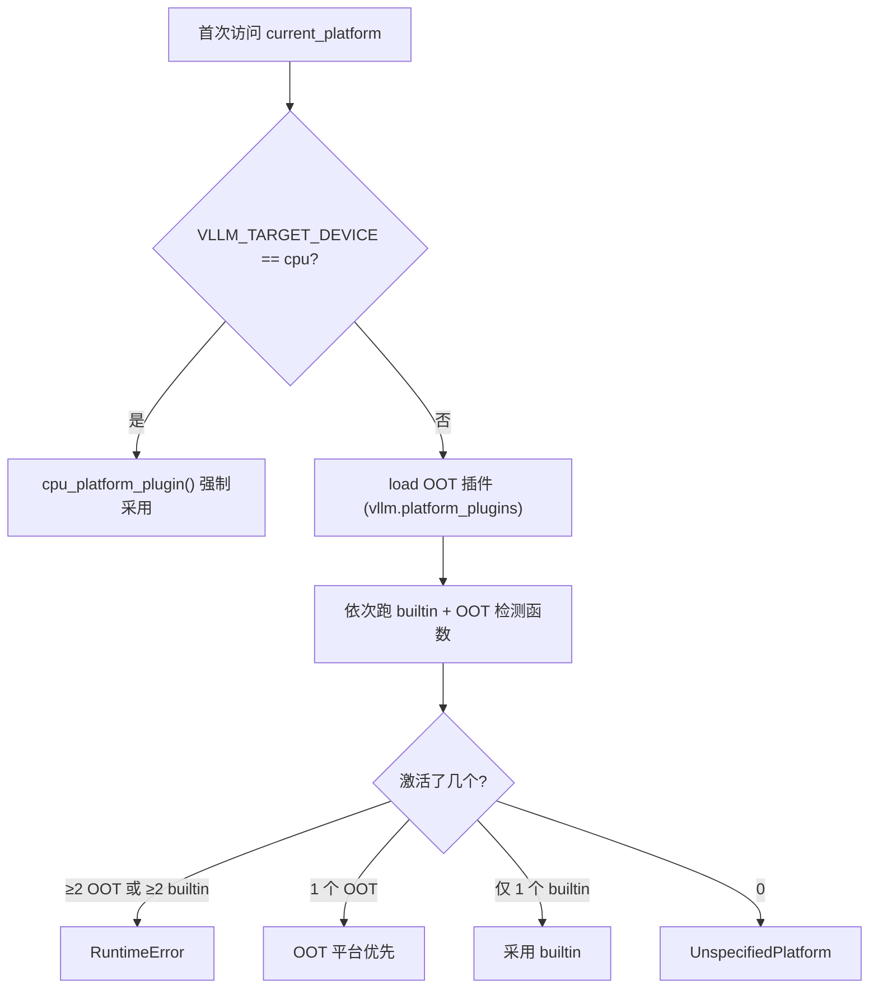

# 平台检测与 current_platform 懒加载

`vllm/platforms/__init__.py`（340 行）是平台检测/懒加载核心。核心问题：vLLM 启动时如何决定 `current_platform` 是哪个类。

## 1. 内置检测函数（`builtin_platform_plugins` 字典 @L224-L230）

每个检测函数在硬件/环境可用时返回**平台类全限定名字符串**，否则返回 `None`：

| 函数 | 检测逻辑 | 位置 |
|---|---|---|
| `cuda_platform_plugin()` | pynvml `nvmlInit()` + device count > 0，且版本串不含 `"cpu"`（防 CPU wheel 在 GPU 机器误激活）；NVML 异常时走 Jetson 兜底（检查 `/etc/nv_tegra_release`）| @L59-L107 |
| `rocm_platform_plugin()` | `import amdsmi` + `amdsmi_init()` + processor handles 非空；WSL 下回退检查 `torch.version.hip` | @L110-L142 |
| `xpu_platform_plugin()` | `torch.distributed.is_xccl_available()` 则设 `dist_backend="xccl"`；`hasattr(torch, "xpu") and torch.xpu.is_available()` | @L145-L164 |
| `cpu_platform_plugin()` | `VLLM_TARGET_DEVICE == "cpu"` 或版本串含 `"cpu"` 或 macOS；AMD Zen + zentorch 时切 `ZenCpuPlatform` | @L176-L221 |
| `tpu_platform_plugin()` | `VLLM_TPU_USING_PATHWAYS` → Pathways 代理；否则 `import libtpu` | @L35-L56 |

## 2. 裁决流程（`resolve_current_platform_cls_qualname()` @L233-L286）

1. **`VLLM_TARGET_DEVICE=cpu` 显式指定最优先**：直接调 `cpu_platform_plugin()` 并断言非 None（@L237-L241），**不探测其它插件**——注释说明 CPU CI 会复用加速器 wheel 跑在加速器宿主机上，逐个探测会导致 CPU 与宿主加速器同时激活。
2. 加载 OOT 插件：`platform_plugins = load_plugins_by_group(PLATFORM_PLUGINS_GROUP)`（@L243，即 `vllm.platform_plugins` entry point 组，见 [plugin-system.md](plugin-system.md)）。
3. 遍历 `chain(builtin_platform_plugins, platform_plugins)`，逐个调用检测函数；**单插件抛异常只记 debug 日志继续**（@L253-L258）；返回非 None 的记入 `activated_plugins`。
4. 优先级裁决：
   - 激活 ≥2 个 OOT 插件 → `RuntimeError("Only one platform plugin can be activated")`（@L265-L269）
   - **恰好 1 个 OOT → 优先采用 OOT 平台**（@L270-L272），即使 builtin 也同时激活
   - 激活 ≥2 个 builtin → 同样 `RuntimeError`（@L273-L277）
   - 恰好 1 个 builtin → 采用之（@L278-L282）
   - 全部未激活 → `UnspecifiedPlatform`（@L284-L285）

## 3. `current_platform` 懒加载（@L289-L329）

- 模块级缓存 `_current_platform = None` + 初始化轨迹 `_init_trace`（保存调用栈，便于排查首次初始化位置）。
- 通过 **PEP 562 模块级 `__getattr__`**（@L296-L319）：首次访问 `"current_platform"` 时，`resolve_current_platform_cls_qualname()` 得到限定名字符串 → `resolve_obj_by_qualname(qualname)()` 延迟导入并实例化（@L311-L312；`resolve_obj_by_qualname` 在 `repo://vllm/utils/import_utils.py#L125-L131`）。
- **为什么不能在 import 时解析**（注释 @L298-L308）：
  1. OOT 平台插件需要 `from vllm.platforms import Platform` 继承基类，提前解析会循环导入；
  2. 插件必须全部加载完才能裁决。
- 配套模块级 `__setattr__`（@L322-L329）允许测试 monkeypatch 覆写。

## 4. 相关环境变量

| 变量 | 作用 | 位置 |
|---|---|---|
| `VLLM_TARGET_DEVICE` | 仅影响 CPU 平台判定（默认 `"cuda"`）；**没有 `VLLM_PLATFORM` 这个变量**（全库 grep 零匹配），OOT 平台靠 entry point 检测函数而非环境变量 | `repo://vllm/envs.py#L616`、platforms/__init__.py@L237 |
| `VLLM_PLUGINS` | 插件白名单（逗号分隔）；未设置=全部加载；空串=全不加载 | `repo://vllm/plugins/__init__.py#L40,L56-L66` |
| `VLLM_TPU_USING_PATHWAYS` | 由 `JAX_PLATFORMS` 含 `"proxy"` 推导，走 Pathways TPU 代理 | `repo://vllm/envs.py#L1561-L1563` |

## 5. 对 OOT 后端的含义

- 你的检测函数会与 5 个内置检测函数**同场竞技**；只要你的函数返回了类名，你就赢了（OOT 优先）。
- 检测函数**必须幂等且不抛异常**——每个 worker 进程都会重跑（`repo://vllm/v1/worker/worker_base.py#L269-L271` 重新 `load_general_plugins()`，平台检测在首次访问 `current_platform` 时也会在各进程重跑）。
- 检测函数签名是 `() -> str | None`，返回**类限定名字符串**而非类对象。

## 相关页面

- [platform-abstraction.md](platform-abstraction.md) — 被选中的类要长什么样
- [plugin-system.md](plugin-system.md) — entry point 注册细节
