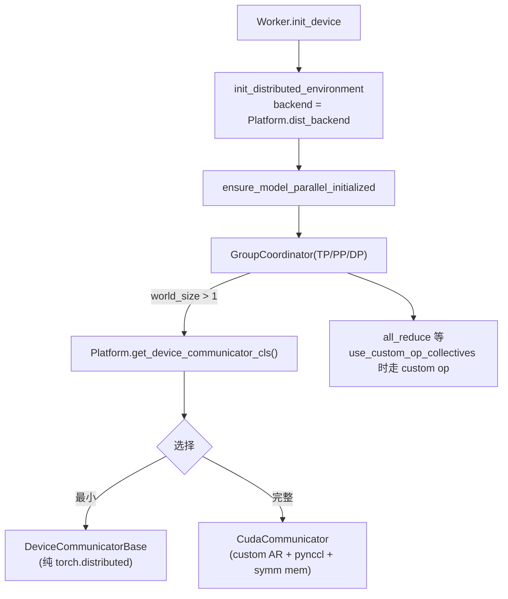

# 分布式通信接入点

硬件后端在分布式上有两个挂点：**`Platform.dist_backend`**（torch.distributed PG backend：nccl/gloo/xccl/ccl/hccl…）和 **`Platform.get_device_communicator_cls()`**（设备集合通信器类）。

## 1. GroupCoordinator（`repo://vllm/distributed/parallel_state.py`，2520 行）

- `class GroupCoordinator` @L421：每组同时创建 device 组（`dist_backend`）与 CPU 组（gloo）（@L496-L522）。
- **设备判定支持 OOT 平台**：`torch.device(f"{current_platform.device_name}:{idx}")`（@L524-L540）——所以 `device_name` 必须与 PyTorch 设备类型字符串一致。
- 集合通信 custom op 注册：`all_reduce/reduce_scatter/all_gather` 的 real/fake 实现经 `direct_register_custom_op` 注册（@L193-L233、@L393-L414）；`GroupCoordinator.all_reduce` 在 `use_custom_op_call`（TPU 或 `current_platform.use_custom_op_collectives()`）时走 custom op 路径（@L566-L568、@L722-L791）。
- `init_distributed_environment` @L1746-L1909：rank/world_size 折算、`torch.distributed.init_process_group`（backend 不可用回退 gloo）、`init_world_group`；`initialize_model_parallel` @L1911；`ensure_model_parallel_initialized` @L2157。
- 全局 custom allreduce 开关：`_ENABLE_CUSTOM_ALL_REDUCE` / `set_custom_all_reduce`（@L1640-L1645）；worker 侧 `set_custom_all_reduce(not disable_custom_all_reduce)`（gpu_worker.py@L1497）。
- `suspend_device_comms/resume_device_comms` @L183-L188：sleep 模式挂起 NCCL。
- 模型层封装 `communication_op.py`（`tensor_model_parallel_all_reduce` 等）全部委托 `get_tp_group()`（@L12-L43）。

## 2. DeviceCommunicator 选择（平台钩子）

`GroupCoordinator` 构造中，`world_size > 1` 时：

```python
communicator_cls = resolve_obj_by_qualname(current_platform.get_device_communicator_cls())
```

（@L542-L554。）基类默认返回 `DeviceCommunicatorBase`（`repo://vllm/platforms/interface.py#L1067-L1072`）。

### 各平台实现（`vllm/distributed/device_communicators/`）

| 类 | 位置 | 特点 |
|---|---|---|
| `DeviceCommunicatorBase` | base_device_communicator.py@L161 | 默认 `all_reduce`(@L219)/`all_gather`(@L235)/`send/recv/broadcast` 基于 torch.distributed；EP 的 `dispatch/combine` 是占位，需配合 all2all manager |
| `CudaCommunicator` | cuda_communicator.py | 最完整：custom allreduce、pynccl、symmetric memory（`nccl_symm_mem_context` @L522-L535）、all2all manager 分支 @L163-L225 |
| `CpuCommunicator` | cpu_communicator.py@L20 | 默认 torch.distributed；同 SHM 组时切 `_CPUSHMDistributed` 共享内存路径（@L234）；`supports_tensor_dict` 决定 dict 收发路径（@L54） |
| `XpuCommunicator` | xpu_communicator.py@L16 | **"朴素 torch.distributed" 范本，OOT 最小接入参考**：`all_reduce` 直接走 torch.distributed（oneCCL/xccl 后端），启用 all2all 时挂 `AgRsAll2AllManager`（@L31、@L43），无 custom allreduce |
| `ray_communicator.py` / `mnnvl_compat.py` / `shm_broadcast.py` 等 | — | Ray 辅助、Multi-Node NVLink 兼容、控制面 `MessageQueue`（parallel_state.py@L556-L562 消费） |

## 3. OOT 平台的通信接入清单

1. 设 `dist_backend`（如 `"ccl"`/`"hccl"`/`"xccl"`——必须是当前 torch 构建可用的 PG backend，否则 `init_distributed_environment` 回退 gloo，@L1746-L1909）。
2. 实现或复用 `DeviceCommunicator` 子类：
   - 最小：直接返回 `DeviceCommunicatorBase`（纯 torch.distributed，仿 `XpuCommunicator`）。
   - 进阶：覆盖 `all_reduce` 等接自家通信库；需要 EP（专家并行）时实现 `dispatch/combine` 并挂 all2all manager。
3. 若想走 vLLM 的 custom-op 集合通信路径（torch.compile 友好）：覆盖 `Platform.use_custom_op_collectives()` 返回 True，并确保对应 op 在你的 dispatch key 上有实现（parallel_state.py@L566-L568）。
4. 设备可见性：设好 `device_control_env_var` 与 `ray_noset_device_env_vars`（Ray 集成必需）。
5. 可选：`use_custom_allreduce()`（@L1130-L1135）、`stateless_init_device_torch_dist_pg()`（@L1190-L1202，KV transfer 等无主 PG 场景）。



## 相关页面

- [worker-executor.md](worker-executor.md) — `init_device` 中分布式初始化的调用位置
- [new-backend-guide.md](../guides/new-backend-guide.md) — 通信部分的接入步骤
