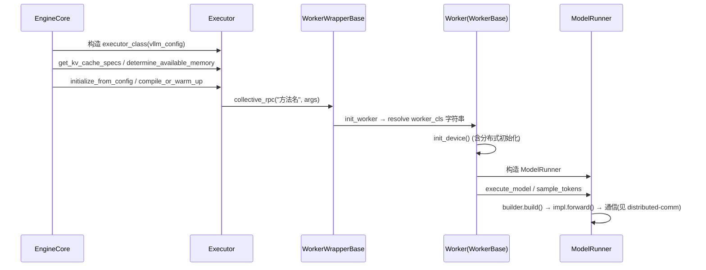

# Worker 与执行链（Executor → Worker → ModelRunner）

**勘误**：本版本 V1 引擎基类名为 `Executor`（不再叫 `ExecutorBase`）；`Platform.get_worker_class()` 已删除，worker 类选择改为平台在 `check_and_update_config` 中设置 `parallel_config.worker_cls`。

## 1. worker_cls 机制（平台接线的关键）

- `ParallelConfig.worker_cls` 默认 `"auto"`（"如果是 auto，将根据平台确定 worker 类"）；投机解码 `sd_worker_cls` 同理：`repo://vllm/config/parallel.py#L268-L273`。
- 内置平台在 `check_and_update_config` 中替换 `"auto"`：
  - CUDA → `"vllm.v1.worker.gpu_worker.Worker"`（`repo://vllm/platforms/cuda.py#L331-L332`）
  - ROCm → rocm.py@L921-L922；XPU → `"vllm.v1.worker.xpu_worker.XPUWorker"`（xpu.py@L360-L363）；CPU → `"vllm.v1.worker.cpu_worker.CPUWorker"`（cpu.py@L281-L282）
- **官方文档明确要求 OOT 平台在此设置 worker_cls**："最重要的一点是 worker_cls 应在该函数中设置"（`repo://docs/design/plugin_system.md#L105`）。
- **worker_cls 必须是字符串全限定名**：`WorkerWrapperBase.init_worker` 经 `resolve_obj_by_qualname` 解析，传类对象直接 `ValueError`（`repo://vllm/v1/worker/worker_base.py#L274-L283`）。
- `worker_extension_cls` 会被动态继承进 worker 类（注入 `__bases__`，供 `collective_rpc` 扩展调用，冲突检查后生效）：@L285-L311。
- CLI：`--worker-cls`（`repo://vllm/engine/arg_utils.py#L1230`）。

## 2. WorkerBase（`repo://vllm/v1/worker/worker_base.py`）

`WorkerBase` @L44 是跨硬件 Worker 抽象（"允许 vLLM 干净地分离不同硬件的实现，并抽象控制面通信" @L44-L48）。构造函数接收 `vllm_config, local_rank, rank, distributed_init_method, is_driver_worker`，持有 `current_platform`、`device`、`model_runner`（@L50-L94）。

硬件后端必须实现的方法：

| 方法 | 位置 | 说明 |
|---|---|---|
| `init_device` | @L134 | 初始化设备与分布式 |
| `load_model` | @L162 | 加载模型 |
| `execute_model` / `sample_tokens` | @L166 / @L177 | 每步执行与采样 |
| `get_kv_cache_spec` | @L103 | KV cache 布局声明 |
| `determine_available_memory` | — | profile 后计算可用 KV 内存 |
| `initialize_from_config` | @L345-L349 调用约定 | KV cache 张量分配（旧文档的 `initialize_cache` 已演化为此名） |
| `compile_or_warm_up_model` | @L116 | 编译/预热 |
| `get_cache_block_size_bytes` | @L183 | block 大小 |
| `synchronize_device` | @L128 | **非 torch.accelerator 设备必须覆写** |
| `shutdown` | @L206 | 清理 |

按特性：`sleep/wake_up`（sleep 模式）、`take_draft_token_ids`（投机解码）、`add/remove/pin/list_loras`（@L189-L199）、`execute_dummy_batch`（DP）、`check_health`（@L124）。

`WorkerWrapperBase` @L211-L218：代表 executor 中的一个进程，先 `update_environment_variables`，`init_worker` 中惰性初始化并 `load_general_plugins()`（@L269-L271）。

## 3. GPU Worker 参考实现（`repo://vllm/v1/worker/gpu_worker.py`，1524 行）

`class Worker(WorkerBase)` @L179-L229。`init_device()` @L357-L455 流程要点：

1. 计算 DP/TP local_rank 偏移（@L362-L379）；发布逻辑→物理 GPU 映射 `set_assigned_physical_gpu_ids`（@L383-L410）；
2. `torch.accelerator.set_device_index`（@L420-L421）；dtype 支持校验（@L423）；
3. **在内存快照前初始化分布式**（NCCL buffer 先分配）：`init_worker_distributed_environment(..., backend=current_platform.dist_backend)`（@L425-L435；模块级函数 @L1481-L1499，内含 `set_custom_all_reduce(...)` + `init_distributed_environment` + `ensure_model_parallel_initialized`）；
4. 内存快照（`MemorySnapshot`）→ 构造 ModelRunner（@L465-L485）。

其余：`load_model` @L497-L515、`determine_available_memory` @L524-L535、`sleep/wake_up` @L242-L301（可挂起 NCCL 通信）。

## 4. Executor 层（`repo://vllm/v1/executor/abstract.py`）

- `Executor.get_class` @L48-L93 按 `parallel_config.distributed_executor_backend` 选择：`"ray"` → `RayDistributedExecutor`（或 V2）、`"mp"` → `MultiprocExecutor`、`"uni"` → `UniProcExecutor`、`"external_launcher"` → `ExecutorWithExternalLauncher`、任意字符串按全限定名 resolve 且必须是 `Executor` 子类。
- **`collective_rpc` 是 executor 的唯一操作通道**：`initialize_from_config`、`compile_or_warm_up_model`、`determine_available_memory`、`execute_model`、`sample_tokens`、`sleep/wake_up`、LoRA 增删等全部通过 `collective_rpc("worker方法名", args=...)` 广播（@L120-L337；docstring 建议只传控制消息 @L190-L194）。

## 5. ModelRunner（`repo://vllm/v1/worker/gpu_model_runner.py`，7739 行）

`class GPUModelRunner` @L503。核心方法：

- `execute_model` @L4274 起：持久 batch 状态更新 `_update_states`（@L4312）、KV transfer connector preempt 处理、投机解码调度；
- `sample_tokens` @L4653、`load_model` @L5399、`get_model` @L3405；
- KV cache 三件套：`initialize_kv_cache_tensors` @L7419、`initialize_kv_cache` @L7491（内含 `bind_kv_cache` @L7454）、`get_kv_cache_spec` @L7633；
- profile/编译：`profile_run` @L6539、`_dummy_run` @L5923；
- 注意力 builder 实例化与 cudagraph 仲裁见 [attention-backend.md](../acceleration/attention-backend.md) §4。

可复用 mixin：`kv_connector_model_runner_mixin.py`、`lora_model_runner_mixin.py`、`ec_connector_model_runner_mixin.py`。

## 6. 完整接线链

上层接线：`EngineCore.__init__` 中 `self.model_executor = executor_class(vllm_config)`（`repo://vllm/v1/engine/core.py#L111-L137`）；每步 `execute_model(non_block=True)` + `sample_tokens`（@L601-L626）。

## 相关页面

- [platform-abstraction.md](../platform/platform-abstraction.md) — `check_and_update_config` 钩子
- [distributed-comm.md](distributed-comm.md) — `init_device` 里初始化的分布式环境
